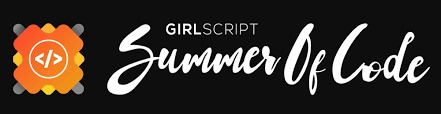
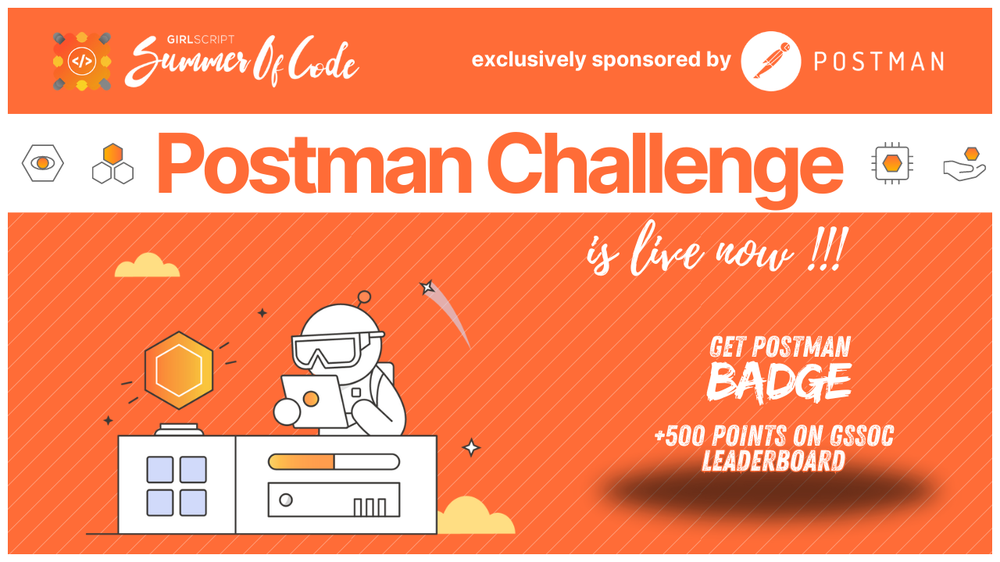
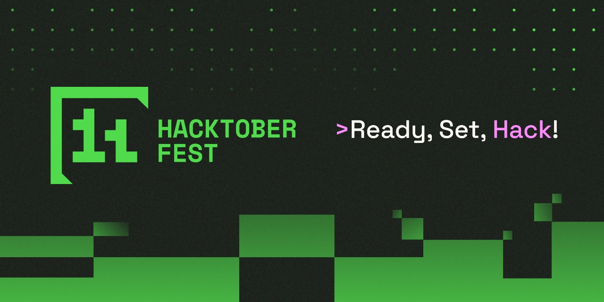

# [Algo](https://ajay-dhangar.github.io/algo/) - Open Source Algorithm Repository


## introduction
Welcome to **Algo**, an open-source project that provides developers with algorithmic solutions and resources. Whether you're a beginner or an experienced coder, you can contribute, learn, and grow with us! 🚀

<div align = "center">
<br>

<table align="center">
    <thead align="center">
        <tr border: 1px;>
            <td><b>🌟 Stars</b></td>
            <td><b>🍴 Forks</b></td>
            <td><b>🐛 Issues</b></td>
            <td><b>🔔 Open PRs</b></td>
            <td><b>🔕 Close PRs</b></td>
            <td><b>🛠 Languages</b></td>
            <td><b>🌐 Contributors </b></td>
        </tr>
     </thead>
    <tbody>
         <tr>
            <td></td>
            <td></td>
            <td></td>
            <td></td>
           <td></td>
           <td></td>
           <td></td>
        </tr>
    </tbody>
</table>
</div>
<br>

## Algo Events

**We are actively participating in the following events:**

<table>

   <tr>
      <th>Event Logo</th>
      <th>Event Name</th>
      <th>Event Description</th>
      <th>Status</th>       
   </tr>
   <tr>
      <td></td>
      <td>GSSoC'24 Extd</td>
      <td>GSSoC'24 Extd is a one-month open-source Program conducted by the GirlScript Foundation. It is an initiative to introduce more beginners to Open-Source Software Development.</td>
       <td>Active</td>
   </tr>
    <tr>
      <td></td>
      <td>Postman Challenge in GSSoC</td>
      <td>The Postman Challenge in collaboration with GSSoC is an initiative to promote API development and open-source contributions. Participants complete challenges using Postman and are rewarded with certificates and goodies.</td>
       <td>Active</td>
   </tr>
    <tr>
      <td></td>
      <td>Hacktoberfest 2024</td>
      <td>Hacktoberfest is a month-long celebration of open source software run by DigitalOcean, GitHub, and Twilio. It encourages contributions to open source projects and promotes a global community of developers.</td>
        <td>Excluded</td>
   </tr>

</table>

<br />


## 🌐 Demo Links

- [Demo](https://ajay-dhangar.github.io/algo/)


## Table of Contents

- [Algo - Open Source Algorithm Repository](#algo---open-source-algorithm-repository)
  - [introduction](#introduction)
  - [🚀Featured In](#featured-in)
  - [Table of Contents](#table-of-contents)
  - [Project Overview](#project-overview)
    - [Pick up Topics](#pick-up-topics)
  - [Features](#features)
  - [Website](#website)
  - [Installation](#installation)
  - [Local Development](#local-development)
  - [Build](#build)
  - [Deployment](#deployment)
    - [Using SSH:](#using-ssh)
    - [Not using SSH:](#not-using-ssh)
  - [Contributing](#contributing)
  - [Contributors ✨](#contributors-)
  - [Stargazers](#stargazers)
  - [Forkers](#forkers)
  - [Resources for Guidance](#resources-for-guidance)


## Project Overview

Algo provides a collection of well-documented algorithmic solutions written in various programming languages, covering a range of topics like sorting, searching, dynamic programming, and more.

### Pick up Topics

- [DSA Roadmap](https://roadmap.sh/datastructures-and-algorithms)

We aim to:
- Create an extensive library of algorithms in different languages
- Help developers learn algorithmic problem-solving
- Foster open-source contribution and collaboration

## Features

- **Multi-language Support**: Algorithms in multiple programming languages
- **Beginner-Friendly**: Well-structured, easy-to-understand explanations
- **Open Source Contributions**: Welcoming developers at all levels to contribute
- **Community Forum**: A new interactive platform where developers can ask questions, share ideas, and collaborate in real-time. This forum will help bridge the gap between beginners and experts, allowing for deeper engagement and problem-solving.

## Website

This website is built using [Docusaurus 3](https://docusaurus.io/), a modern static website generator.

## Installation

```bash
 npm install
```

## Local Development

```bash
 npm start
```

This command starts a local development server and opens a browser window. Most changes are reflected live without having to restart the server.

## Build

```bash
 npm run build
```

This command generates static content into the `build` directory, which can be served using any static content hosting service.

## Deployment

### Using SSH:

```bash
 USE_SSH=true npm run deploy
```

### Not using SSH:

```bash
 GIT_USER=<Your GitHub username> npm run deploy
```

If you are using GitHub Pages for hosting, this command is a convenient way to build the website and push to the `gh-pages` branch.

## Contributing

We welcome contributions from developers of all experience levels. For guidelines, please see the [CONTRIBUTING.md](./CONTRIBUTING.md) file.

## Contributors ✨

Thanks to these amazing people who have contributed to the **Algo** project:

<!-- readme: contributors -start -->
<p align="center">
    
</p>
<!-- readme: contributors -end -->

<br>

## Stargazers

[](https://github.com/ajay-dhangar/algo/stargazers)

## Forkers

[](https://github.com/ajay-dhangar/algo/network/members)

## Resources for Guidance
Here are some resources that may be helpful as you contribute to Algo:
- [Docusaurus Documentation](https://docusaurus.io/docs/docs-introduction)
- [React.js Documentation](https://legacy.reactjs.org/docs/getting-started.html)
- [Markdown Guide](https://www.markdownguide.org/)
- [MDX Documentation](https://mdxjs.com/docs/)
- [Mermaid Documentation](https://mermaid.js.org/)

<div align="center">
    <a href="#top">
        
    </a>
</div>
