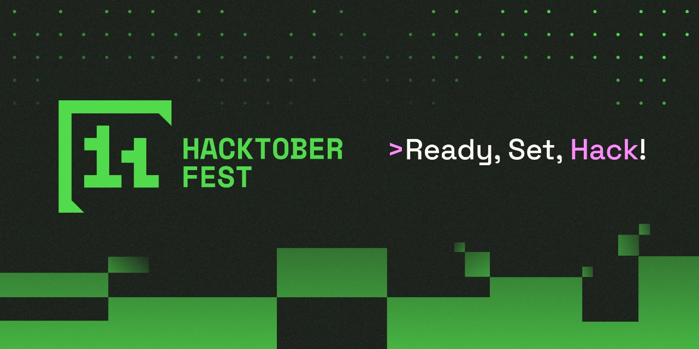

# [Algo](https://ajay-dhangar.github.io/algo/) - Open Source Algorithm Repository


---

## Table of Contents

|1|2|3|4|5|6|7|8|9|10|11|
|---|---|---|---|---|---|---|---|---|---|---|
| [Introduction](#introduction) | [Algo Events](#algo-events) | [Links](#-links) | [Project Overview](#project-overview) | [Features](#features) | [Website](#website) | [Installation](#installation) | [Local Development](#local-development) | [Build](#build) | [Deployment](#deployment) | [Contributing](#-contributing) |

---

## introduction

Welcome to Algo, an open-source educational platform built with Docusaurus (React + MDX). We provide developers with comprehensive algorithmic solutions and resources. Whether you're a beginner or an expert, you can contribute, learn, and help us build the world's top educational documentation.

<div align = "center">
<br>

<table align="center">
    <thead align="center">
        <tr border: 1px;>
            <td><b>🌟 Stars</b></td>
            <td><b>🍴 Forks</b></td>
            <td><b>🐛 Issues</b></td>
            <td><b>🔔 Open PRs</b></td>
            <td><b>🔕 Close PRs</b></td>
            <td><b>🛠 Languages</b></td>
            <td><b>🌐 Contributors </b></td>
        </tr>
     </thead>
    <tbody>
         <tr>
            <td></td>
            <td></td>
            <td></td>
            <td></td>
           <td></td>
           <td></td>
           <td></td>
        </tr>
    </tbody>
</table>
</div>
<br>

## Algo Events

**We are actively participating in the following events:**

<table>

   <tr>
      <th>Event Logo</th>
      <th>Event Name</th>
      <th>Event Description</th>
      <th>Status</th>       
   </tr>
   <tr>
      <td><picture><source srcset="gssoc-algo-banner.webp" type="image/webp"/></picture></td>
      <td>GSSoC '26</td>
      <td>GirlScript Summer of Code (GSSoC) is an awesome 3-month open-source program that's all about getting people into software development.</td>
       <td>Active</td>
   </tr>
   <tr>
      <td></td>
      <td>GSSoC'24 Extd</td>
      <td>GSSoC'24 Extd is a one-month open-source Program conducted by the GirlScript Foundation. It is an initiative to introduce more beginners to Open-Source Software Development.</td>
       <td>Active</td>
   </tr>
    <tr>
      <td></td>
      <td>Postman Challenge in GSSoC</td>
      <td>The Postman Challenge in collaboration with GSSoC is an initiative to promote API development and open-source contributions. Participants complete challenges using Postman and are rewarded with certificates and goodies.</td>
       <td>Active</td>
   </tr>
    <tr>
      <td></td>
      <td>Hacktoberfest 2024</td>
      <td>Hacktoberfest is a month-long celebration of open source software run by DigitalOcean, GitHub, and Twilio. It encourages contributions to open source projects and promotes a global community of developers.</td>
        <td>Excluded</td>
   </tr>

</table>

<br />

## 🌐 Links

- [Algo](https://ajay-dhangar.github.io/algo/)

## Project Overview

Algo provides a collection of well-documented algorithmic solutions written in various programming languages, covering a range of topics like sorting, searching, dynamic programming, and more.

### Pick up Topics

- [DSA Roadmap](https://roadmap.sh/datastructures-and-algorithms)

We aim to:
- Create an extensive library of algorithms in different languages
- Help developers learn algorithmic problem-solving
- Foster open-source contribution and collaboration

## Features

- **Multi-language Support**: Algorithms in multiple programming languages ([contribution workflow](./CONTRIBUTING.md#5-how-to-add-a-new-algorithm-in-multiple-languages))
- **Beginner-Friendly**: Well-structured, easy-to-understand explanations
- **Open Source Contributions**: Welcoming developers at all levels to contribute
- **Community Forum**: A new interactive platform where developers can ask questions, share ideas, and collaborate in real-time. This forum will help bridge the gap between beginners and experts, allowing for deeper engagement and problem-solving.

## Website

This website is built using [Docusaurus](https://docusaurus.io/), a modern static website generator.

## Installation

```bash
 npm install
```

## Local Development

```bash
 npm start
```

This command starts a local development server and opens a browser window. Most changes are reflected live without having to restart the server.

The frontend uses `customFields.apiBaseUrl` for API-backed features such as quiz history and the code playground. In development, it defaults to `http://localhost:5000`, so local contributors can run the backend on the default port without extra setup.

To use a different backend locally, create a `.env` file from `.env.example` and set one of these variables before starting the frontend:

```env
ALGO_API_URL=http://localhost:5000
```

`DOCUSAURUS_API_BASE_URL` is still supported as a backward-compatible alias.

## Build

```bash
 npm run build
```

This command generates static content into the `build` directory, which can be served using any static content hosting service.

## Deployment

Production builds require an explicit API base URL. Set `ALGO_API_URL` in your hosting environment before running `npm run build` or deploying:

```env
ALGO_API_URL=https://api.example.com
```

If neither `ALGO_API_URL` nor `DOCUSAURUS_API_BASE_URL` is set in production, the build fails with a clear configuration error instead of silently emitting relative API requests.

### Using SSH:

```bash
 USE_SSH=true npm run deploy
```

### Not using SSH:

```bash
 GIT_USER=<Your GitHub username> npm run deploy
```

If you are using GitHub Pages for hosting, this command is a convenient way to build the website and push to the `gh-pages` branch.

## 🤝 Contributing

As a Project Admin, I ensure a structured workflow to maintain high code quality.

* **Respond within 24 hours:** I aim to assign issues quickly.
* **Quality Checks:** CI/CD checks must pass before merging.
* **Guidelines:** Please read our [CONTRIBUTING.md](./CONTRIBUTING.md) before starting.

We welcome contributions from developers of all experience levels.

## Contributors ✨

Thanks to these amazing people who have contributed to the **Algo** project:

<br>

## Manually invoke Gemini Code Assist

Gemini Code Assist listens to comments from any pull request contributor, and decides whether it should respond.

To manually invoke Gemini Code Assist, you can use the following commands in the main comments page on the pull request as an issue comment.

| Command | Description
|:---|:---|
|`/gemini summary` | Posts a summary of the changes in the pull request |
|`/gemini review` |Posts a code review of the changes in the pull request |
|`/gemini`| Manually invokes Gemini Code Assist in comments |
|`/gemini help` | Overview of the available commands |

## Stargazers

[](https://github.com/ajay-dhangar/algo/stargazers)

## Forkers

[](https://github.com/ajay-dhangar/algo/network/members)

## Resources for Guidance

These links are summarized in [CONTRIBUTING.md — Recommended reading](./CONTRIBUTING.md#recommended-reading) with a one-line note on when to use each tool while contributing or editing docs.

- [Docusaurus Documentation](https://docusaurus.io/docs/docs-introduction) — site layout, sidebars, and local preview
- [Markdown Guide](https://www.markdownguide.org/) — writing `.md` algorithm and tutorial pages
- [MDX Documentation](https://mdxjs.com/docs/) — pages that embed React components
- [React.js Documentation](https://react.dev/learn) — custom components and interactive docs
- [Mermaid Documentation](https://mermaid.js.org/) — flowcharts and diagrams in documentation

<div align="center">
    <a href="#top">
        
    </a>
</div>
