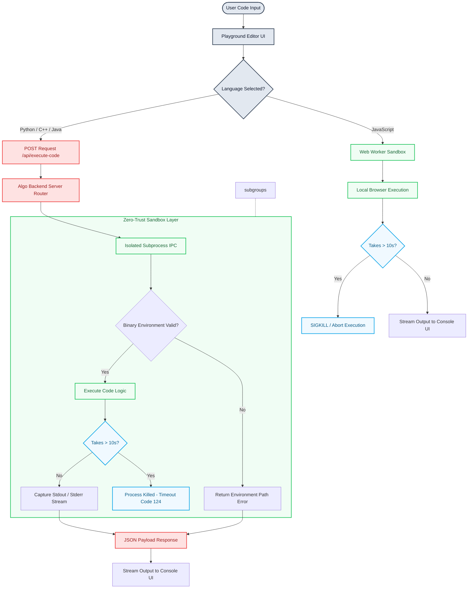

# Multi-Language Playground Feature - README Addition

## Add this section to the main README.md under the Playground section:

The **Algo Playground** features an isolated runtime execution engine that supports multiple high-level programming stacks, enabling learners to analyze, benchmark, and deploy core algorithmic routines inside their preferred software environment.



## Multi-Language Playground

The Algo Playground now supports multiple programming languages, allowing learners to practice algorithms in their language of choice!

### Supported Languages

- **JavaScript** - Client-side execution with Web Workers for safety
- **Python** - Server-side execution with standard library support
- **C++** - Compiled execution with GCC for maximum performance
- **Java** - JVM execution with full standard library access

### Features

✨ **Dynamic Language Selection**
- Switch between languages with a dropdown menu
- Syntax highlighting automatically adapts
- File extension updates in real-time

📚 **Language-Specific Templates**
Each language includes 4 working templates:
- Binary Search Algorithm
- Bubble Sort Algorithm  
- Reverse Linked List
- Fibonacci Series

⚡ **Fast Execution**
- JavaScript: Runs instantly in Web Workers (client-side)
- Other languages: Executed on the backend with proper isolation

🛡️ **Secure Environment**
- 10-second execution timeout prevents infinite loops
- Web Worker sandboxing for JavaScript
- Process isolation for other languages
- No network or file system access

### Quick Start

1. **Install language runtimes** (first time only):
   ```bash
   # Run the setup checker
   bash scripts/check-languages.sh  # macOS/Linux
   # or
   scripts\check-languages.bat      # Windows
   ```

2. **Start the application**:
   ```bash
   npm run start:all
   ```

3. **Open the playground**:
   Navigate to `http://localhost:3000/playground`

4. **Select a language and start coding!**

### Examples

**JavaScript:**
```javascript
function binarySearch(arr, target) {
  let left = 0, right = arr.length - 1;
  while(left <= right) {
    const mid = Math.floor((left + right) / 2);
    if(arr[mid] === target) return mid;
    arr[mid] < target ? left = mid + 1 : right = mid - 1;
  }
  return -1;
}
console.log(binarySearch([1, 3, 5, 7, 9], 7)); // 3
```

**Python:**
```python
def binary_search(arr, target):
    left, right = 0, len(arr) - 1
    while left <= right:
        mid = (left + right) // 2
        if arr[mid] == target:
            return mid
        elif arr[mid] < target:
            left = mid + 1
        else:
            right = mid - 1
    return -1

print(binary_search([1, 3, 5, 7, 9], 7))  # 3
```

**C++:**
```cpp
#include <iostream>
#include <vector>
using namespace std;

int binarySearch(vector<int>& arr, int target) {
    int left = 0, right = arr.size() - 1;
    while(left <= right) {
        int mid = left + (right - left) / 2;
        if(arr[mid] == target) return mid;
        arr[mid] < target ? left = mid + 1 : right = mid - 1;
    }
    return -1;
}

int main() {
    vector<int> arr = {1, 3, 5, 7, 9};
    cout << binarySearch(arr, 7) << endl;  // 3
    return 0;
}
```

**Java:**
```java
public class BinarySearch {
    public static int binarySearch(int[] arr, int target) {
        int left = 0, right = arr.length - 1;
        while(left <= right) {
            int mid = left + (right - left) / 2;
            if(arr[mid] == target) return mid;
            if(arr[mid] < target) left = mid + 1;
            else right = mid - 1;
        }
        return -1;
    }
    
    public static void main(String[] args) {
        int[] arr = {1, 3, 5, 7, 9};
        System.out.println(binarySearch(arr, 7));  // 3
    }
}
```

### Requirements

**For JavaScript:**
- Already built-in, no additional setup needed

**For Python, C++, Java:**
- **Linux/macOS**: Install via package manager (see setup checker)
- **Windows**: Download and install from official sources
- **Docker**: All tools pre-installed in container

### Documentation

- **[Quick Start Guide](#)** - Get up and running in 5 minutes
- **[Complete Documentation](#)** - Full feature documentation
- **[Implementation Details](#)** - Technical deep dive

### Troubleshooting

**Backend server not running?**
```bash
npm run server:dev
```

**Language not found?**
```bash
# Run the setup checker for your platform
bash scripts/check-languages.sh     # macOS/Linux
scripts\check-languages.bat         # Windows
```

**Code timing out?**
- Check for infinite loops
- Optimize algorithm performance
- 10-second limit per execution

### Performance Tips

- **JavaScript**: Best for quick algorithms and I/O operations
- **Python**: Ideal for learning, slower but readable
- **C++**: Fastest execution, best for competitive programming
- **Java**: Good balance of performance and type safety

### Browser Console

If you encounter issues:
1. Open Developer Tools (F12)
2. Check Console tab for error messages
3. Look for backend connectivity errors
4. Check network requests to /api/execute-code

### Next Steps

- Try all languages with the provided templates
- Create your own algorithm implementations
- Compare execution times across languages
- Contribute new algorithms or templates!