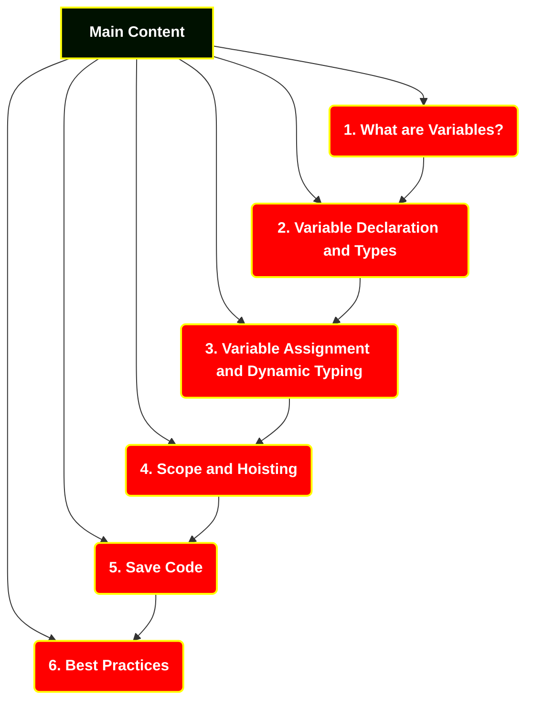
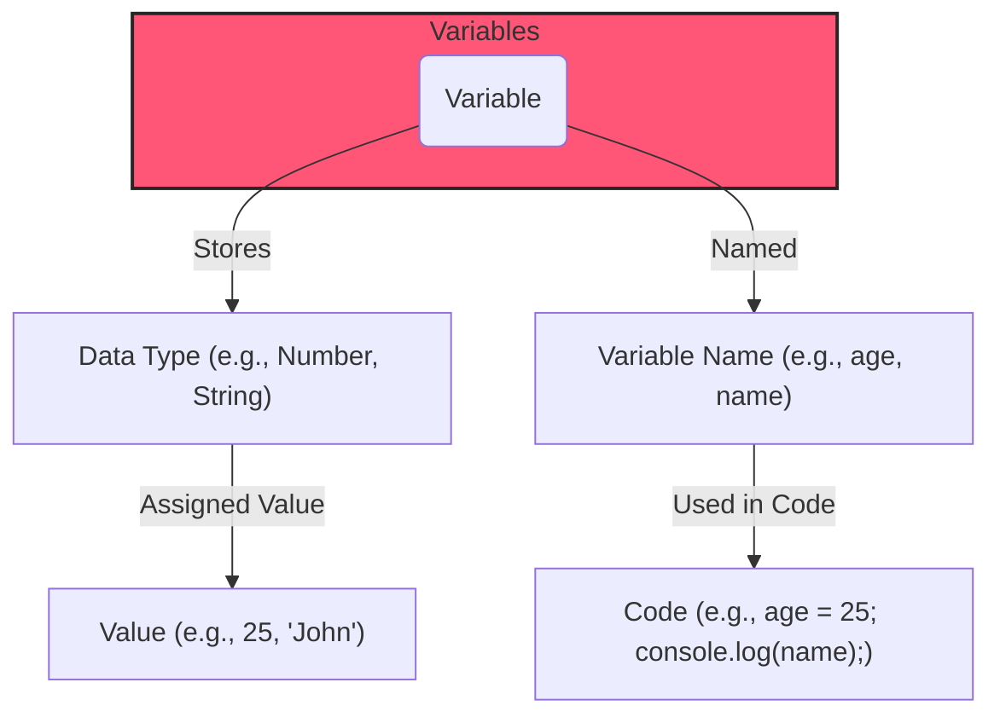
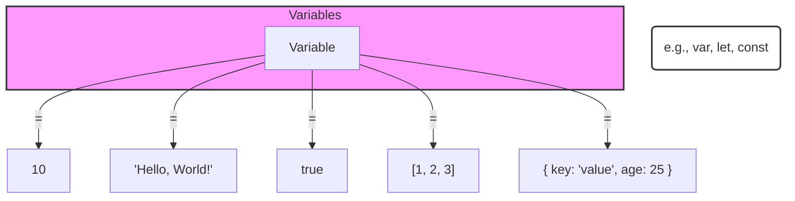
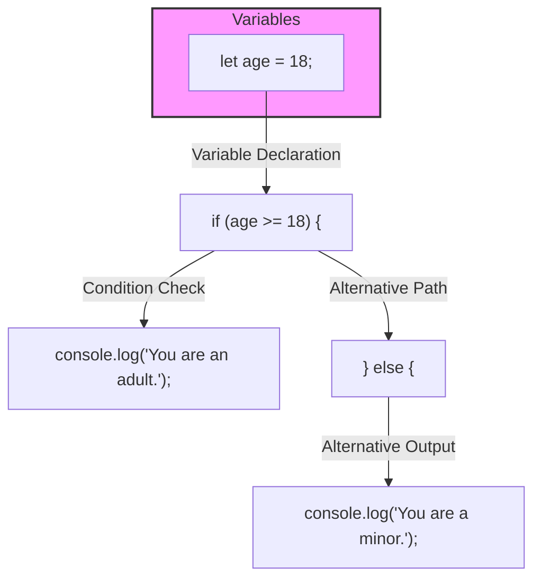

Hey, everyone! Welcome back to our site. I'm Ajay Dhangar, and today we're diving into a fundamental concept in JavaScript – Variables. Whether you're a beginner or looking for a refresher, this video is for you. So, let's get started!

### Section 1: What are Variables?

So, what exactly are variables? Well, think of them as containers. They're like labeled boxes that hold different types of information in your program.

<!-- [Visual Aid: Illustration of a variable as a box] -->

In JavaScript, we use variables to store and manage data. They can represent numbers, text, or more complex structures.

<!-- [Visual Aid: Examples of variables holding different types of data] -->

### Section 2: Variable Declaration and Types:

Now, let's talk about how to declare variables and the different types available in JavaScript.

<!-- [Visual Aid: Code snippets demonstrating variable declaration] -->

You can declare variables using 'var,' 'let,' or 'const.' 'Var' has been around for a while, but with ES6, we got 'let' and 'const.' 

<!-- [Visual Aid: Comparison of 'var,' 'let,' and 'const' usage] -->

'Let' and 'const' are block-scoped, which means they're confined to the block of code where they're declared, providing better control over your variables.

<!-- [Visual Aid: Block scope illustration] -->

### Section 3: Variable Assignment and Dynamic Typing:

Once you've declared a variable, you can assign values to it. JavaScript is a dynamically typed language, so the type of a variable can change during runtime.

<!-- [Visual Aid: Code example demonstrating variable assignment and dynamic typing] -->

This flexibility is powerful, but it's essential to be aware of the types of data your variables hold to avoid unexpected behavior.

<!-- [Visual Aid: Illustration of dynamic typing] -->

### Section 4: Scope and Hoisting:

Understanding the scope of your variables is crucial. 'Var' variables are function-scoped, while 'let' and 'const' are block-scoped.

<!-- [Visual Aid: Code examples demonstrating scope] -->

Also, there's something called hoisting, where variable declarations are moved to the top of their scope during the compilation phase. This can lead to some interesting scenarios.

<!-- [Visual Aid: Hoisting explanation and illustration] -->

### Section 5: Best Practices:

Before we wrap up, let's talk about best practices. In modern JavaScript, it's recommended to use 'const' by default. If you know the value will change, then use 'let.'

<!-- [Visual Aid: Code examples demonstrating best practices] -->

And please, let's leave 'var' behind. It's a bit outdated and can cause unexpected issues.

<!-- [Visual Aid: X mark on 'var'] -->

<!-- [Closing Scene] -->

### Conclusion:

That wraps up our exploration of variables in JavaScript. Remember, they're the building blocks of your programs, so understanding them is key. If you found this video helpful, give it a thumbs up, subscribe for more content, and hit that notification bell.

<!-- [Closing Scene with Channel Logo and Subscribe Prompt]
[Outro Music] -->