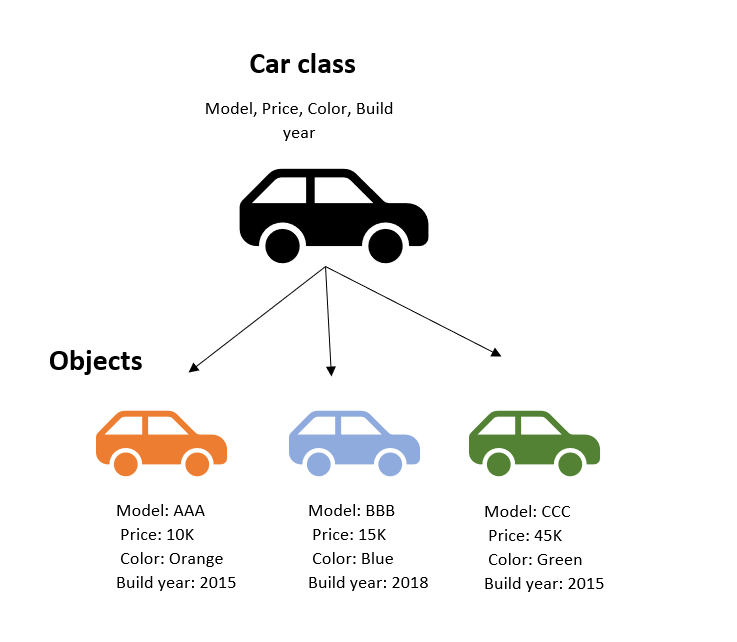

# **Classes and Objects in Object-Oriented Programming**

In Object-Oriented Programming (OOP), **classes** and **objects** are fundamental concepts that help structure your code.

## **What is a Class?**

A **class** is a blueprint or template for creating objects. It defines a datatype by bundling data and methods that work on the data. Classes encapsulate data for the object and define methods for manipulating that data.

### **Key Components of a Class:**
- **Attributes**: Variables that hold data for the class.
- **Methods**: Functions defined inside the class that can manipulate the attributes.

### **Example of a Class**

<details>
<summary><strong>C++ Code</strong></summary>

```cpp
class Car {
private:
    string model;
    int year;

public:
    // Constructor
    Car(string m, int y) : model(m), year(y) {}

    // Method to display car details
    void display() {
        cout << "Model: " << model << ", Year: " << year << endl;
    }
};
```
</details>

<details>
<summary><strong>Java Code</strong></summary>

```java
class Car {
    private String model;
    private int year;

    // Constructor
    Car(String m, int y) {
        model = m;
        year = y;
    }

    // Method to display car details
    void display() {
        System.out.println("Model: " + model + ", Year: " + year);
    }
}
```
</details>

---

## **What is an Object?**

An **object** is an instance of a class. When you create an object, you create a specific instance of a class with its own unique set of attributes. Objects interact with one another and can have their own state and behavior.

### **Creating Objects**

<details>
<summary><strong>C++ Code</strong></summary>

```cpp
int main() {
    Car myCar("Toyota", 2020);
    myCar.display(); // Output: Model: Toyota, Year: 2020
    return 0;
}
```
</details>

<details>
<summary><strong>Java Code</strong></summary>

```java
public class Main {
    public static void main(String[] args) {
        Car myCar = new Car("Toyota", 2020);
        myCar.display(); // Output: Model: Toyota, Year: 2020
    }
}
```
</details>

---

## **Key Differences Between Classes and Objects:**
- **Definition**: A class is a blueprint; an object is an instance of that blueprint.
- **Memory**: Class is a logical entity; an object is a physical entity in memory.
- **Instantiation**: Classes need to be instantiated to create objects.

  
*Diagram illustrating the relationship between classes and objects in OOP.*

---

## **Conclusion**

Classes and objects are the cornerstones of OOP, enabling developers to create modular, reusable, and maintainable code. Understanding these concepts is essential for mastering object-oriented design and programming.

---
