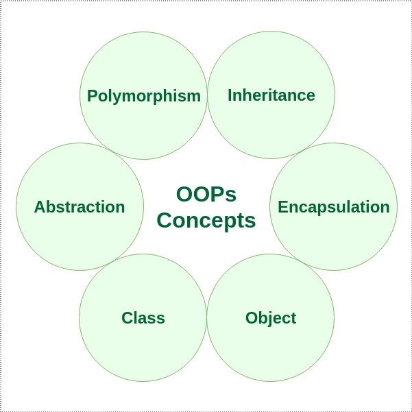

# **Introduction to Object-Oriented Programming (OOPs)**

Object-Oriented Programming (OOPs) is a **programming paradigm** that organizes software design around data, or objects, rather than functions and logic. It helps in breaking down complex problems into smaller, manageable units by representing real-world entities as objects.

## **Key Concepts of OOPs**

OOPs is built on four main pillars:
1. **Encapsulation**
2. **Abstraction**
3. **Inheritance**
4. **Polymorphism**

  

These core concepts help developers create software that is more modular, reusable, and scalable. We will explore these in detail in the following sections.

---

## **Advantages of OOPs over Procedure-Oriented Programming**

Object-oriented programming (OOP) offers several key advantages over procedural programming:

- **Code Reusability**: OOP promotes code reusability by using objects and classes. This leads to less duplication and more efficient development, as you can create reusable components that can be leveraged in different parts of your application.

- **Enhanced Code Organization**: OOP provides a clear and logical structure, making the code easier to understand, maintain, and debug. By organizing code into objects, related functionalities are grouped together.

- **Support for DRY Principle**: OOP supports the DRY (Don’t Repeat Yourself) principle, encouraging the minimization of code repetition. This leads to cleaner, more maintainable code, as common functionalities are placed in a single location and reused, reducing redundancy.

- **Faster Development**: OOP enables faster development by reusing existing code and creating modular components. This allows for quicker and more efficient application development, as developers can build upon already existing codebases.

---

## **Why OOPs is Important?**

OOPs mirrors real-world entities and their interactions, making it a natural way to structure code for many applications. This approach is widely used in designing software systems that require high levels of flexibility and extensibility, such as video games, graphical user interfaces (GUIs), and complex enterprise applications.

---

The next sections will delve deeper into each of these principles and other related concepts like **Classes and Objects**, **Constructors**, **Interfaces**, and **Real-World Examples**.
