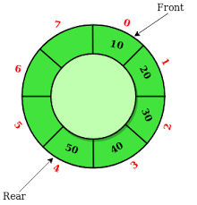

### Introduction to Circular Queue

A circular queue is a linear data structure that follows the First In First Out (FIFO) principle, similar to a regular queue. However, in a circular queue, the last position is connected back to the first position to form a circle. This circular arrangement allows for efficient use of space, as it enables the queue to utilize any free space created by dequeue operations without shifting elements.



### Circular Queue Operations

1. **Enqueue**: Add an element to the back of the queue.
2. **Dequeue**: Remove the element from the front of the queue.
3. **Peek**: Retrieve the element at the front of the queue without removing it.
4. **isEmpty**: Check if the queue is empty.
5. **isFull**: Check if the queue is full.
6. **Size**: Get the number of elements in the queue.

### Pseudocode

#### Basic Operations

1. **Enqueue**:

    ```text
    function enqueue(circularQueue, element):
         if isFull(circularQueue):
              return "Queue Overflow"
         circularQueue.rear = (circularQueue.rear + 1) % circularQueue.size
         circularQueue.elements[circularQueue.rear] = element
    ```

2. **Dequeue**:

    ```text
    function dequeue(circularQueue):
         if isEmpty(circularQueue):
              return "Queue Underflow"
         frontElement = circularQueue.elements[circularQueue.front]
         circularQueue.front = (circularQueue.front + 1) % circularQueue.size
         return frontElement
    ```

3. **Peek**:

    ```text
    function peek(circularQueue):
         if isEmpty(circularQueue):
              return "Queue is empty"
         return circularQueue.elements[circularQueue.front]
    ```

4. **isEmpty**:

    ```text
    function isEmpty(circularQueue):
         return circularQueue.front == circularQueue.rear
    ```

5. **isFull**:

    ```text
    function isFull(circularQueue):
         return (circularQueue.rear + 1) % circularQueue.size == circularQueue.front
    ```

6. **Size**:

    ```text
    function size(circularQueue):
         return (circularQueue.rear - circularQueue.front + circularQueue.size) % circularQueue.size
    ```

### Implementation in Python, C++, and Java

#### Python Implementation

```python
class CircularQueue:
     def __init__(self, size):
          self.size = size
          self.elements = [None] * size
          self.front = 0
          self.rear = 0

     def enqueue(self, element):
          if self.is_full():
               return "Queue Overflow"
          self.rear = (self.rear + 1) % self.size
          self.elements[self.rear] = element

     def dequeue(self):
          if self.is_empty():
               return "Queue Underflow"
          frontElement = self.elements[self.front]
          self.front = (self.front + 1) % self.size
          return frontElement

     def peek(self):
          if self.is_empty():
               return "Queue is empty"
          return self.elements[self.front]

     def is_empty(self):
          return self.front == self.rear

     def is_full(self):
          return (self.rear + 1) % self.size == self.front

     def size(self):
          return (self.rear - self.front + self.size) % self.size

# Example usage
cq = CircularQueue(5)
cq.enqueue(10)
cq.enqueue(20)
print(cq.dequeue())  # Output: 10
print(cq.peek())     # Output: 20
print(cq.is_empty()) # Output: False
print(cq.size())     # Output: 1
```

#### C++ Implementation

```cpp
#include <iostream>
using namespace std;

class CircularQueue {
private:
     int *elements;
     int front, rear, size;

public:
     CircularQueue(int size) {
          this->size = size;
          elements = new int[size];
          front = rear = 0;
     }

     void enqueue(int element) {
          if (is_full()) {
               cout << "Queue Overflow" << endl;
               return;
          }
          rear = (rear + 1) % size;
          elements[rear] = element;
     }

     int dequeue() {
          if (is_empty()) {
               cout << "Queue Underflow" << endl;
               return -1; // Indicating underflow
          }
          int frontElement = elements[front];
          front = (front + 1) % size;
          return frontElement;
     }

     int peek() {
          if (is_empty()) {
               cout << "Queue is empty" << endl;
               return -1; // Indicating empty
          }
          return elements[front];
     }

     bool is_empty() {
          return front == rear;
     }

     bool is_full() {
          return (rear + 1) % size == front;
     }

     int size_of_queue() {
          return (rear - front + size) % size;
     }

     ~CircularQueue() {
          delete[] elements;
     }
};

// Example usage
int main() {
     CircularQueue cq(5);
     cq.enqueue(10);
     cq.enqueue(20);
     cout << cq.dequeue() << endl;  // Output: 10
     cout << cq.peek() << endl;      // Output: 20
     cout << boolalpha << cq.is_empty() << endl; // Output: false
     cout << cq.size_of_queue() << endl; // Output: 1
     return 0;
}
```

#### Java Implementation

```java
public class CircularQueue {
     private int[] elements;
     private int front, rear, size;

     public CircularQueue(int size) {
          this.size = size;
          elements = new int[size];
          front = rear = 0;
     }

     public void enqueue(int element) {
          if (is_full()) {
               System.out.println("Queue Overflow");
               return;
          }
          rear = (rear + 1) % size;
          elements[rear] = element;
     }

     public int dequeue() {
          if (is_empty()) {
               System.out.println("Queue Underflow");
               return -1; // Indicating underflow
          }
          int frontElement = elements[front];
          front = (front + 1) % size;
          return frontElement;
     }

     public int peek() {
          if (is_empty()) {
               System.out.println("Queue is empty");
               return -1; // Indicating empty
          }
          return elements[front];
     }

     public boolean is_empty() {
          return front == rear;
     }

     public boolean is_full() {
          return (rear + 1) % size == front;
     }

     public int size_of_queue() {
          return (rear - front + size) % size;
     }

     // Example usage
     public static void main(String[] args) {
          CircularQueue cq = new CircularQueue(5);
          cq.enqueue(10);
          cq.enqueue(20);
          System.out.println(cq.dequeue());  // Output: 10
          System.out.println(cq.peek());      // Output: 20
          System.out.println(cq.is_empty());  // Output: false
          System.out.println(cq.size_of_queue()); // Output: 1
     }
}
```

### Complexity

- **Time Complexity**:

  - Enqueue: $O(1)$
  - Dequeue: $O(1)$
  - Peek: $O(1)$
  - isEmpty: $O(1)$
  - isFull: $O(1)$
  - Size: $O(1)$

- **Space Complexity**: $O(n)$, where $n$ is the number of elements that can be stored in the circular queue.

### Example

Consider a circular queue with the following operations:

1. Enqueue 10
2. Enqueue 20
3. Dequeue
4. Peek
5. Check if empty
6. Get size

**Operations**:

- Enqueue 10: Queue becomes [10, _, _, _, _]
- Enqueue 20: Queue becomes [10, 20, _, _, _]
- Dequeue: Removes 10, Queue becomes [_, 20, _, _, _]
- Peek: Returns 20, Queue remains [_, 20, _, _, _]
- isEmpty: Returns false
- Size: Returns 1

### Conclusion

A circular queue is an efficient data structure that improves the utilization of space in scenarios where a standard linear queue might lead to wasted memory due to the shifting of elements. It is widely used in applications such as CPU scheduling, resource sharing, and buffering tasks in operating systems. Understanding and implementing a circular queue can significantly enhance performance and memory management in various algorithms and systems.
