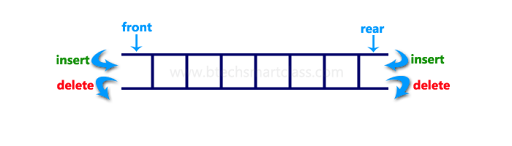

### Introduction to Double-Ended Queue (Deque)

A **double-ended queue (Deque)** is a linear data structure similar to a queue but allows insertions and deletions from both ends—front and rear. This flexibility makes deques useful in situations where both ends of the data need to be accessed, and they can efficiently handle tasks such as maintaining sequences of items or managing resources.



### Double-Ended Queue Operations

1. **InsertFront**: Add an element to the front of the deque.
2. **InsertRear**: Add an element to the rear of the deque.
3. **DeleteFront**: Remove the element from the front of the deque.
4. **DeleteRear**: Remove the element from the rear of the deque.
5. **PeekFront**: Retrieve the element at the front of the deque without removing it.
6. **PeekRear**: Retrieve the element at the rear of the deque without removing it.
7. **isEmpty**: Check if the deque is empty.
8. **isFull**: Check if the deque is full.

### Pseudocode

#### Basic Operations

1. **InsertFront**:

    ```text
    function insertFront(deque, element):
         if isFull(deque):
              return "Deque Overflow"
         deque.front = (deque.front - 1 + deque.size) % deque.size
         deque.elements[deque.front] = element
    ```

2. **InsertRear**:

    ```text
    function insertRear(deque, element):
         if isFull(deque):
              return "Deque Overflow"
         deque.rear = (deque.rear + 1) % deque.size
         deque.elements[deque.rear] = element
    ```

3. **DeleteFront**:

    ```text
    function deleteFront(deque):
         if isEmpty(deque):
              return "Deque Underflow"
         frontElement = deque.elements[deque.front]
         deque.front = (deque.front + 1) % deque.size
         return frontElement
    ```

4. **DeleteRear**:

    ```text
    function deleteRear(deque):
         if isEmpty(deque):
              return "Deque Underflow"
         rearElement = deque.elements[deque.rear]
         deque.rear = (deque.rear - 1 + deque.size) % deque.size
         return rearElement
    ```

5. **PeekFront**:

    ```text
    function peekFront(deque):
         if isEmpty(deque):
              return "Deque is empty"
         return deque.elements[deque.front]
    ```

6. **PeekRear**:

    ```text
    function peekRear(deque):
         if isEmpty(deque):
              return "Deque is empty"
         return deque.elements[deque.rear]
    ```

7. **isEmpty**:

    ```text
    function isEmpty(deque):
         return deque.front == deque.rear
    ```

8. **isFull**:

    ```text
    function isFull(deque):
         return (deque.rear + 1) % deque.size == deque.front
    ```

### Implementation in Python, C++, and Java

#### Python Implementation

```python
class Deque:
     def __init__(self, size):
          self.size = size
          self.elements = [None] * size
          self.front = 0
          self.rear = 0

     def insert_front(self, element):
          if self.is_full():
               return "Deque Overflow"
          self.front = (self.front - 1 + self.size) % self.size
          self.elements[self.front] = element

     def insert_rear(self, element):
          if self.is_full():
               return "Deque Overflow"
          self.rear = (self.rear + 1) % self.size
          self.elements[self.rear] = element

     def delete_front(self):
          if self.is_empty():
               return "Deque Underflow"
          frontElement = self.elements[self.front]
          self.front = (self.front + 1) % self.size
          return frontElement

     def delete_rear(self):
          if self.is_empty():
               return "Deque Underflow"
          rearElement = self.elements[self.rear]
          self.rear = (self.rear - 1 + self.size) % self.size
          return rearElement

     def peek_front(self):
          if self.is_empty():
               return "Deque is empty"
          return self.elements[self.front]

     def peek_rear(self):
          if self.is_empty():
               return "Deque is empty"
          return self.elements[self.rear]

     def is_empty(self):
          return self.front == self.rear

     def is_full(self):
          return (self.rear + 1) % self.size == self.front

# Example usage
dq = Deque(5)
dq.insert_front(10)
dq.insert_rear(20)
print(dq.delete_front())  # Output: 10
print(dq.peek_rear())     # Output: 20
print(dq.is_empty())      # Output: False
```

#### C++ Implementation

```cpp
#include <iostream>
using namespace std;

class Deque {
private:
     int *elements;
     int front, rear, size;

public:
     Deque(int size) {
          this->size = size;
          elements = new int[size];
          front = rear = 0;
     }

     void insert_front(int element) {
          if (is_full()) {
               cout << "Deque Overflow" << endl;
               return;
          }
          front = (front - 1 + size) % size;
          elements[front] = element;
     }

     void insert_rear(int element) {
          if (is_full()) {
               cout << "Deque Overflow" << endl;
               return;
          }
          rear = (rear + 1) % size;
          elements[rear] = element;
     }

     int delete_front() {
          if (is_empty()) {
               cout << "Deque Underflow" << endl;
               return -1; // Indicating underflow
          }
          int frontElement = elements[front];
          front = (front + 1) % size;
          return frontElement;
     }

     int delete_rear() {
          if (is_empty()) {
               cout << "Deque Underflow" << endl;
               return -1; // Indicating underflow
          }
          int rearElement = elements[rear];
          rear = (rear - 1 + size) % size;
          return rearElement;
     }

     int peek_front() {
          if (is_empty()) {
               cout << "Deque is empty" << endl;
               return -1; // Indicating empty
          }
          return elements[front];
     }

     int peek_rear() {
          if (is_empty()) {
               cout << "Deque is empty" << endl;
               return -1; // Indicating empty
          }
          return elements[rear];
     }

     bool is_empty() {
          return front == rear;
     }

     bool is_full() {
          return (rear + 1) % size == front;
     }

     ~Deque() {
          delete[] elements;
     }
};

// Example usage
int main() {
     Deque dq(5);
     dq.insert_front(10);
     dq.insert_rear(20);
     cout << dq.delete_front() << endl;  // Output: 10
     cout << dq.peek_rear() << endl;     // Output: 20
     cout << boolalpha << dq.is_empty() << endl;  // Output: false
     return 0;
}
```

#### Java Implementation

```java
public class Deque {
     private int[] elements;
     private int front, rear, size;

     public Deque(int size) {
          this.size = size;
          elements = new int[size];
          front = rear = 0;
     }

     public void insert_front(int element) {
          if (is_full()) {
               System.out.println("Deque Overflow");
               return;
          }
          front = (front - 1 + size) % size;
          elements[front] = element;
     }

     public void insert_rear(int element) {
          if (is_full()) {
               System.out.println("Deque Overflow");
               return;
          }
          rear = (rear + 1) % size;
          elements[rear] = element;
     }

     public int delete_front() {
          if (is_empty()) {
               System.out.println("Deque Underflow");
               return -1; // Indicating underflow
          }
          int frontElement = elements[front];
          front = (front + 1) % size;
          return frontElement;
     }

     public int delete_rear() {
          if (is_empty()) {
               System.out.println("Deque Underflow");
               return -1; // Indicating underflow
          }
          int rearElement = elements[rear];
          rear = (rear - 1 + size) % size;
          return rearElement;
     }

     public int peek_front() {
          if (is_empty()) {
               System.out.println("Deque is empty");
               return -1; // Indicating empty
          }
         

 return elements[front];
     }

     public int peek_rear() {
          if (is_empty()) {
               System.out.println("Deque is empty");
               return -1; // Indicating empty
          }
          return elements[rear];
     }

     public boolean is_empty() {
          return front == rear;
     }

     public boolean is_full() {
          return (rear + 1) % size == front;
     }

     public static void main(String[] args) {
          Deque dq = new Deque(5);
          dq.insert_front(10);
          dq.insert_rear(20);
          System.out.println(dq.delete_front());  // Output: 10
          System.out.println(dq.peek_rear());     // Output: 20
          System.out.println(dq.is_empty());      // Output: false
     }
}
```

### Complexity

- **Time Complexity**:

  - InsertFront: $O(1)$
  - InsertRear: $O(1)$
  - DeleteFront: $O(1)$
  - DeleteRear: $O(1)$
  - PeekFront: $O(1)$
  - PeekRear: $O(1)$
  - isEmpty: $O(1)$
  - isFull: $O(1)$

- **Space Complexity**: $O(n)$, where $n$ is the number of elements that can be stored in the deque.

### Example

Consider a deque with the following operations:

1. InsertFront 10
2. InsertRear 20
3. DeleteFront
4. PeekRear
5. Check if empty

**Operations**:

- InsertFront 10: Deque becomes [_, 10, _, _, _]
- InsertRear 20: Deque becomes [_, 10, 20, _, _]
- DeleteFront: Removes 10, Deque becomes [_, _, 20, _, _]
- PeekRear: Returns 20, Deque remains [_, _, 20, _, _]
- isEmpty: Returns false

### Conclusion

The double-ended queue (Deque) is a versatile data structure that allows both insertions and deletions from both ends, providing more flexibility than a regular queue or stack. It is widely used in applications such as managing task queues, scheduling algorithms, and resource management. Understanding deques and their implementation can optimize many performance-critical systems.
