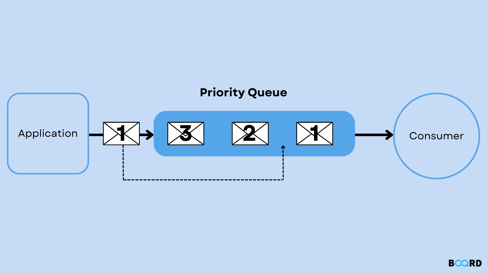

### Introduction to Priority Queue

A priority queue is an abstract data type that operates similarly to a regular queue or stack, but each element is assigned a priority. In a priority queue, elements are served based on their priority rather than the order in which they were added. This means that elements with higher priority are processed before those with lower priority.



### Priority Queue Operations

1. **Insert**: Add an element to the priority queue with a specified priority.
2. **Remove**: Remove and return the element with the highest priority.
3. **Peek**: Retrieve the element with the highest priority without removing it.
4. **isEmpty**: Check if the priority queue is empty.
5. **Size**: Get the number of elements in the priority queue.

### Pseudocode

#### Basic Operations

1. **Insert**:

    ```text
    function insert(priorityQueue, element, priority):
         priorityQueue.append((element, priority))
         sort(priorityQueue)   // Sort by priority
    ```

2. **Remove**:

    ```text
    function remove(priorityQueue):
         if isEmpty(priorityQueue):
              return "Priority Queue Underflow"
         return priorityQueue.pop(0) // Removes the element with highest priority
    ```

3. **Peek**:

    ```text
    function peek(priorityQueue):
         if isEmpty(priorityQueue):
              return "Priority Queue is empty"
         return priorityQueue[0] // Highest priority element
    ```

4. **isEmpty**:

    ```text
    function isEmpty(priorityQueue):
         return len(priorityQueue) == 0
    ```

5. **Size**:

    ```text
    function size(priorityQueue):
         return len(priorityQueue)
    ```

### Implementation in Python, C++, and Java

#### Python Implementation

```python
class PriorityQueue:
     def __init__(self):
          self.elements = []

     def insert(self, element, priority):
          self.elements.append((element, priority))
          self.elements.sort(key=lambda x: x[1])  # Sort by priority

     def remove(self):
          if self.is_empty():
                return "Priority Queue Underflow"
          return self.elements.pop(0)  # Highest priority element

     def peek(self):
          if self.is_empty():
                return "Priority Queue is empty"
          return self.elements[0]  # Highest priority element

     def is_empty(self):
          return len(self.elements) == 0

     def size(self):
          return len(self.elements)

# Example usage
pq = PriorityQueue()
pq.insert("Task 1", 2)
pq.insert("Task 2", 1)
print(pq.remove())  # Output: ("Task 2", 1)
print(pq.peek())    # Output: ("Task 1", 2)
print(pq.is_empty())  # Output: False
print(pq.size())    # Output: 1
```

#### C++ Implementation

```cpp
#include <iostream>
#include <vector>
#include <algorithm>

class PriorityQueue {
private:
     std::vector<std::pair<int, int>> elements; // Pair of (element, priority)

public:
     void insert(int element, int priority) {
          elements.push_back({element, priority});
          std::sort(elements.begin(), elements.end(), [](auto &a, auto &b) {
               return a.second < b.second; // Sort by priority
          });
     }

     std::pair<int, int> remove() {
          if (is_empty()) {
                std::cerr << "Priority Queue Underflow" << std::endl;
                return {-1, -1}; // Indicating underflow
          }
          std::pair<int, int> highestPriority = elements.front();
          elements.erase(elements.begin());
          return highestPriority;
     }

     std::pair<int, int> peek() {
          if (is_empty()) {
                std::cerr << "Priority Queue is empty" << std::endl;
                return {-1, -1}; // Indicating empty
          }
          return elements.front();
     }

     bool is_empty() {
          return elements.empty();
     }

     int size() {
          return elements.size();
     }
};

// Example usage
int main() {
     PriorityQueue pq;
     pq.insert(1, 2);
     pq.insert(2, 1);
     auto task = pq.remove();  // Output: (2, 1)
     std::cout << "Removed: " << task.first << " with priority: " << task.second << std::endl;
     task = pq.peek();         // Output: (1, 2)
     std::cout << "Next: " << task.first << " with priority: " << task.second << std::endl;
     std::cout << std::boolalpha << pq.is_empty() << std::endl; // Output: false
     std::cout << pq.size() << std::endl;   // Output: 1
     return 0;
}
```

#### Inbuilt `priority_queue` in C++

In C++, the Standard Template Library (STL) provides a built-in **`priority_queue`** class, which implements a max-heap by default. A `priority_queue` is a container adaptor, meaning it provides specific functionality on top of an existing container like `vector` or `deque`.

In a **max-heap** implementation, the highest priority element is the largest element, which is always at the top. The priority queue automatically sorts its elements based on their priorities.

##### Operations provided by the inbuilt `priority_queue`:

1. **push()**:  
   This function inserts an element into the priority queue. The element is automatically positioned according to its priority, which in the default case is its value (largest element has the highest priority). The time complexity for this operation is `O(log n)` as the insertion maintains the heap property.

   ```cpp
   pq.push(10);  // Inserts 10 into the priority queue
   ```
   
2. **pop()**:  
   This function removes the highest-priority element (i.e., the element at the top of the heap). After removal, the heap is adjusted to maintain the heap property. The time complexity for this operation is `O(log n)`.

   ```cpp
   pq.pop();  // Removes the highest priority element
   ```
   
3. **top()**:  
   This function returns the element with the highest priority in the queue (i.e., the largest element in a max-heap). It does not remove the element, allowing the user to peek at the maximum priority element. The time complexity for this operation is `O(1)`.

   ```cpp
   int highest = pq.top();  // Retrieves the highest priority element without removing it
   ```
   
4. **empty()**:  
   This function checks whether the priority queue is empty. It returns `true` if there are no elements, otherwise it returns `false`. The time complexity for this operation is `O(1)`.

   ```cpp
   bool isEmpty = pq.empty();  // Checks if the priority queue is empty
   ```
   
5. **size()**:  
   This function returns the number of elements in the priority queue. The time complexity for this operation is `O(1)`.

   ```cpp
   int count = pq.size();  // Returns the number of elements in the priority queue
   ```

   
```cpp
#include <iostream>
#include <queue>
using namespace std;
 
int main()
{
    int arr[7] = { 15, 3, 5, 7, 6, 12, 1};
 
    // defining priority queue
    priority_queue<int> pq;
 
    // pushing into priority queue
    for (int i = 0; i < arr.size(); i++) {
        pq.push(arr[i]);
    }
 
    // printing priority queue
    cout << "Priority Queue: ";
    while (!pq.empty()) {
        cout << pq.top() << ' '; // It will return highest element 
        pq.pop();  // poping into priority queue
    }
 
    return 0;
}
```

#### Java Implementation

```java
import java.util.ArrayList;
import java.util.Collections;
import java.util.Comparator;

public class PriorityQueue {
     private ArrayList<Pair> elements;

     public PriorityQueue() {
          elements = new ArrayList<>();
     }

     public void insert(int element, int priority) {
          elements.add(new Pair(element, priority));
          Collections.sort(elements, Comparator.comparingInt(pair -> pair.priority)); // Sort by priority
     }

     public Pair remove() {
          if (is_empty()) {
                System.out.println("Priority Queue Underflow");
                return null; // Indicating underflow
          }
          return elements.remove(0); // Remove highest priority
     }

     public Pair peek() {
          if (is_empty()) {
                System.out.println("Priority Queue is empty");
                return null; // Indicating empty
          }
          return elements.get(0); // Highest priority element
     }

     public boolean is_empty() {
          return elements.isEmpty();
     }

     public int size() {
          return elements.size();
     }

     // Pair class to hold element and priority
     private class Pair {
          int element;
          int priority;

          Pair(int element, int priority) {
               this.element = element;
               this.priority = priority;
          }
     }

     // Example usage
     public static void main(String[] args) {
          PriorityQueue pq = new PriorityQueue();
          pq.insert(1, 2);
          pq.insert(2, 1);
          Pair task = pq.remove();  // Output: Pair with element 2
          System.out.println("Removed: " + task.element + " with priority: " + task.priority);
          task = pq.peek();         // Output: Pair with element 1
          System.out.println("Next: " + task.element + " with priority: " + task.priority);
          System.out.println(pq.is_empty()); // Output: false
          System.out.println(pq.size());      // Output: 1
     }
}
```

### Complexity

- **Time Complexity**:

  - Insert: $O(n \log n)$ (due to sorting)
  - Remove: $O(n)$ (removing the first element)
  - Peek: $O(1)$
  - isEmpty: $O(1)$
  - Size: $O(1)$

- **Space Complexity**: $O(n)$, where $n$ is the number of elements in the priority queue.

### Example

Consider a priority queue with the following operations:

1. Insert Task 1 with priority 2
2. Insert Task 2 with priority 1
3. Remove the highest priority task
4. Peek at the highest priority task
5. Check if empty
6. Get size

**Operations**:

- Insert Task 1 (priority 2): Queue becomes [(Task 1, 2)]
- Insert Task 2 (priority 1): Queue becomes [(Task 2, 1), (Task 1, 2)]
- Remove: Removes Task 2 (priority 1), Queue becomes [(Task 1, 2)]
- Peek: Returns Task 1 (priority 2), Queue remains [(Task 1, 2)]
- isEmpty: Returns false
- Size: Returns 1

### Conclusion

A priority queue is a powerful data structure used in scenarios where elements need to be processed based on priority rather than order. It is commonly used in algorithms such as Dijkstra's shortest path algorithm, Huffman coding, and various scheduling algorithms. Understanding and implementing priority queues effectively can significantly improve the efficiency of your algorithms.
