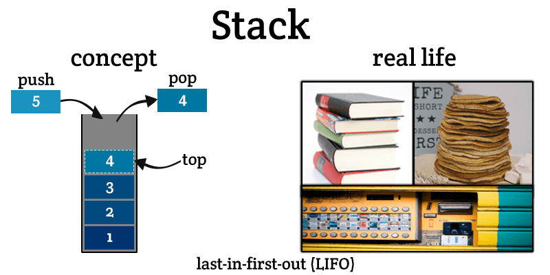

### Introduction to Stack

A **stack** is a linear data structure that follows the Last In First Out (LIFO) principle. This means that the last element added to the stack will be the first one to be removed. Think of a stack of plates; you add plates to the top and also remove plates from the top.

Stacks are widely used in various computing applications, including:

- **Function Call Management**: Keeping track of active subroutines in programming languages.
- **Expression Evaluation**: Parsing expressions in compilers.
- **Backtracking Algorithms**: Navigating through potential paths in maze-solving or puzzle games.
- **Undo Mechanisms**: Implementing undo features in text editors and other applications.



### Stack Operations

A stack typically supports the following operations:

1. **Push**: Add an element to the top of the stack.
2. **Pop**: Remove the element from the top of the stack.
3. **Peek (Top)**: Retrieve the element at the top of the stack without removing it.
4. **isEmpty**: Check if the stack is empty.
5. **isFull**: Check if the stack is full (applicable for stacks with a fixed size).
6. **Size**: Get the number of elements in the stack.

### Pseudocode

#### Basic Operations

1. **Push**:

   ```text
   function push(stack, element):
       if isFull(stack):
           return "Stack Overflow"
       stack.top = stack.top + 1
       stack.elements[stack.top] = element
   ```

2. **Pop**:

   ```text
   function pop(stack):
       if isEmpty(stack):
           return "Stack Underflow"
       element = stack.elements[stack.top]
       stack.top = stack.top - 1
       return element
   ```

3. **Peek (Top)**:

   ```text
   function peek(stack):
       if isEmpty(stack):
           return "Stack is empty"
       return stack.elements[stack.top]
   ```

4. **isEmpty**:

   ```text
   function isEmpty(stack):
       return stack.top == -1
   ```

5. **isFull**:

   ```text
   function isFull(stack):
       return stack.top == stack.size - 1
   ```

6. **Size**:

   ```text
   function size(stack):
       return stack.top + 1
   ```

### Implementation in Python, C++, and Java

#### Python Implementation

```python
class Stack:
    def __init__(self, size):
        self.size = size
        self.elements = [None] * size
        self.top = -1

    def push(self, element):
        if self.is_full():
            print("Stack Overflow")
            return
        self.top += 1
        self.elements[self.top] = element

    def pop(self):
        if self.is_empty():
            print("Stack Underflow")
            return None
        element = self.elements[self.top]
        self.top -= 1
        return element

    def peek(self):
        if self.is_empty():
            print("Stack is empty")
            return None
        return self.elements[self.top]

    def is_empty(self):
        return self.top == -1

    def is_full(self):
        return self.top == self.size - 1

    def size_of_stack(self):
        return self.top + 1

# Example usage
stack = Stack(5)
stack.push(10)
stack.push(20)
print(stack.pop())    # Output: 20
print(stack.peek())   # Output: 10
print(stack.is_empty())  # Output: False
print(stack.size_of_stack())  # Output: 1
```

#### C++ Implementation

```cpp
#include <iostream>
using namespace std;

class Stack {
private:
    int *elements;
    int top;
    int size;

public:
    Stack(int size) {
        this->size = size;
        elements = new int[size];
        top = -1;
    }

    void push(int element) {
        if (is_full()) {
            cout << "Stack Overflow" << endl;
            return;
        }
        elements[++top] = element;
    }

    int pop() {
        if (is_empty()) {
            cout << "Stack Underflow" << endl;
            return -1; // Indicating underflow
        }
        return elements[top--];
    }

    int peek() {
        if (is_empty()) {
            cout << "Stack is empty" << endl;
            return -1; // Indicating empty
        }
        return elements[top];
    }

    bool is_empty() {
        return top == -1;
    }

    bool is_full() {
        return top == size - 1;
    }

    int size_of_stack() {
        return top + 1;
    }

    ~Stack() {
        delete[] elements;
    }
};

// Example usage
int main() {
    Stack stack(5);
    stack.push(10);
    stack.push(20);
    cout << stack.pop() << endl;     // Output: 20
    cout << stack.peek() << endl;    // Output: 10
    cout << boolalpha << stack.is_empty() << endl; // Output: false
    cout << stack.size_of_stack() << endl; // Output: 1
    return 0;
}
```

#### Java Implementation

```java
public class Stack {
    private int[] elements;
    private int top;
    private int size;

    public Stack(int size) {
        this.size = size;
        elements = new int[size];
        top = -1;
    }

    public void push(int element) {
        if (is_full()) {
            System.out.println("Stack Overflow");
            return;
        }
        elements[++top] = element;
    }

    public int pop() {
        if (is_empty()) {
            System.out.println("Stack Underflow");
            return -1; // Indicating underflow
        }
        return elements[top--];
    }

    public int peek() {
        if (is_empty()) {
            System.out.println("Stack is empty");
            return -1; // Indicating empty
        }
        return elements[top];
    }

    public boolean is_empty() {
        return top == -1;
    }

    public boolean is_full() {
        return top == size - 1;
    }

    public int size_of_stack() {
        return top + 1;
    }

    // Example usage
    public static void main(String[] args) {
        Stack stack = new Stack(5);
        stack.push(10);
        stack.push(20);
        System.out.println(stack.pop());    // Output: 20
        System.out.println(stack.peek());   // Output: 10
        System.out.println(stack.is_empty()); // Output: false
        System.out.println(stack.size_of_stack()); // Output: 1
    }
}
```

### Complexity

- **Time Complexity**:

  - Push: $O(1)$
  - Pop: $O(1)$
  - Peek: $O(1)$
  - isEmpty: $O(1)$
  - isFull: $O(1)$
  - Size: $O(1)$

- **Space Complexity**: $O(n)$, where $n$ is the number of elements that can be stored in the stack.

### Example

Consider a stack with the following operations:

1. Push 10
2. Push 20
3. Pop
4. Peek
5. Check if empty
6. Get size

**Operations**:

- **Push 10**: Stack becomes [10, _, _, _, _]
- **Push 20**: Stack becomes [10, 20, _, _, _]
- **Pop**: Removes 20, Stack becomes [10, _, _, _, _]
- **Peek**: Returns 10, Stack remains [10, _, _, _, _]
- **isEmpty**: Returns false
- **Size**: Returns 1

### Conclusion

A stack is a fundamental data structure that is simple yet powerful, enabling efficient management of data with its LIFO behavior. It plays a critical role in various computing scenarios, such as managing function calls, parsing expressions, and implementing undo mechanisms. Understanding and implementing stacks is essential for solving a wide range of algorithmic problems and building efficient software systems.
