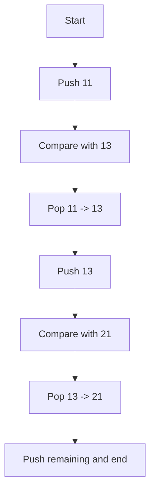

# Next Greater Element (NGE) Algorithm

This documentation explains how to find the Next Greater Element (NGE) for each element in an array using a stack-based approach in C++.

## Algorithm Overview
The Next Greater Element algorithm finds the next greater element for each element in an array. For an element, the NGE is the first greater element on its right in the array.

### Key Points
- Uses a stack to keep track of elements for which the NGE is not yet found.
- Iterates over the array elements and prints NGE pairs.
- For elements without an NGE, outputs `-1`.

## Code Implementation
Here is the C++ code for the NGE algorithm:

```cpp
#include <bits/stdc++.h>
using namespace std;

void printNGE(int arr[], int n) {
    stack<int> s;
    s.push(arr[0]);

    for (int i = 1; i < n; i++) {
        while (!s.empty() && s.top() < arr[i]) {
            cout << s.top() << " --> " << arr[i] << endl;
            s.pop();
        }
        s.push(arr[i]);
    }

    while (!s.empty()) {
        cout << s.top() << " --> " << -1 << endl;
        s.pop();
    }
}

int main() {
    int arr[] = { 11, 13, 21, 3 };
    int n = sizeof(arr) / sizeof(arr[0]);
    printNGE(arr, n);
    return 0;
}
```

## Explanation
- **Stack**: Used to store elements without their NGE identified.
- **Logic**:
  - For each element, check if it is the NGE for elements in the stack.
  - If it is, pop the stack and print the pair.
  - Otherwise, push the element to the stack.
- **Final Elements**: After iterating, elements left in the stack have no NGE, so they are paired with `-1`.

## Output
For the input `{11, 13, 21, 3}`, the output will be:

```
11 --> 13
13 --> 21
21 --> -1
3 --> -1
```

## Complexity
- **Time Complexity**: O(n), where n is the number of elements in the array.
- **Space Complexity**: O(n) for the stack.

## Diagrams and Visuals with Mermaid
To visualize the process, consider the following stack transitions:



