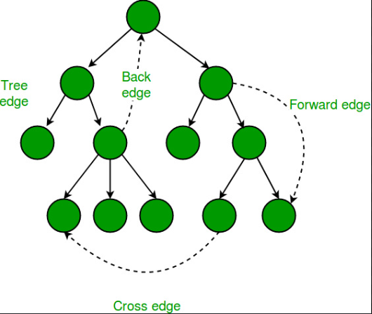

# Tarjan's Algorithm for Strongly Connected Components
## Overview
Tarjan's Algorithm is an efficient DFS-based algorithm used to find all Strongly Connected Components (SCCs) in a directed graph. A strongly connected component of a directed graph is a maximal subset of vertices where each vertex is reachable from every other vertex in the subset.

## Use Cases
- Optimizing Network Communication: Identifying components in network design where nodes (e.g., servers) can communicate both ways.
- Dependency Analysis: Useful in scenarios where components or modules have dependencies on one another.
- Deadlock Detection: In an operating system, SCCs can be used to identify deadlock cycles in a wait-for graph.

## Algorithm Details
**Steps**
1. Perform a Depth First Search (DFS) traversal on the graph.
2. Track discovery and low-link values for each node:
- Discovery Time: Order in which a node is visited.
- Low-Link Value: The lowest discovery time reachable from that node.
3. Nodes are pushed to a stack upon their initial discovery and are considered part of an SCC until all reachable nodes are processed.
4. After visiting all nodes from a given node, if the node is the root of an SCC (where its discovery time equals its low-link value), all nodes in the SCC are popped from the stack.

**Time Complexity**
- O(V + E) where V is the number of vertices and E is the number of edges. This efficiency arises because each node and edge is visited only once.




## Pseudocode

```C
function tarjansSCC(graph):
    Initialize discovery and low arrays to -1
    Initialize an empty stack and set index = 0
    For each vertex v in graph:
        if v is not visited:
            DFS(v)
    end function

function DFS(v):
    Set discovery[v] = low[v] = index; index++
    Push v to the stack
    For each neighbor u of v:
        if u is not visited:
            DFS(u)
            Set low[v] = min(low[v], low[u])
        else if u is in the stack:
            Set low[v] = min(low[v], discovery[u])
    end loop

    if discovery[v] == low[v]:
        While stack top is not v:
            Pop vertex from stack and add to current SCC
        Add v to SCC
    end if
end function
```

## Example Code in C++
Here’s a C++ implementation of Tarjan's Algorithm:

```Cpp
#include <iostream>
#include <vector>
#include <stack>
using namespace std;

class TarjansAlgorithm {
private:
    vector<vector<int>> adj;
    vector<int> discovery, low;
    stack<int> stk;
    vector<bool> onStack;
    int time = 0, V;

    void DFS(int v) {
        discovery[v] = low[v] = ++time;
        stk.push(v);
        onStack[v] = true;

        for (int u : adj[v]) {
            if (discovery[u] == -1) {  // u is not visited
                DFS(u);
                low[v] = min(low[v], low[u]);
            } else if (onStack[u]) {
                low[v] = min(low[v], discovery[u]);
            }
        }

        if (discovery[v] == low[v]) {
            cout << "SCC: ";
            while (true) {
                int u = stk.top(); stk.pop();
                onStack[u] = false;
                cout << u << " ";
                if (u == v) break;
            }
            cout << endl;
        }
    }

public:
    TarjansAlgorithm(int vertices) : V(vertices), adj(vertices), discovery(vertices, -1), low(vertices, -1), onStack(vertices, false) {}

    void addEdge(int v, int u) {
        adj[v].push_back(u);
    }

    void findSCCs() {
        for (int i = 0; i < V; ++i)
            if (discovery[i] == -1)
                DFS(i);
    }
};

int main() {
    TarjansAlgorithm g(5);
    g.addEdge(1, 0);
    g.addEdge(0, 2);
    g.addEdge(2, 1);
    g.addEdge(0, 3);
    g.addEdge(3, 4);
    cout << "Strongly Connected Components:\n";
    g.findSCCs();
    return 0;
}
```

## Explanation of the Code
1. DFS Traversal: The code initiates a DFS for each unvisited node, updating discovery and low values.
2. Stack Operations: Nodes are added to the stack when first visited. If a node completes processing and is the root of an SCC, nodes are popped from the stack until the root node is reached.
3. Printing SCCs: When an SCC is identified (where discovery[v] == low[v]), the SCC is printed.

## Example Walkthrough
Consider a graph with vertices and edges as shown:

1. Vertices are visited according to their DFS discovery time.
2. Each SCC is printed as it's identified when discovery == low for that root node.

### Diagram of SCCs
Below is an example directed graph that Tarjan’s Algorithm would traverse:

- Nodes: 0, 1, 2, 3, 4
- Edges: 1 -> 0, 0 -> 2, 2 -> 1, 0 -> 3, 3 -> 4

For this graph, SCCs are:
- SCC 1: {0, 1, 2}
- SCC 2: {3}
- SCC 3: {4}

## Real-World Example
Consider using Tarjan's Algorithm in a call graph of a large software application to identify isolated functional units. Each SCC in this call graph could represent a module that can operate independently or an area where cyclic dependencies might be managed.
