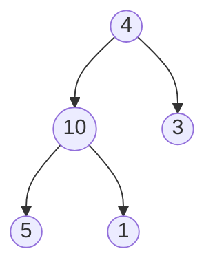
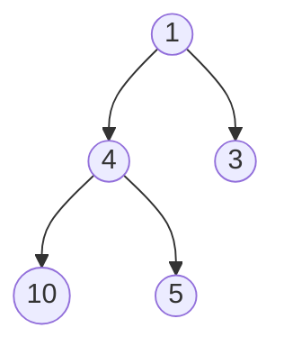

# Heap Tree Algorithm

## Overview
A Heap Tree is a specialized binary tree-based data structure that satisfies the heap property. It is widely used in implementing priority queues and for heap sort algorithms. The heap property ensures that the parent node is always greater than or equal to (in a max-heap) or less than or equal to (in a min-heap) its child nodes.

## Introduction
A Heap Tree can be either a max-heap or a min-heap:
- **Max-Heap**: The value of each node is greater than or equal to the values of its children.
- **Min-Heap**: The value of each node is less than or equal to the values of its children.

Heap Trees are typically implemented using arrays for efficient indexing and manipulation.

## Characteristics of Heap Tree Algorithm
- **Efficient Priority Queue Operations**: Supports efficient insertion, deletion, and retrieval of the highest (or lowest) priority element.
- **Complete Binary Tree**: Always maintains a complete binary tree structure, ensuring balanced tree properties.
- **Heap Property**: Ensures that the tree satisfies the heap property, making it suitable for priority-based operations.

## How the Heap Tree Algorithm Works
1. **Insertion**:
   - Add the new element at the end of the tree (or array).
   - Restore the heap property by "bubbling up" the new element to its correct position.

2. **Deletion**:
   - Remove the root element (highest or lowest priority).
   - Replace the root with the last element in the tree (or array).
   - Restore the heap property by "bubbling down" the replaced element to its correct position.

3. **Heapify**:
   - Convert an arbitrary array into a heap by iteratively applying the heap property from the bottom up.

## Step-by-Step Execution

Here’s an example of how the Heap Tree Algorithm works on a small dataset:

### Max-Heap Example

1. **Initial Array**: [4, 10, 3, 5, 1]
2. **Build Max-Heap**:
   - Start from the last non-leaf node and apply the heap property.
   - Resulting Max-Heap: [10, 5, 3, 4, 1]

### Min-Heap Example

1. **Initial Array**: [4, 10, 3, 5, 1]
2. **Build Min-Heap**:
   - Start from the last non-leaf node and apply the heap property.
   - Resulting Min-Heap: [1, 4, 3, 10, 5]

## Execution Steps
1. **Insertion**:
   - Add the element to the end of the array.
   - Bubble up to maintain the heap property.

2. **Deletion**:
   - Remove the root element.
   - Replace the root with the last element.
   - Bubble down to maintain the heap property.

## Time Complexity
- Insertion: **O(log n)** due to the bubbling up process.
- Deletion: **O(log n)** due to the bubbling down process.
- Building a Heap: **O(n)** using the bottom-up approach.

## Applications
- **Priority Queues**: Efficiently manage and retrieve elements based on priority.
- **Heap Sort**: An efficient comparison-based sorting algorithm.
- **Graph Algorithms**: Used in algorithms like Dijkstra's shortest path and Prim's minimum spanning tree.

## Pseudocode

1. **Insert an element**:
   - Add the element to the end of the array.
   - Bubble up to maintain the heap property.

2. **Delete the root**:
   - Replace the root with the last element.
   - Bubble down to maintain the heap property.

3. **Heapify an array**:
   - Start from the last non-leaf node and apply the heap property.

## Advantages of Heap Tree Algorithm
- **Efficient Priority Management**: Ideal for applications requiring dynamic priority management.
- **Balanced Structure**: Maintains a complete binary tree, ensuring balanced operations.
- **Versatile**: Can be used for both max-heap and min-heap implementations.

## Limitations
- **Not Suitable for Search Operations**: Inefficient for searching arbitrary elements compared to balanced search trees.
- **Fixed Structure**: Requires a complete binary tree structure, limiting flexibility.

# Heap Tree vs. Binary Search Tree

| Feature         | Heap Tree                                                               | Binary Search Tree                                        |
|-----------------|-------------------------------------------------------------------------|-----------------------------------------------------------|
| **Data Storage** | Stores elements to satisfy the heap property                           | Stores elements to satisfy the binary search property      |
| **Priority Operations** | Efficient insertion, deletion, and retrieval of priority elements | Efficient search, insertion, and deletion of arbitrary elements |
| **Time Complexity** | O(log n) for insertion and deletion                                  | O(log n) for search, insertion, and deletion (balanced)    |
| **Use Case**     | Used for priority queues and heap sort                                 | Used for dynamic set operations and searching              |

## Conclusion

The Heap Tree Algorithm is a fundamental data structure for efficient priority queue operations and sorting. Its balanced structure and heap property make it essential for applications in priority management and sorting algorithms. Understanding Heap Trees is crucial for anyone working in data structures and algorithm design.