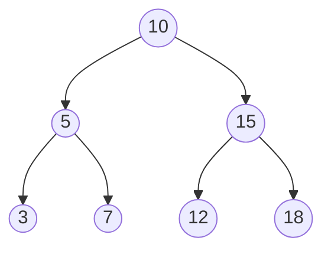

# Binary Tree Algorithm

## Overview
A Binary Tree is a hierarchical data structure in which each node has at most two children, referred to as the left child and the right child. It is widely used for various applications, including search algorithms, expression parsing, and organizing data.

## Introduction
A Binary Tree can take various forms, including:
- **Full Binary Tree**: Every node has either 0 or 2 children.
- **Complete Binary Tree**: All levels are fully filled except possibly the last level, which is filled from left to right.
- **Perfect Binary Tree**: All internal nodes have two children and all leaf nodes are at the same level.
- **Skewed Binary Tree**: All nodes have only one child, either left or right.

## Characteristics of Binary Tree Algorithm
- **Hierarchical Structure**: Organizes data in a hierarchical manner.
- **Efficient Traversals**: Supports various tree traversal methods (preorder, inorder, postorder).
- **Flexible Structure**: Can represent a variety of structures like binary search trees, heaps, etc.

## How the Binary Tree Algorithm Works
1. **Insertion**:
   - New nodes are typically added in level order, starting from the root.
   - Can also follow specific rules based on the type of binary tree (e.g., BST).

2. **Traversal**:
   - Visit nodes in a specific order (e.g., inorder, preorder, postorder).

3. **Deletion**:
   - Removing a node while maintaining the tree structure.
   - Specific rules apply based on whether the node is a leaf, has one child, or has two children.

## Step-by-Step Execution

Here’s an example of how the Binary Tree Algorithm works on a small dataset:

### Example

1. **Initial Insertion**:
   - Insert elements: 10, 5, 15, 3, 7, 12, 18



### Traversal Orders

- **Preorder (Root, Left, Right)**: 10, 5, 3, 7, 15, 12, 18
- **Inorder (Left, Root, Right)**: 3, 5, 7, 10, 12, 15, 18
- **Postorder (Left, Right, Root)**: 3, 7, 5, 12, 18, 15, 10

## Execution Steps
1. **Insertion**:
   - Add the element to the appropriate position based on the tree rules.
  
2. **Traversal**:
   - Implement algorithms for various tree traversal methods.

3. **Deletion**:
   - Identify the node to be deleted and adjust pointers accordingly.

## Time Complexity
- Insertion: **O(log n)** for balanced trees (like BST), **O(n)** for skewed trees.
- Traversal: **O(n)** for all types of traversals since each node is visited once.
- Deletion: **O(log n)** for balanced trees, **O(n)** for skewed trees.

## Applications
- **Binary Search Trees (BST)**: Efficiently manage dynamic datasets for searching, insertion, and deletion.
- **Expression Trees**: Used to represent and evaluate expressions in compilers.
- **Huffman Coding Trees**: Used in data compression algorithms.

## Pseudocode

1. **Insert an element**:
   - Create a new node.
   - Traverse to find the correct position based on the type of binary tree.

2. **Delete a node**:
   - Find the node to be deleted.
   - Adjust pointers based on whether the node is a leaf, has one child, or two children.

3. **Traverse the tree**:
   - Implement the desired traversal method (preorder, inorder, postorder).

## Advantages of Binary Tree Algorithm
- **Hierarchical Representation**: Naturally represents hierarchical relationships.
- **Flexible**: Can be modified to create specialized trees (e.g., BST, AVL, Red-Black).
- **Versatile Traversal**: Multiple traversal methods allow flexibility in data access.

## Limitations
- **Not Always Balanced**: Unbalanced trees can lead to inefficient operations (O(n)).
- **Memory Overhead**: Each node requires additional memory for pointers to children.

# Binary Tree vs. Binary Search Tree

| Feature              | Binary Tree                                           | Binary Search Tree                                   |
|----------------------|------------------------------------------------------|-----------------------------------------------------|
| **Structure**        | Each node has at most two children                   | Each node follows the binary search property        |
| **Insertion**        | Can be arbitrary                                     | Follows specific rules based on key comparison      |
| **Traversal**        | Supports various traversal methods                   | Supports all binary tree traversal methods           |
| **Time Complexity**  | O(n) for unbalanced trees; O(log n) for balanced trees | O(log n) for search, insertion, and deletion (balanced) |
| **Use Case**         | General representation of data                       | Efficient searching and sorted data operations       |

## Conclusion

The Binary Tree Algorithm is a fundamental data structure used in various applications ranging from searching and sorting to hierarchical data representation. Understanding Binary Trees is crucial for anyone working in data structures and algorithm design.

```

