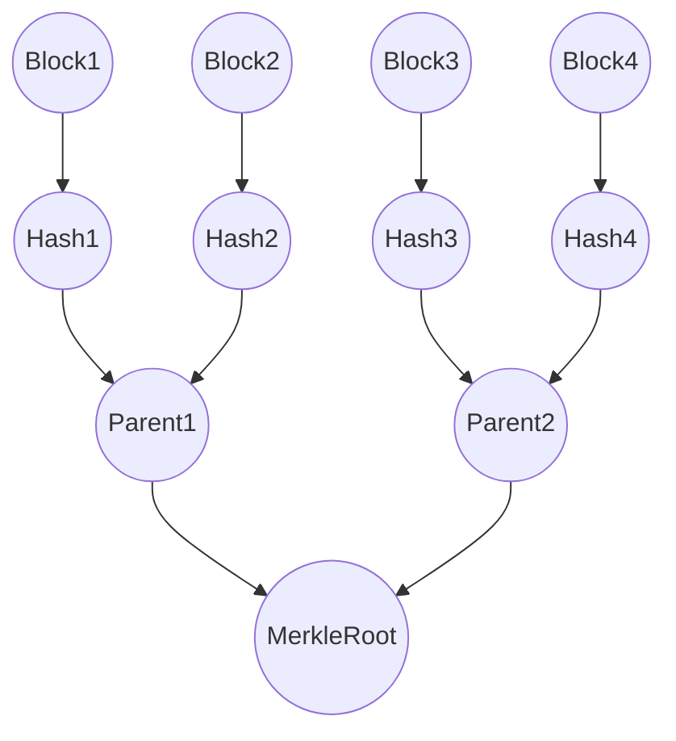

# Merkle Tree Algorithm

## Overview
Merkle Tree is a cryptographic data structure used to ensure the integrity and consistency of data in systems such as blockchain, distributed storage, and peer-to-peer networks. By using a tree of hash functions, Merkle Trees allow efficient and secure verification of large data sets.

## Introduction
A Merkle Tree, also known as a hash tree, is a binary tree where each leaf node contains a hash of data blocks, and each non-leaf node contains a hash of its child nodes. The root node of the Merkle Tree is called the Merkle Root and provides a unique fingerprint of the entire dataset. Merkle Trees enable fast verification of data integrity without requiring access to the entire dataset.

## Characteristics of Merkle Tree Algorithm
- **Efficient Verification**: Merkle Trees allow efficient verification of whether a data block belongs to a dataset by providing proof with logarithmic complexity.
- **Tamper Resistance**: Any modification to the underlying data changes the Merkle Root, ensuring tamper-proof data integrity.
- **Scalability**: Merkle Trees scale well with increasing data size, enabling their use in distributed systems and large datasets.

## How the Merkle Tree Algorithm Works
1. **Initialization**:
   - Divide the dataset into smaller blocks of data.
   - Hash each block using a cryptographic hash function (e.g., SHA-256) to create leaf nodes.

2. **Building the Tree**:
 give   - Pair the leaf nodes and compute the hash of each pair to form the parent nodes.
   - Continue pairing and hashing the parent nodes until only one node (Merkle Root) remains.

3. **Verification Process**:
   - To verify the inclusion of a specific data block, provide the hashes of sibling nodes along the path from the leaf node to the root.
   - Recompute the hashes up the tree to ensure the resulting Merkle Root matches the original root.

## Step-by-Step Execution

Here’s an example of how the Merkle Tree Algorithm works on a small dataset of four blocks:

## Execution Steps
1. **Hash each block**: 
   - `H1 = Hash(Block1)`
   - `H2 = Hash(Block2)`
   - `H3 = Hash(Block3)`
   - `H4 = Hash(Block4)`
   
2. **Combine hashes**: 
   - `P1 = Hash(H1 + H2)`
   - `P2 = Hash(H3 + H4)`
   
3. **Compute the Merkle Root**: 
   - `MerkleRoot = Hash(P1 + P2)`

## Time Complexity
- Constructing a Merkle Tree: **O(n)**, where **n** is the number of leaf nodes (data blocks).
- Verifying the inclusion of a block: **O(log n)** comparisons due to the binary structure.

## Applications
- **Blockchain Technology**: Ensures transaction integrity.
- **Peer-to-Peer Networks**: Verifies file integrity in distributed systems like BitTorrent.
- **Data Storage Systems**: Detects data corruption in distributed storage.
- **Version Control Systems**: Tracks changes in file versions across distributed repositories.
# Merkle Tree Algorithm

## Pseudocode

1. **Divide the dataset into blocks** and hash each block to create leaf nodes.
2. **While more than one node exists**:
   - a. Pair adjacent nodes and hash their concatenated values.
   - b. Form a parent node with the resulting hash.
3. The final node is the **Merkle Root**.
4. **To verify a block**:
   - a. Obtain the hash path from the leaf to the root.
   - b. Recompute hashes using sibling nodes and check if the Merkle Root matches.

## Advantages of Merkle Tree Algorithm
- **Efficient Data Verification**: Minimal data is required for verification, making it scalable.
- **Tamper Detection**: Any change to the data alters the Merkle Root, ensuring data integrity.
- **Scalability**: Ideal for large datasets due to its logarithmic structure.

## Limitations
- **Hash Collisions**: Though unlikely, hash functions may produce the same hash for different data, compromising integrity.
- **Fixed Data Size**: Works well with fixed-size blocks; varying block sizes require extra processing.

# Merkle Tree vs. Binary Tree

| Feature         | Merkle Tree                                                               | Binary Tree                                                |
|-----------------|---------------------------------------------------------------------------|------------------------------------------------------------|
| **Data Storage** | Stores hashes in non-leaf nodes and data in leaf nodes                   | Stores actual data in both leaf and non-leaf nodes          |
| **Verification** | Efficient cryptographic verification using hash paths                    | Does not provide cryptographic verification                 |
| **Time Complexity** | O(log n) for verification                                              | O(n) for searching or traversing the tree                   |
| **Use Case**     | Used for verifying data integrity in large datasets                      | Used for general data storage and searching tasks           |

## Conclusion

The Merkle Tree Algorithm is a key cryptographic tool for ensuring data integrity in distributed systems. Its scalability and efficiency make it essential for applications in blockchain, distributed storage, and data verification. Understanding Merkle Trees is crucial for anyone working in modern cryptographic or distributed technologies.

