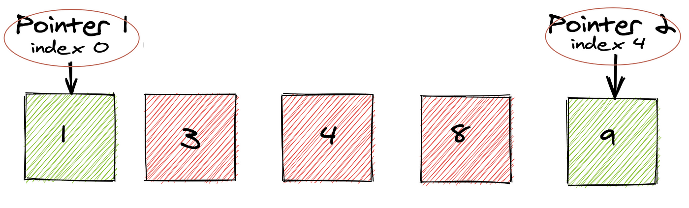

## Two Pointers Algorithm



### Definition:
The **Two Pointers** technique is a widely used algorithmic pattern that utilizes two pointers (or indices) to traverse a data structure, usually an array or a string. This approach is particularly useful for problems that require searching, comparing, or modifying elements based on specific conditions.

### Characteristics:

- **Pointer Definition**:
  - Two pointers can start at different positions in the data structure and move towards each other (or in the same direction) based on the problem requirements.

- **Efficiency**:
  - The Two Pointers technique helps to reduce the time complexity by avoiding nested loops, which can lead to inefficient solutions. By incrementing or decrementing pointers based on certain conditions, we can often achieve a linear time complexity.

- **Types of Two Pointers**:
  - **Moving Inward**: Both pointers move towards each other (e.g., finding a pair that sums to a target).
  - **Moving Outward**: Both pointers move in the same direction (e.g., finding subarrays or substrings).

### Common Use Cases:

- **Finding pairs in an array that sum to a target**.
- **Reversing a string**.
- **Merging two sorted arrays**.
- **Finding the longest substring with at most K distinct characters**.

### Time Complexity:
- **O(n)**, where n is the size of the array or string. The two pointers ensure that we traverse the data structure only once.

### Space Complexity:
- **O(1)**, as the approach typically uses a constant amount of extra space regardless of the input size.

### C++ Implementation (Finding a Pair with a Given Sum):

Let's take the example of finding two numbers in a sorted array that add up to a target sum.

```cpp
#include <iostream>
#include <vector>
using namespace std;

pair<int, int> findPairWithSum(const vector<int>& arr, int target) {
    int left = 0;
    int right = arr.size() - 1;

    while (left < right) {
        int current_sum = arr[left] + arr[right];

        if (current_sum == target) {
            return {arr[left], arr[right]};  // Pair found
        } else if (current_sum < target) {
            left++;  // Move left pointer right to increase sum
        } else {
            right--;  // Move right pointer left to decrease sum
        }
    }

    return {-1, -1};  // No pair found
}

int main() {
    vector<int> arr = {1, 2, 3, 4, 6};
    int target = 5;

    pair<int, int> result = findPairWithSum(arr, target);
    if (result.first != -1) {
        cout << "Pair found: " << result.first << ", " << result.second << endl;
    } else {
        cout << "No pair found." << endl;
    }

    return 0;
}
``` 

### Explanation:
In this example, the `while` loop continues until the two pointers meet.  
The sum of the elements at the two pointers is compared to the target. If they match, the pair is returned. If the current sum is less than the target, the left pointer is moved to the right to increase the sum. If the current sum is greater than the target, the right pointer is moved to the left to decrease the sum.  
This ensures that we check each pair only once, resulting in an overall time complexity of **O(n)**.

### Summary:
The Two Pointers technique is a versatile approach that optimizes many problems involving arrays and strings. By leveraging two pointers, we can reduce the time complexity from **O(n²)** (for nested loops) to **O(n)**, making our solutions more efficient and scalable.
