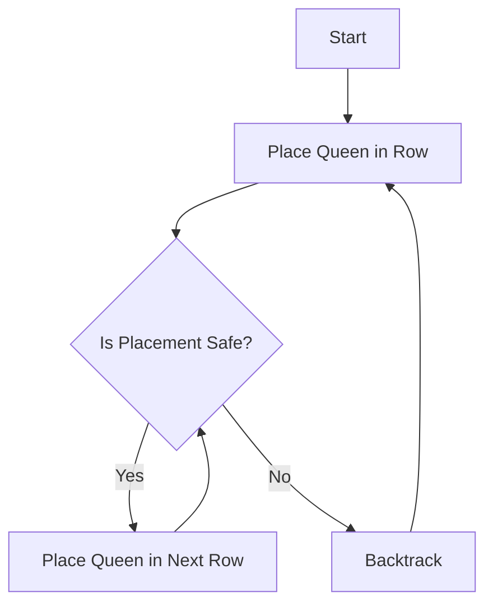

# N-Queens Algorithm

## Introduction
The N-Queens problem is a classic example of constraint satisfaction problems and explores ways to place `n` queens on an `n×n` chessboard such that no two queens can attack each other. This challenge is often solved using backtracking techniques and has various applications in algorithm design and artificial intelligence.

### Problem Statement

The goal is to place `n` queens on an `n×n` chessboard so that:
- No two queens are in the same row, column, or diagonal.

### Approach
Backtracking builds the solution step-by-step, eliminating configurations that violate constraints.

### Algorithm
1. **Place Queen in Row**: Place queens one by one in different rows, beginning with the leftmost column.
2. **Check Safety**: For each cell in the current row, check if placing the queen will not conflict with previously placed queens.
3. **Recursive Backtracking**: If a placement is safe, proceed to place the next queen in the following row.
4. **Backtrack**: If placing a queen in a column leads to no solution, remove the queen and try the next cell in the row.

### Python Code Implementation

```python
# Function to check if a queen can be placed on the board at [row][col]
def is_safe(board, row, col, n):
    # Checking the left side of the row
    for i in range(col):
        if board[row][i] == 1:
            return False
    
    # Checking upper diagonal on the left side
    for i, j in zip(range(row, -1, -1), range(col, -1, -1)):
        if board[i][j] == 1:
            return False

    # Checking lower diagonal on the left side
    for i, j in zip(range(row, n), range(col, -1, -1)):
        if board[i][j] == 1:
            return False

    return True

# Function to solve N-Queens using backtracking
def solve_n_queens(board, col, n):
    # If all queens are placed, return True
    if col >= n:
        return True
    
    # Try placing a queen in each row for this column
    for i in range(n):
        # Check if it's safe to place the queen
        if is_safe(board, i, col, n):
            # Place the queen
            board[i][col] = 1

            # Recur to place the rest of the queens
            if solve_n_queens(board, col + 1, n):
                return True
            
            # If placing queen at board[i][col] doesn't lead to a solution, remove queen (backtrack)
            board[i][col] = 0

    return False

# Function to initialize the board and call solve_n_queens
def n_queens(n):
    # Initialize an n x n chessboard with all positions set to 0
    board = [[0 for _ in range(n)] for _ in range(n)]
    # Attempt to solve the N-Queens problem
    if solve_n_queens(board, 0, n):
        # If solution exists, print the board
        for row in board:
            print(row)
    else:
        # If no solution exists, print message
        print("No solution exists")

# Driver code to test the above functions
n = int(input("Enter the number of queens (and board size): "))
n_queens(n)

```

## Explanation of Functions
- `is_safe(board, row, col, n)`: Checks if it is safe to place a queen at position `[row][col]` by ensuring no other queens threaten the position from the left side, upper-left diagonal, or lower-left diagonal.
- `solve_n_queens(board, col, n)`: Solves the problem by placing queens one column at a time. If placing a queen in a specific cell doesn’t lead to a solution, it backtracks.
- `n_queens(n)`: Initializes the board and starts the recursive process by calling solve_n_queens. If a solution is found, it prints the board configuration; otherwise, it outputs that no solution exists.
  
### Complexity
- **Time Complexity:** The time complexity is O(N!) due to the combinatorial nature of queen placements.
- **Space Complexity:** The space complexity is 𝑂(N<sup>2</sup>) because an n×n board is used to store the board configuration.

### Example Walkthrough
For a 4x4 board, the algorithm would place the queens row by row, backtracking as necessary until it finds a valid solution:

1. **Initial Placement:** The algorithm places the first queen in the top-left cell.
2. **Row-by-Row Backtracking:** As it tries to place each subsequent queen, it checks for safety, backtracks when conflicts arise, and adjusts placements until a valid configuration is found.

### Visual Representation with Mermaid Diagram
Here's a conceptual flow of the backtracking process in the N-Queens algorithm:


**Note: This algorithm is adapted from GeeksforGeeks.**
