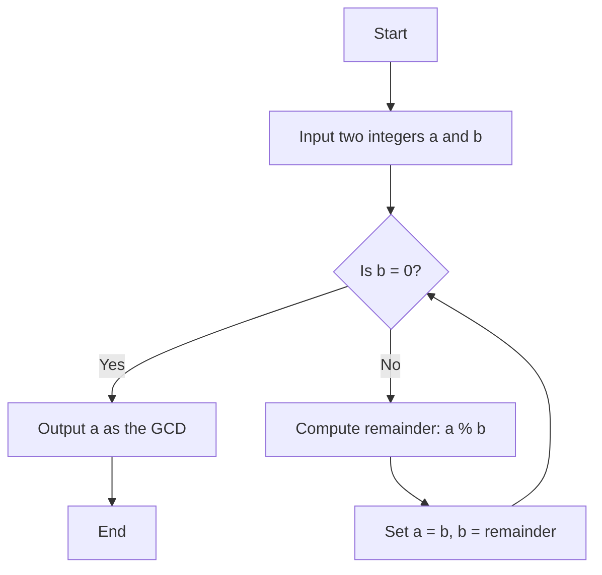

# Euclidean Algorithm

The Euclidean Algorithm is an efficient method for finding the Greatest Common Divisor (GCD) of two integers. It uses the principle that the GCD of two numbers does not change if the larger number is replaced by its remainder when divided by the smaller number.

## Steps to Implement
1. Divide the larger number by the smaller number and find the remainder.
2. Replace the larger number with the smaller number and the smaller number with the remainder.
3. Repeat until the remainder is 0. The non-zero remainder is the GCD.

## Code Examples

### C++ Implementation

```cpp
#include <iostream>
using namespace std;

int gcd(int a, int b) {
    while (b != 0) {
        int remainder = a % b;
        a = b;
        b = remainder;
    }
    return a;
}

int main() {
    int a, b;
    cout << "Enter two integers: ";
    cin >> a >> b;
    cout << "GCD of " << a << " and " << b << " is: " << gcd(a, b) << endl;
    return 0;
}
```

### Python Implementation

```python
def gcd(a, b):
    while b != 0:
        a, b = b, a % b
    return a

if __name__ == "__main__":
    a = int(input("Enter the first integer: "))
    b = int(input("Enter the second integer: "))
    print(f"GCD of {a} and {b} is: {gcd(a, b)}")
```

## Example Walkthrough

### Example 1: GCD of 56 and 98
1. $ 98 \mod 56 = 42 $
2. $ 56 \mod 42 = 14 $
3. $ 42 \mod 14 = 0 $

$ \text{GCD} = 14 $

### Example 2: GCD of 101 and 103
1. $ 103 \mod 101 = 2 $
2. $ 101 \mod 2 = 1 $
3. $ 2 \mod 1 = 0 $

$ \text{GCD} = 1 $

## Applications and Use Cases
- **Simplifying Fractions**: Reducing fractions to their simplest form.
- **Cryptography**: Used in algorithms like RSA for key generation.
- **Divisibility Problems**: Essential in modular arithmetic and number theory.

## Math Representation

$ a = b \times q + r $

where $ q $ is the quotient and $ r $    is the remainder.

## Diagrams 



## Conclusion
The Euclidean Algorithm is a fundamental technique in number theory for efficiently finding the Greatest Common Divisor (GCD) of two integers. By repeatedly applying the division and remainder operation, it significantly reduces the problem size, making it an optimal solution for GCD calculations. 

This algorithm not only forms the basis for many mathematical and computational applications, such as simplifying fractions and cryptographic algorithms, but it also introduces important concepts in algorithm design like iteration and efficiency. Understanding and implementing the Euclidean Algorithm helps build a solid foundation in number theory and algorithmic thinking.
