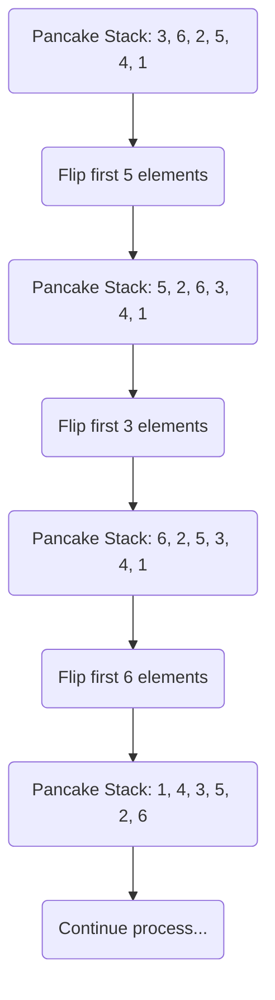

# Pancake Sorting Algorithm

## Overview
Pancake sorting is a sorting algorithm in which the only allowed operation is to reverse the elements of a prefix of the array. The goal is to sort the array using a minimal number of prefix reversals. This problem is a classic example of a **sorting** algorithm that limits the available operations.

## Introduction
In **Pancake Sorting**, we are given a stack of pancakes of varying sizes and we want to sort them in order of size, with the largest pancake at the bottom and the smallest pancake on top. However, the only allowed operation is a **flip**, which reverses the order of the top `k` pancakes in the stack. The algorithm aims to sort the pancakes using the fewest number of flips.

## Characteristics of Pancake Sorting Algorithm
- **Flip-Based Sorting**: The algorithm sorts an array by repeatedly flipping prefixes of the array.
- **In-Place Sorting**: Pancake sort is performed in-place, meaning it uses a constant amount of extra space.
- **Non-Comparison-Based**: Unlike comparison-based algorithms like Quick Sort or Merge Sort, pancake sorting only allows flipping operations.

## How Pancake Sorting Works
1. **Find the Largest Pancake**: In each iteration, find the largest pancake that is not yet in its correct position.
2. **Flip the Largest Pancake to the Top**: Perform a flip to move the largest pancake to the top of the stack.
3. **Flip the Largest Pancake to Its Correct Position**: Perform another flip to move the largest pancake to its correct position at the bottom of the unsorted section of the stack.
4. **Repeat**: Repeat the process for the remaining unsorted pancakes.

## Step-by-Step Execution of Pancake Algorithm

## Algorithm Steps
1. **Find the largest unsorted pancake** in the stack.
2. **Flip it to the top** of the stack.
3. **Flip it again** to place it in its correct position.
4. Repeat the process for the remaining unsorted pancakes until all are sorted.

## Time Complexity
- **Time Complexity:** O(n²) where `n` is the number of pancakes. This is because:
- Finding the largest pancake takes linear time (O(n)).
- Flipping the stack also takes linear time.
- These operations are repeated for each unsorted pancake.

- **Space Complexity:** O(1) as the algorithm works in-place without requiring additional memory.

## Applications
- **Theoretical Significance:** Pancake sorting is primarily of theoretical interest and is not used in practical applications due to its inefficiency compared to other sorting algorithms.

- **Robotic Manipulation:** Pancake sorting is an example of constrained sorting, which is related to problems in robotic manipulation and sorting, where only specific operations are allowed.

- **Problem Solving:** It serves as an educational example, demonstrating how to approach problems with limited operations, making it useful in algorithmic teaching and learning.

## Algorithm Steps
1. **For each unsorted portion of the array**, find the index of the largest element.
2. **If the largest element is not at the top**, flip the subarray to move it to the top.
3. **Flip again** to move the largest element to its correct position.
4. Repeat for the rest of the array until it is fully sorted.

## Advantages of Pancake Sorting
- **In-Place:** Pancake sorting requires no extra space for sorting.
- **Simple Operations:** The algorithm only uses a single operation (flip), making it straightforward to understand and implement.

## Limitations
- **Inefficient:** Pancake sorting has a time complexity of O(n²), making it unsuitable for large datasets.
- **Theoretical Use:** It is primarily used as a theoretical example and rarely applied in real-world sorting tasks.

## Conclusion
Pancake Sorting is an interesting and educational sorting algorithm, though it is inefficient compared to practical algorithms like Quick Sort or Merge Sort. It serves as a useful theoretical model for constrained sorting problems, such as in robotic manipulation or problem-solving scenarios where only specific operations are allowed.

