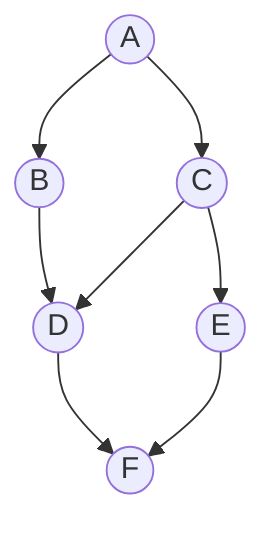

# Topological Sorting Algorithm 

## Overview
Topological Sorting is a graph-based algorithm used to order vertices of a **Directed Acyclic Graph (DAG)**. It provides a linear ordering of vertices such that for every directed edge **u → v**, vertex **u** comes before **v**. This algorithm is fundamental in tasks such as task scheduling, course prerequisite checking, and more.

## Introduction
In **Topological Sorting**, vertices of a DAG are arranged in a sequence such that every directed edge points from an earlier vertex to a later one in the sequence. This algorithm is applicable only for **DAGs**, as the presence of a cycle would violate the ordering.

## Characteristics of Topological Sorting Algorithm
- **Linear Ordering**: Topological sorting produces a linear sequence that respects the directed edges.
- **Acyclic Graph**: Works only with **DAGs** (Directed Acyclic Graphs).
- **No Unique Solution**: There may be multiple valid topological orderings depending on the graph's structure.

## How Topological Sorting Works
1. **Identify Vertices**: In a DAG, identify vertices with no incoming edges (i.e., in-degree of 0).
2. **Remove Vertices**: Remove the vertex and all its outgoing edges from the graph.
3. **Repeat Process**: Continue the process for remaining vertices until all vertices are ordered.
4. **Result**: The result is a topological ordering where all directed edges point forward in the sequence.

## Step-by-Step Execution

## Execution Steps
Topological Sorting helps in sorting vertices in a Directed Acyclic Graph (DAG) such that for every directed edge `u → v`, vertex `u` comes before `v` in the ordering.

### Algorithm Steps:
1. **Identify vertices with no incoming edges** (in-degree 0), e.g., vertex A.
2. **Remove A** and its outgoing edges.
3. **Repeat the process** for remaining vertices.
4. **Continue** until all vertices are sorted.

### Example of Topological Order:
A -→ B -→ C -→ D → E -→ F

## Time Complexity
**Time Complexity:** O(V + E), where:
- `V` is the number of vertices.
- `E` is the number of edges.

Each vertex and edge is visited exactly once, making the algorithm linear.

## Applications
1. **Task Scheduling**: Determines the order in which tasks should be performed, ensuring some tasks precede others.
2. **Course Prerequisites**: Determines the order of courses in an academic curriculum where certain courses have prerequisites.
3. **Dependency Resolution**: Used in package managers to install software dependencies in the correct order.
4. **Compiler Optimization**: Helps determine the order of code execution in a pipeline (instruction scheduling).

## Pseudocode

### Kahn's Algorithm for Topological Sorting
1. Compute the in-degree for each vertex.
2. Initialize a queue with all vertices having in-degree 0.
3. While the queue is not empty:
    - Dequeue a vertex from the queue.
    - Append it to the topological ordering list.
    - For each outgoing edge from the dequeued vertex, reduce the in-degree of the adjacent vertex.
    - If the in-degree of an adjacent vertex becomes zero, enqueue it.
4. If all vertices are processed, the result is the topological order. Otherwise, the graph contains a cycle.

### DFS-Based Algorithm
1. Perform DFS on each vertex.
2. On visiting a vertex, mark it as visited and recursively visit all its unvisited neighbors.
3. Once all neighbors are visited, push the vertex onto a stack.
4. After DFS completes, the stack contains the topological order.

## Advantages of Topological Sorting
- **Efficient Task Ordering**: Helps in scheduling tasks with dependencies.
- **Cycle Detection**: If a cycle exists in the graph, the algorithm will detect it and stop.
- **Linear Time**: The algorithm works in linear time O(V + E) for DAGs.

## Limitations
- **Applicable Only to DAGs**: Topological sorting works only for Directed Acyclic Graphs. It cannot be applied to cyclic graphs.

## Conclusion
Topological Sorting is a fundamental algorithm used in many real-world applications such as task scheduling, dependency resolution, and compiler optimization. Understanding how to implement and apply this algorithm is essential for working with Directed Acyclic Graphs (DAGs) in graph theory and computer science. Its linear time complexity makes it efficient for large-scale problems, and its ability to detect cycles ensures that tasks are organized correctly in the absence of cyclic dependencies.

