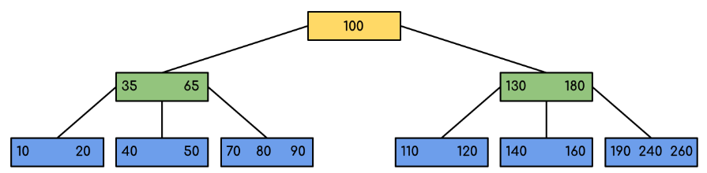
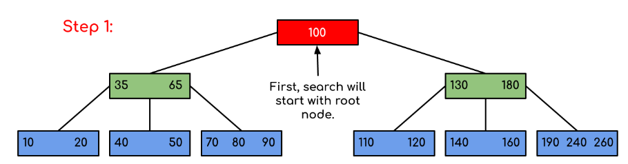
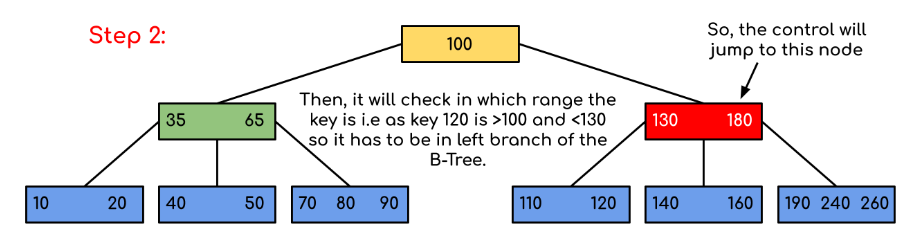
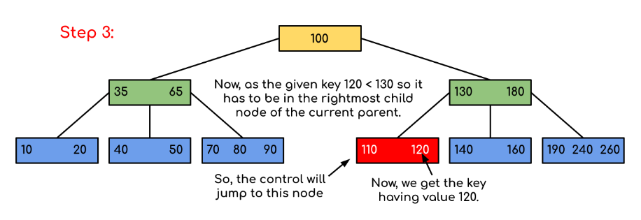

The limitations of traditional binary search trees can be frustrating. Meet the B-Tree, the multi-talented data structure that can handle massive amounts of data with ease. When it comes to storing and searching large amounts of data, traditional binary search trees can become impractical due to their poor performance and high memory usage. B-Trees, also known as B-Tree or Balanced Tree, are a type of self-balancing tree that was specifically designed to overcome these limitations.

Unlike traditional binary search trees, B-Trees are characterized by the large number of keys that they can store in a single node, which is why they are also known as “large key” trees. Each node in a B-Tree can contain multiple keys, which allows the tree to have a larger branching factor and thus a shallower height. This shallow height leads to less disk I/O, which results in faster search and insertion operations. B-Trees are particularly well suited for storage systems that have slow, bulky data access such as hard drives, flash memory, and CD-ROMs.

B-Trees maintain balance by ensuring that each node has a minimum number of keys, so the tree is always balanced. This balance guarantees that the time complexity for operations such as insertion, deletion, and searching is always **O(log n)**, regardless of the initial shape of the tree.

## Time Complexity of B-Tree: 

| Sr. No. | Algorithm | Time Complexity |
|---------|------------|-----------------|
| 1.      | Search     | O(log n)        |
| 2.      | Insert     | O(log n)        |
| 3.      | Delete     | O(log n)        |

**Note:** `n` is the total number of elements in the B-tree.

## Properties of B-Tree:

*   All leaves are at the same level.
*   B-Tree is defined by the term minimum degree **t**. The value of **t** depends upon disk block size.
*   Every node except the root must contain at least `t-1` keys. The root may contain a minimum of **1** key.
*   All nodes (including root) may contain at most **(2 * t – 1)** keys.
*   Number of children of a node is equal to the number of keys in it plus **1**.
*   All keys of a node are sorted in increasing order. The child between two keys **k<sub>1</sub>** and **k<sub>2</sub>** contains all keys in the range from **k<sub>1</sub>** to **k<sub>2</sub>**.
*   B-Tree grows and shrinks from the root, unlike Binary Search Tree. Binary Search Trees grow downward and also shrink from downward.
*   Like other balanced Binary Search Trees, the time complexity to search, insert, and delete is **O(log n)**.
*   Insertion of a node in B-Tree happens only at the leaf node.

Following is an example of a B-Tree of minimum order 5:  
**Note:** In practical B-Trees, the value of the minimum order is much more than 5. 

We can see in the above diagram that all the leaf nodes are at the same level and all non-leaves have no empty sub-tree and have keys one less than the number of their children.

## Interesting Facts about B-Trees:

> The minimum height of the B-Tree that can exist with `n` number of nodes and `m` is the maximum number of children a node can have:  
> **h<sub>min</sub> = ⌈ log<sub>m</sub> (n + 1) ⌉ - 1**  
> 
> The maximum height of the B-Tree that can exist with `n` number of nodes and `t` is the minimum number of children that a non-root node can have:  
>   **h<sub>max</sub> = ⌊ log<sub>t</sub> ( (n + 1) / 2 ) ⌋**,  
>   where **t = ⌈ m / 2 ⌉**.

## Traversal in B-Tree:

Traversal is also similar to inorder traversal of a Binary Tree. We start from the leftmost child, recursively print the leftmost child, then repeat the same process for the remaining children and keys. In the end, recursively print the rightmost child. 

## Search Operation in B-Tree:

Search is similar to the search in a Binary Search Tree. Let the key to be searched be `k`.

*   Start from the root and recursively traverse down.
*   For every visited non-leaf node:
    *   If the node has the key, we simply return the node.
    *   Otherwise, we recurse down to the appropriate child (the child just before the first greater key) of the node.
*   If we reach a leaf node and don’t find `k` in the leaf node, return `NULL`.

Searching a B-Tree is similar to searching a binary tree. The algorithm is similar and goes with recursion. At each level, the search is optimized by using limiting values (separation values) to minimize unnecessary branches. If we reach a leaf node and don’t find the desired key, it will return `NULL`.

## Algorithm for Searching an Element in a B-Tree:

```
struct Node {
	int n;
	int key[MAX_KEYS];
	Node* child[MAX_CHILDREN];
	bool leaf;
};

Node* BtreeSearch(Node* x, int k) {
	int i = 0;
	while (i < x->n && k > x->key[i]) {
		i++;
	}
	if (i < x->n && k == x->key[i]) {
		return x;
	}
	if (x->leaf) {
		return nullptr;
	}
	return BtreeSearch(x->child[i], k);
}
```

## Examples:

> **Input:** Search 120 in the given B-Tree.
>
> 
>
>  
> **Solution:**
>
> 
>
>  
> 
>
>  
> 

In this example, we can see that our search was reduced by just limiting the chances where the key containing the value could be present. Similarly, if within the above example we have to look for 180, then the control will stop at step 2 because the program will find that the key 180 is present within the current node. Similarly, if it’s to search for 90, then as `90 < 100`, it will go to the left subtree automatically, and the control flow will follow the same pattern as shown in the above example.

Below is the implementation of the above approach:

### C++ 


```
#include <iostream>

using namespace std;

// A BTree node
class BTreeNode {
    int* keys;           // An array of keys
    int t;              // Minimum degree (defines the range for number
                        // of keys)
    BTreeNode** C;      // An array of child pointers
    int n;              // Current number of keys
    bool leaf;          // Is true when node is leaf. Otherwise false

public:
    BTreeNode(int _t, bool _leaf); // Constructor
    // A function to traverse all nodes in a subtree rooted
    // with this node
    void traverse();
    // A function to search a key in the subtree rooted with
    // this node.
    BTreeNode* search(int k); // returns NULL if k is not present.
    // Make the BTree friend of this so that we can access
    // private members of this class in BTree functions
    friend class BTree;
};

// A BTree
class BTree {
    BTreeNode* root;  // Pointer to root node
    int t;            // Minimum degree

public:
    // Constructor (Initializes tree as empty)
    BTree(int _t)
    {
        root = NULL;
        t = _t;
    }

    // function to traverse the tree
    void traverse()
    {
        if (root != NULL)
            root->traverse();
    }

    // function to search a key in this tree
    BTreeNode* search(int k)
    {
        return (root == NULL) ? NULL : root->search(k);
    }
};

// Constructor for BTreeNode class
BTreeNode::BTreeNode(int _t, bool _leaf)
{
    // Copy the given minimum degree and leaf property
    t = _t;
    leaf = _leaf;
    // Allocate memory for maximum number of possible keys
    // and child pointers
    keys = new int[2 * t - 1];
    C = new BTreeNode*[2 * t];
    // Initialize the number of keys as 0
    n = 0;
}

// Function to traverse all nodes in a subtree rooted with
// this node
void BTreeNode::traverse()
{
    // There are n keys and n+1 children, traverse through n
    // keys and first n children
    int i;
    for (i = 0; i < n; i++) {
        // If this is not leaf, then before printing key[i],
        // traverse the subtree rooted with child C[i].
        if (leaf == false)
            C[i]->traverse();
        cout << " " << keys[i];
    }
    // Print the subtree rooted with last child
    if (leaf == false)
        C[i]->traverse();
}

// Function to search key k in subtree rooted with this node
BTreeNode* BTreeNode::search(int k)
{
    // Find the first key greater than or equal to k
    int i = 0;
    while (i < n && k > keys[i])
        i++;
    // If the found key is equal to k, return this node
    if (keys[i] == k)
        return this;
    // If the key is not found here and this is a leaf node
    if (leaf == true)
        return NULL;
    // Go to the appropriate child
    return C[i]->search(k);
}
```
### Java

```
// Java program to illustrate the sum of two numbers
// A BTree
class Btree {
    public BTreeNode root; // Pointer to root node
    public int t;          // Minimum degree

    // Constructor (Initializes tree as empty)
    Btree(int t)
    {
        this.root = null;
        this.t = t;
    }

    // function to traverse the tree
    public void traverse()
    {
        if (this.root != null)
            this.root.traverse();
        System.out.println();
    }

    // function to search a key in this tree
    public BTreeNode search(int k)
    {
        if (this.root == null)
            return null;
        else
            return this.root.search(k);
    }
}

// A BTree node
class BTreeNode {
    int[] keys;          // An array of keys
    int t;              // Minimum degree (defines the range for number
                        // of keys)
    BTreeNode[] C;      // An array of child pointers
    int n;              // Current number of keys
    boolean leaf;       // Is true when node is leaf. Otherwise false

    // Constructor
    BTreeNode(int t, boolean leaf)
    {
        this.t = t;
        this.leaf = leaf;
        this.keys = new int[2 * t - 1];
        this.C = new BTreeNode[2 * t];
        this.n = 0;
    }

    // A function to traverse all nodes in a subtree rooted
    // with this node
    public void traverse()
    {
        // There are n keys and n+1 children, traverse
        // through n keys and first n children
        int i = 0;
        for (i = 0; i < this.n; i++) {
            // If this is not leaf, then before printing
            // key[i], traverse the subtree rooted with
            // child C[i].
            if (this.leaf == false) {
                C[i].traverse();
            }
            System.out.print(keys[i] + " ");
        }
        // Print the subtree rooted with last child
        if (leaf == false)
            C[i].traverse();
    }

    // A function to search a key in the subtree rooted with
    // this node.
    BTreeNode search(int k) // returns NULL if k is not present.
    {
        // Find the first key greater than or equal to k
        int i = 0;
        while (i < n && k > keys[i])
            i++;
        // If the found key is equal to k, return this node
        if (keys[i] == k)
            return this;
        // If the key is not found here and this is a leaf
        // node
        if (leaf == true)
            return null;
        // Go to the appropriate child
        return C[i].search(k);
    }
}

```


### Python3

```
# Create a node
class BTreeNode:
    def __init__(self, leaf=False):
        self.leaf = leaf
        self.keys = []
        self.child = []

# Tree
class BTree:
    def __init__(self, t):
        self.root = BTreeNode(True)
        self.t = t

    # Insert node
    def insert(self, k):
        root = self.root
        if len(root.keys) == (2 * self.t) - 1:
            temp = BTreeNode()
            self.root = temp
            temp.child.insert(0, root)
            self.split_child(temp, 0)
            self.insert_non_full(temp, k)
        else:
            self.insert_non_full(root, k)

    # Insert nonfull
    def insert_non_full(self, x, k):
        i = len(x.keys) - 1
        if x.leaf:
            x.keys.append((None, None))
            while i >= 0 and k[0] < x.keys[i][0]:
                x.keys[i + 1] = x.keys[i]
                i -= 1
            x.keys[i + 1] = k
        else:
            while i >= 0 and k[0] < x.keys[i][0]:
                i -= 1
            i += 1
            if len(x.child[i].keys) == (2 * self.t) - 1:
                self.split_child(x, i)
                if k[0] > x.keys[i][0]:
                    i += 1
            self.insert_non_full(x.child[i], k)

    # Split the child
    def split_child(self, x, i):
        t = self.t
        y = x.child[i]
        z = BTreeNode(y.leaf)
        x.child.insert(i + 1, z)
        x.keys.insert(i, y.keys[t - 1])
        z.keys = y.keys[t: (2 * t) - 1]
        y.keys = y.keys[0: t - 1]
        if not y.leaf:
            z.child = y.child[t: 2 * t]
            y.child = y.child[0: t - 1]

    # Print the tree
    def print_tree(self, x, l=0):
        print("Level ", l, " ", len(x.keys), end=":")
        for i in x.keys:
            print(i, end=" ")
        print()
        l += 1
        if len(x.child) > 0:
            for i in x.child:
                self.print_tree(i, l)

    # Search key in the tree
    def search_key(self, k, x=None):
        if x is not None:
            i = 0
            while i < len(x.keys) and k > x.keys[i][0]:
                i += 1
            if i < len(x.keys) and k == x.keys[i][0]:
                return (x, i)
            elif x.leaf:
                return None
            else:
                return self.search_key(k, x.child[i])
        else:
            return self.search_key(k, self.root)

def main():
    b = BTree(3)
    for i in range(10):
        b.insert((i, "Value" + str(i)))

    b.print_tree(b.root)

if __name__ == "__main__":
    main()

```


## Applications of B-Trees

-   Used in large databases to access data stored on the disk.
-   Searching for data in a dataset can be achieved in significantly less time using the B-Tree.
-   Multilevel indexing can be achieved with the indexing feature.
-   Most servers also use the B-tree approach.
-   B-Trees are used in CAD systems to organize and search geometric data.
-   B-Trees are also used in areas such as natural language processing, computer networks, and cryptography.

## Advantages of B-Trees

-   Guaranteed time complexity of O(log n) for basic operations like insertion, deletion, and searching, making them suitable for large datasets and real-time applications.
-   B-Trees are self-balancing.
-   High concurrency and high throughput.
-   Efficient storage utilization.

## Disadvantages of B-Trees

-   B-Trees are based on disk-based data structures and can have high disk usage.
-   Not the best for all cases.
-   Slower in comparison to other data structures.
