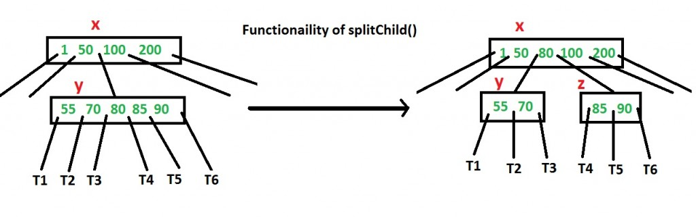
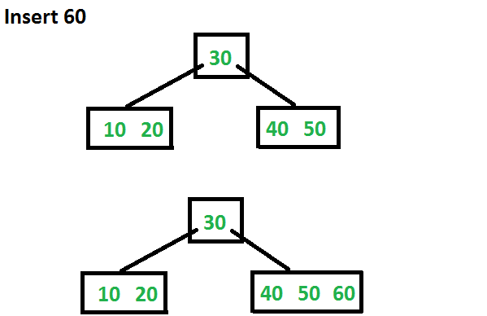
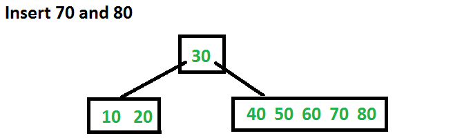
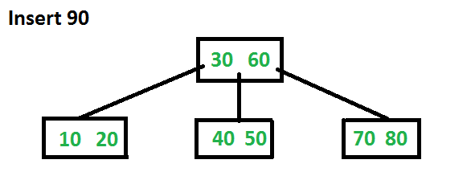

# Insert Operation in B-Tree

In the previous post, we introduced B-Trees and discussed the `search()` and `traverse()` functions. In this post, we will discuss the `insert()` operation. A new key is always inserted at the leaf node. Let the key to be inserted be `k`. Like in a Binary Search Tree (BST), we start from the root and traverse down until we reach a leaf node. Once we reach a leaf node, we insert the key there. Unlike BSTs, we have a predefined range on the number of keys that a node can contain. So before inserting a key into the node, we must ensure that there is extra space.

**How do we ensure that a node has space available for a key before it is inserted?** We use an operation called `splitChild()`, which is used to split a child of a node. See the following diagram to understand the split. In this diagram, child `y` of `x` is being split into two nodes `y` and `z`. Note that the `splitChild` operation moves a key up, which is the reason B-Trees grow up, unlike BSTs, which grow down.  



As discussed, to insert a new key, we go down from the root to the leaf. Before traversing down to a node, we first check if the node is full. If the node is full, we split it to create space. The complete algorithm is as follows:

### Insertion Algorithm  
1. Initialize `x` as root.  
2. While `x` is not a leaf, do the following:  
   - **a)** Find the child of `x` that will be traversed next. Let the child be `y`.  
   - **b)** If `y` is not full, change `x` to point to `y`.  
   - **c)** If `y` is full, split it and change `x` to point to one of the two parts of `y`. If `k` is smaller than the middle key in `y`, set `x` as the first part of `y`. Otherwise, set it as the second part of `y`. When we split `y`, we move a key from `y` to its parent `x`.  
3. The loop in step 2 stops when `x` is a leaf. `x` must have space for 1 extra key, as we have been splitting all nodes in advance. So, simply insert `k` into `x`.  

Note that the algorithm follows the Cormen book. This is a proactive insertion algorithm; before going down to a node, we split it if it is full. The advantage of this preemptive splitting is that we never traverse a node twice. If we were to only split a node after a new key is inserted (a reactive approach), we might end up traversing all nodes from the leaf to the root again, especially when all nodes on the path from the root to the leaf are full. This may cause a cascading effect where splitting occurs up to the root.

However, there is a disadvantage to this proactive insertion: we may perform unnecessary splits.

### Example Insertion Sequence

Let us understand the algorithm with an example B-Tree of minimum degree `t` as 3 and a sequence of integers: 10, 20, 30, 40, 50, 60, 70, 80, and 90 in an initially empty B-Tree. Initially, the root is `NULL`. Let us first insert `10`.  


Next, let us insert `20`, `30`, `40`, and `50`. They will all be inserted in the root because the maximum number of keys a node can accommodate is \(2t - 1\), which is 5.  


Now, let us insert `60`. Since the root node is full, it will first split into two, and then `60` will be inserted into the appropriate child.  



Let us now insert `70` and `80`. These new keys will be inserted into the appropriate leaf without any splits.  



Finally, let us insert `90`. This insertion will cause a split, with the middle key moving up to the parent.  



Following are the implementations of the above proactive algorithm.


C++
---

```
#include<iostream>
using namespace std;

// A BTree node
class BTreeNode
{
    int *keys;  // An array of keys
    int t;      // Minimum degree (defines the range for number of keys)
    BTreeNode **C; // An array of child pointers
    int n;     // Current number of keys
    bool leaf; // Is true when node is leaf. Otherwise false
public:
    BTreeNode(int _t, bool _leaf);   // Constructor

    // A utility function to insert a new key in the subtree rooted with
    // this node. The assumption is, the node must be non-full when this
    // function is called
    void insertNonFull(int k);

    // A utility function to split the child y of this node. i is index of y in
    // child array C[].  The Child y must be full when this function is called
    void splitChild(int i, BTreeNode *y);

    // A function to traverse all nodes in a subtree rooted with this node
    void traverse();

    // A function to search a key in the subtree rooted with this node.
    BTreeNode *search(int k);   // returns NULL if k is not present.

// Make BTree friend of this so that we can access private members of this
// class in BTree functions
friend class BTree;
};

// A BTree
class BTree
{
    BTreeNode *root; // Pointer to root node
    int t;  // Minimum degree
public:
    // Constructor (Initializes tree as empty)
    BTree(int _t)
    {  root = NULL;  t = _t; }

    // function to traverse the tree
    void traverse()
    {  if (root != NULL) root->traverse(); }

    // function to search a key in this tree
    BTreeNode* search(int k)
    {  return (root == NULL)? NULL : root->search(k); }

    // The main function that inserts a new key in this B-Tree
    void insert(int k);
};

// Constructor for BTreeNode class
BTreeNode::BTreeNode(int t1, bool leaf1)
{
    // Copy the given minimum degree and leaf property
    t = t1;
    leaf = leaf1;

    // Allocate memory for maximum number of possible keys
    // and child pointers
    keys = new int[2*t-1];
    C = new BTreeNode *[2*t];

    // Initialize the number of keys as 0
    n = 0;
}

// Function to traverse all nodes in a subtree rooted with this node
void BTreeNode::traverse()
{
    // There are n keys and n+1 children, traverse through n keys
    // and first n children
    int i;
    for (i = 0; i < n; i++)
    {
        // If this is not leaf, then before printing key[i],
        // traverse the subtree rooted with child C[i].
        if (leaf == false)
            C[i]->traverse();
        cout << " " << keys[i];
    }

    // Print the subtree rooted with last child
    if (leaf == false)
        C[i]->traverse();
}

// Function to search key k in subtree rooted with this node
BTreeNode *BTreeNode::search(int k)
{
    // Find the first key greater than or equal to k
    int i = 0;
    while (i < n && k > keys[i])
        i++;

    // If the found key is equal to k, return this node
    if (keys[i] == k)
        return this;

    // If key is not found here and this is a leaf node
    if (leaf == true)
        return NULL;

    // Go to the appropriate child
    return C[i]->search(k);
}

// The main function that inserts a new key in this B-Tree
void BTree::insert(int k)
{
    // If tree is empty
    if (root == NULL)
    {
        // Allocate memory for root
        root = new BTreeNode(t, true);
        root->keys[0] = k;  // Insert key
        root->n = 1;  // Update number of keys in root
    }
    else // If tree is not empty
    {
        // If root is full, then tree grows in height
        if (root->n == 2*t-1)
        {
            // Allocate memory for new root
            BTreeNode *s = new BTreeNode(t, false);

            // Make old root as child of new root
            s->C[0] = root;

            // Split the old root and move 1 key to the new root
            s->splitChild(0, root);

            // New root has two children now.  Decide which of the
            // two children is going to have new key
            int i = 0;
            if (s->keys[0] < k)
                i++;
            s->C[i]->insertNonFull(k);

            // Change root
            root = s;
        }
        else  // If root is not full, call insertNonFull for root
            root->insertNonFull(k);
    }
}

// A utility function to insert a new key in this node
// The assumption is, the node must be non-full when this
// function is called
void BTreeNode::insertNonFull(int k)
{
    // Initialize index as index of rightmost element
    int i = n-1;

    // If this is a leaf node
    if (leaf == true)
    {
        // The following loop does two things
        // a) Finds the location of new key to be inserted
        // b) Moves all greater keys to one place ahead
        while (i >= 0 && keys[i] > k)
        {
            keys[i+1] = keys[i];
            i--;
        }

        // Insert the new key at found location
        keys[i+1] = k;
        n = n+1;
    }
    else // If this node is not leaf
    {
        // Find the child which is going to have the new key
        while (i >= 0 && keys[i] > k)
            i--;

        // See if the found child is full
        if (C[i+1]->n == 2*t-1)
        {
            // If the child is full, then split it
            splitChild(i+1, C[i+1]);

            // After split, the middle key of C[i] goes up and
            // C[i] is splitted into two.  See which of the two
            // is going to have the new key
            if (keys[i+1] < k)
                i++;
        }
        C[i+1]->insertNonFull(k);
    }
}

// A utility function to split the child y of this node
// Note that y must be full when this function is called
void BTreeNode::splitChild(int i, BTreeNode *y)
{
    // Create a new node which is going to store (t-1) keys
    // of y
    BTreeNode *z = new BTreeNode(y->t, y->leaf);
    z->n = t - 1;

    // Copy the last (t-1) keys of y to z
    for (int j = 0; j < t-1; j++)
        z->keys[j] = y->keys[j+t];

    // Copy the last t children of y to z
    if (y->leaf == false)
    {
        for (int j = 0; j < t; j++)
            z->C[j] = y->C[j+t];
    }

    // Reduce the number of keys in y
    y->n = t - 1;

    // Since this node is going to have a new child,
    // create space of new child
    for (int j = n; j >= i+1; j--)
        C[j+1] = C[j];

    // Link the new child to this node
    C[i+1] = z;

    // A key of y will move to this node. Find the location of
    // new key and move all greater keys one space ahead
    for (int j = n-1; j >= i; j--)
        keys[j+1] = keys[j];

    // Copy the middle key of y to this node
    keys[i] = y->keys[t-1];

    // Increment count of keys in this node
    n = n + 1;
}

// Driver program to test above functions
int main()
{
    BTree t(3); // A B-Tree with minimum degree 3
    t.insert(10);
    t.insert(20);
    t.insert(5);
    t.insert(6);
    t.insert(12);
    t.insert(30);
    t.insert(7);
    t.insert(17);

    cout << "Traversal of the constructed tree is ";
    t.traverse();

    int k = 6;
    (t.search(k) != NULL)? cout << "\nPresent" : cout << "\nNot Present";

    k = 15;
    (t.search(k) != NULL)? cout << "\nPresent" : cout << "\nNot Present";

    return 0;
}
```
JAVA
---

```
import java.util.Arrays;

class BTreeNode {
    int[] keys; // An array of keys
    int t;      // Minimum degree
    BTreeNode[] C; // An array of child pointers
    int n;     // Current number of keys
    boolean leaf; // True if leaf node, otherwise false

    // Constructor
    BTreeNode(int t, boolean leaf) {
        this.t = t;
        this.leaf = leaf;
        this.keys = new int[2 * t - 1];
        this.C = new BTreeNode[2 * t];
        this.n = 0;
    }

    // Function to traverse all nodes in a subtree rooted with this node
    public void traverse() {
        int i;
        for (i = 0; i < n; i++) {
            if (!leaf) {
                C[i].traverse();
            }
            System.out.print(keys[i] + " ");
        }
        if (!leaf) {
            C[i].traverse();
        }
    }

    // Function to search a key in subtree rooted with this node
    public BTreeNode search(int k) {
        int i = 0;
        while (i < n && k > keys[i]) {
            i++;
        }

        if (i < n && keys[i] == k) {
            return this;
        }

        if (leaf) {
            return null;
        }
        return C[i].search(k);
    }

    // Insert a new key in this node
    public void insertNonFull(int k) {
        int i = n - 1;

        if (leaf) {
            while (i >= 0 && keys[i] > k) {
                keys[i + 1] = keys[i];
                i--;
            }
            keys[i + 1] = k;
            n++;
        } else {
            while (i >= 0 && keys[i] > k) {
                i--;
            }
            if (C[i + 1].n == 2 * t - 1) {
                splitChild(i + 1, C[i + 1]);

                if (keys[i + 1] < k) {
                    i++;
                }
            }
            C[i + 1].insertNonFull(k);
        }
    }

    // Split the child y of this node
    public void splitChild(int i, BTreeNode y) {
        BTreeNode z = new BTreeNode(y.t, y.leaf);
        z.n = t - 1;

        for (int j = 0; j < t - 1; j++) {
            z.keys[j] = y.keys[j + t];
        }

        if (!y.leaf) {
            for (int j = 0; j < t; j++) {
                z.C[j] = y.C[j + t];
            }
        }

        y.n = t - 1;

        for (int j = n; j >= i + 1; j--) {
            C[j + 1] = C[j];
        }
        C[i + 1] = z;

        for (int j = n - 1; j >= i; j--) {
            keys[j + 1] = keys[j];
        }
        keys[i] = y.keys[t - 1];
        n++;
    }
}

class BTree {
    BTreeNode root;
    int t; // Minimum degree

    // Constructor
    public BTree(int t) {
        this.root = null;
        this.t = t;
    }

    // Function to traverse the tree
    public void traverse() {
        if (root != null) {
            root.traverse();
        }
    }

    // Function to search a key in this tree
    public BTreeNode search(int k) {
        return (root == null) ? null : root.search(k);
    }

    // Insert a new key in this B-Tree
    public void insert(int k) {
        if (root == null) {
            root = new BTreeNode(t, true);
            root.keys[0] = k;
            root.n = 1;
        } else {
            if (root.n == 2 * t - 1) {
                BTreeNode s = new BTreeNode(t, false);
                s.C[0] = root;
                s.splitChild(0, root);

                int i = 0;
                if (s.keys[0] < k) {
                    i++;
                }
                s.C[i].insertNonFull(k);
                root = s;
            } else {
                root.insertNonFull(k);
            }
        }
    }
}

// Driver program to test above functions
public class Main {
    public static void main(String[] args) {
        BTree t = new BTree(3); // A B-Tree with minimum degree 3
        t.insert(10);
        t.insert(20);
        t.insert(5);
        t.insert(6);
        t.insert(12);
        t.insert(30);
        t.insert(7);
        t.insert(17);

        System.out.print("Traversal of the constructed tree is: ");
        t.traverse();

        int k = 6;
        System.out.println("\nSearch for key " + k + ": " + (t.search(k) != null ? "Present" : "Not Present"));

        k = 15;
        System.out.println("Search for key " + k + ": " + (t.search(k) != null ? "Present" : "Not Present"));
    }
}

```
**Output:**  
Traversal of the constructed tree is: `5 6 7 10 12 17 20 30`  
**Present**  
**Not Present**

The B-tree is a data structure similar to a binary search tree but allows multiple keys per node and has a higher fanout. This enables the B-tree to store a large amount of data efficiently, making it commonly used in databases and file systems.

## Characteristics of B-Tree

- **Balanced Tree:** All paths from the root to a leaf have the same length.
- **Minimum Degree `t`:** 
  - Each non-root node must contain at least \(t - 1\) keys and can contain at most \(2t - 1\) keys.
  - The root can have at least one key and at most \(2t - 1\) keys.
  - Each node can have at most \(2t\) children.

## Supported Operations

1. **Search(k):** Searches for a key `k` in the tree.
2. **Insert(k):** Inserts a key `k` into the tree.
3. **Delete(k):** Deletes a key `k` from the tree.

### Search Operation
The search operation is similar to that of a binary search tree, where you traverse down the tree based on the comparison of the key.

### Insert Operation
The insert operation is more complicated since inserting a key can cause a node to become full. If a node is full, it must be split into two nodes, and the median key is moved up to the parent node.

### Delete Operation
The delete operation is also complex. Deleting a key can cause a node to have too few keys. If a node has too few keys, it can either merge with a sibling node or borrow a key from a sibling node.

## Advantages of B-Trees

- **Higher Fanout:** B-trees have a higher fanout than binary search trees, resulting in fewer disk accesses when searching for a key.
- **Balanced Structure:** All operations have a worst-case time complexity of \(O(\log n)\).
- **Self-Adjusting:** B-trees can adapt to changes in the dataset without requiring expensive rebalancing operations.
