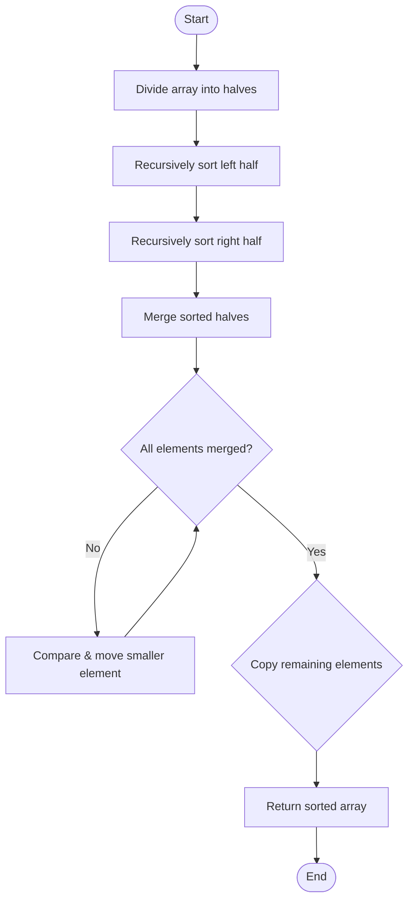

<AdsComponent />

**Merge Sort** is a divide-and-conquer sorting algorithm that divides the array into smaller subarrays, sorts them recursively, and then merges them back together in sorted order. It is a <mark>stable</mark> and <mark>comparison-based</mark> algorithm that guarantees O(n log n) time complexity in all cases. Although it requires additional space for temporary arrays during merging, it is highly efficient for sorting large datasets and is commonly used in practical applications.

<MergeSortVisualization />

## Algorithm

1. Divide the array into two halves at the midpoint.
2. Recursively sort the left half.
3. Recursively sort the right half.
4. Merge the two sorted halves back together:
   - Compare the first elements of both halves
   - Add the smaller element to the result array
   - Move the pointer of the half from which the element was taken
   - Repeat until all elements from both halves are merged
5. Return the merged sorted array.

## Pseudocode

```plaintext title="Merge Sort"
procedure mergeSort(arr, left, right)
    if left < right then
        mid = left + floor((right - left) / 2)
        mergeSort(arr, left, mid)
        mergeSort(arr, mid + 1, right)
        merge(arr, left, mid, right)
    end if
end procedure

procedure merge(arr, left, mid, right)
    n1 = mid - left + 1
    n2 = right - mid
    
    create arrays L[n1] and R[n2]
    
    for i = 0 to n1-1 do
        L[i] = arr[left + i]
    end for
    
    for j = 0 to n2-1 do
        R[j] = arr[mid + 1 + j]
    end for
    
    i = 0, j = 0, k = left
    
    while i < n1 and j < n2 do
        if L[i] <= R[j] then
            arr[k] = L[i]
            i = i + 1
        else
            arr[k] = R[j]
            j = j + 1
        end if
        k = k + 1
    end while
    
    while i < n1 do
        arr[k] = L[i]
        i = i + 1
        k = k + 1
    end while
    
    while j < n2 do
        arr[k] = R[j]
        j = j + 1
        k = k + 1
    end while
end procedure
```

<AdsComponent />

## Diagram



## Example

```js title="Merge Sort"
function mergeSort(arr) {
  if (arr.length <= 1) return arr;
  
  const mid = Math.floor(arr.length / 2);
  const left = mergeSort(arr.slice(0, mid));
  const right = mergeSort(arr.slice(mid));
  
  return merge(left, right);
}

function merge(left, right) {
  const result = [];
  let i = 0, j = 0;
  
  while (i < left.length && j < right.length) {
    if (left[i] <= right[j]) {
      result.push(left[i]);
      i++;
    } else {
      result.push(right[j]);
      j++;
    }
  }
  
  return result.concat(left.slice(i)).concat(right.slice(j));
}

let arr = [64, 34, 25, 12, 22, 11, 90];
console.log(mergeSort(arr)); // [ 11, 12, 22, 25, 34, 64, 90 ]
```

## Complexity

- **Time Complexity**: O(n log n)
  - Best Case: O(n log n)
  - Average Case: O(n log n)
  - Worst Case: O(n log n)
- **Space Complexity**: O(n) - requires auxiliary space for temporary arrays
- **Stable**: Yes - maintains the relative order of equal elements

## Live Example

```js live
function mergeSort() {
  const arr = [64, 34, 25, 12, 22, 11, 90];
  
  function merge(left, right) {
    const result = [];
    let i = 0, j = 0;
    
    while (i < left.length && j < right.length) {
      if (left[i] <= right[j]) {
        result.push(left[i++]);
      } else {
        result.push(right[j++]);
      }
    }
    
    return result.concat(left.slice(i)).concat(right.slice(j));
  }
  
  function doMergeSort(arr) {
    if (arr.length <= 1) return arr;
    const mid = Math.floor(arr.length / 2);
    return merge(doMergeSort(arr.slice(0, mid)), doMergeSort(arr.slice(mid)));
  }
  
  const sorted = doMergeSort(arr);
  
  return (
    <div>
      <h3>Merge Sort</h3>
      <p><b>Array:</b> [64, 34, 25, 12, 22, 11, 90]</p>
      <p>
        <b>Sorted Array:</b> [{sorted.join(", ")}]
      </p>
    </div>
  )
}
```

## Explanation

In the above example, we have an array of numbers `[64, 34, 25, 12, 22, 11, 90]`. We use the merge sort algorithm to sort the array in ascending order. The algorithm divides the array into smaller subarrays recursively, then merges them back together in sorted order. The key advantage of merge sort is its guaranteed O(n log n) time complexity, making it efficient for large datasets. The sorted array is `[11, 12, 22, 25, 34, 64, 90]`.

:::info Try it yourself
Change the array values and see how the merge sort algorithm sorts the array.
:::

<AdsComponent />

:::tip 📝 Note
Merge Sort is one of the most efficient general-purpose sorting algorithms. Its consistent O(n log n) time complexity makes it highly reliable for large datasets.

The main advantage of merge sort is its guaranteed performance and stability - it always maintains the relative order of equal elements.

The main disadvantage is that it requires O(n) extra space for the temporary arrays during the merging process, making it less suitable for memory-constrained environments.

Merge sort is widely used in practice, including in external sorting for data that doesn't fit in memory, and in hybrid sorting algorithms like Timsort.

:::

## References

- [Wikipedia](https://en.wikipedia.org/wiki/Merge_sort)
- [GeeksforGeeks](https://www.geeksforgeeks.org/merge-sort/)
- [Programiz](https://www.programiz.com/dsa/merge-sort)
- [TutorialsPoint](https://www.tutorialspoint.com/data_structures_algorithms/merge_sort_algorithm.htm)
- [StudyTonight](https://www.studytonight.com/data-structures/merge-sort)
- [w3schools](https://www.w3schools.com/dsa/dsa_algo_mergesort.php)

## Related

Bubble Sort, Insertion Sort, Quick Sort, Heap Sort, etc.

<AdsComponent />

## Quiz

1. What is the time complexity of merge sort in the worst case?
   - [ ] O(n)
   - [x] O(n log n)     ✔
   - [ ] O(n²)
   - [ ] O(n!)

2. Is merge sort a stable sorting algorithm?
   - [x] Yes    ✔
   - [ ] No
   - [ ] Maybe
   - [ ] Not sure

3. What is the space complexity of merge sort?
   - [x] O(n)   ✔
   - [ ] O(1)
   - [ ] O(log n)
   - [ ] O(n²)

4. What is the main advantage of merge sort?
   - [ ] It is an in-place algorithm
   - [x] It has O(n log n) time complexity in all cases     ✔
   - [ ] It requires minimal extra space
   - [ ] It is faster than quicksort

5. What is the main disadvantage of merge sort?
   - [ ] It is not stable
   - [x] It requires O(n) extra space  ✔
   - [ ] It has bad cache performance
   - [ ] It is slower than insertion sort

## Conclusion

In this tutorial, we learned about the merge sort algorithm. We discussed the divide-and-conquer approach, pseudocode, diagrams, examples, and complexity analysis. We also implemented merge sort in JavaScript and saw a live example. Merge sort is a powerful sorting algorithm that guarantees O(n log n) performance, making it one of the most reliable choices for sorting large datasets. Feel free to share your thoughts in the comments below.
