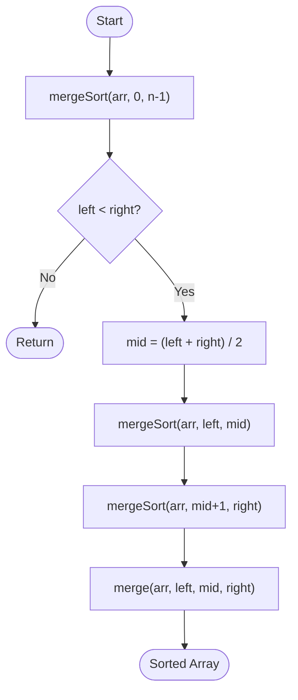

import AdsComponent from '@site/src/components/AdsComponent';

**Merge Sort** is an efficient, stable, comparison-based, divide and conquer sorting algorithm. It divides the unsorted list into `n` sublists, each containing one element, and then repeatedly merges sublists to produce new sorted sublists until there is only one sublist remaining.

<AdsComponent />

<MergeSortVisualization />

<br />

:::info Key Points
- **Type:** Sorting Algorithm (Divide and Conquer)
- **Time Complexity:**
  - **Best Case:** $O(n \log n)$
  - **Average Case:** $O(n \log n)$
  - **Worst Case:** $O(n \log n)$
- **Space Complexity:** $O(n)$
- **Stable:** Yes
- **In-Place:** No
- **Comparison Sort:** Yes
- **Suitable for:** Large data sets, linked lists
:::

:::tip Real-World Analogy
Merge sort is like sorting a shuffled deck of cards by splitting it into two halves, sorting each half independently, and then merging the two sorted halves back into a single sorted deck.
:::

## How Merge Sort Works?

Merge Sort works on the **divide and conquer** strategy:

1. **Divide:** Split the array into two halves.
2. **Conquer:** Recursively sort each half.
3. **Merge:** Combine the two sorted halves into one sorted array.

Consider an array `arr = [38, 27, 43, 3, 9, 82, 10]`:

1. **Divide:** `[38, 27, 43]` and `[3, 9, 82, 10]`
2. **Divide:** `[38]`, `[27, 43]`, `[3, 9]`, `[82, 10]`
3. **Divide:** `[38]`, `[27]`, `[43]`, `[3]`, `[9]`, `[82]`, `[10]`
4. **Merge:** `[27, 38, 43]` and `[3, 9, 10, 82]`
5. **Merge Final:** `[3, 9, 10, 27, 38, 43, 82]` ✅

## Algorithm

1. If the array has one or zero elements, it is already sorted. Return.
2. Find the middle point and divide the array into two halves.
3. Call Merge Sort on the left half.
4. Call Merge Sort on the right half.
5. Merge the two sorted halves.

## Pseudocode

```plaintext title="Merge Sort"
procedure mergeSort(arr, left, right)
    if left < right then
        mid = floor((left + right) / 2)
        mergeSort(arr, left, mid)
        mergeSort(arr, mid + 1, right)
        merge(arr, left, mid, right)
    end if
end procedure

procedure merge(arr, left, mid, right)
    create leftArray = arr[left..mid]
    create rightArray = arr[mid+1..right]
    i = 0, j = 0, k = left
    while i < len(leftArray) and j < len(rightArray)
        if leftArray[i] <= rightArray[j]
            arr[k] = leftArray[i]; i++
        else
            arr[k] = rightArray[j]; j++
        k++
    copy remaining elements of leftArray and rightArray into arr
end procedure
```

<AdsComponent />

## Diagram



## Implementation

<Tabs>
  <TabItem value="javascript" label="JavaScript">

```javascript title="Merge Sort"
function mergeSort(arr) {
  if (arr.length <= 1) return arr;

  const mid = Math.floor(arr.length / 2);
  const left = mergeSort(arr.slice(0, mid));
  const right = mergeSort(arr.slice(mid));

  return merge(left, right);
}

function merge(left, right) {
  const result = [];
  let i = 0, j = 0;

  while (i < left.length && j < right.length) {
    if (left[i] <= right[j]) {
      result.push(left[i++]);
    } else {
      result.push(right[j++]);
    }
  }

  return result.concat(left.slice(i)).concat(right.slice(j));
}

console.log(mergeSort([38, 27, 43, 3, 9, 82, 10]));
// Output: [3, 9, 10, 27, 38, 43, 82]
```

  </TabItem>
  <TabItem value="python" label="Python">

```python title="Merge Sort"
def merge_sort(arr):
    if len(arr) <= 1:
        return arr

    mid = len(arr) // 2
    left = merge_sort(arr[:mid])
    right = merge_sort(arr[mid:])

    return merge(left, right)

def merge(left, right):
    result = []
    i = j = 0

    while i < len(left) and j < len(right):
        if left[i] <= right[j]:
            result.append(left[i])
            i += 1
        else:
            result.append(right[j])
            j += 1

    result.extend(left[i:])
    result.extend(right[j:])
    return result

print(merge_sort([38, 27, 43, 3, 9, 82, 10]))
# Output: [3, 9, 10, 27, 38, 43, 82]
```

  </TabItem>
  <TabItem value="cpp" label="C++">

```cpp title="Merge Sort"
#include <iostream>
#include <vector>
using namespace std;

void merge(vector<int>& arr, int left, int mid, int right) {
    vector<int> leftArr(arr.begin() + left, arr.begin() + mid + 1);
    vector<int> rightArr(arr.begin() + mid + 1, arr.begin() + right + 1);

    int i = 0, j = 0, k = left;
    while (i < leftArr.size() && j < rightArr.size()) {
        if (leftArr[i] <= rightArr[j]) arr[k++] = leftArr[i++];
        else arr[k++] = rightArr[j++];
    }
    while (i < leftArr.size()) arr[k++] = leftArr[i++];
    while (j < rightArr.size()) arr[k++] = rightArr[j++];
}

void mergeSort(vector<int>& arr, int left, int right) {
    if (left >= right) return;
    int mid = (left + right) / 2;
    mergeSort(arr, left, mid);
    mergeSort(arr, mid + 1, right);
    merge(arr, left, mid, right);
}
```

  </TabItem>
  <TabItem value="java" label="Java">

```java title="Merge Sort"
public class MergeSort {
    static void merge(int[] arr, int left, int mid, int right) {
        int n1 = mid - left + 1, n2 = right - mid;
        int[] L = new int[n1], R = new int[n2];

        System.arraycopy(arr, left, L, 0, n1);
        System.arraycopy(arr, mid + 1, R, 0, n2);

        int i = 0, j = 0, k = left;
        while (i < n1 && j < n2)
            arr[k++] = L[i] <= R[j] ? L[i++] : R[j++];
        while (i < n1) arr[k++] = L[i++];
        while (j < n2) arr[k++] = R[j++];
    }

    static void mergeSort(int[] arr, int left, int right) {
        if (left < right) {
            int mid = (left + right) / 2;
            mergeSort(arr, left, mid);
            mergeSort(arr, mid + 1, right);
            merge(arr, left, mid, right);
        }
    }
}
```

  </TabItem>
</Tabs>

## Complexity Analysis

| Case | Time Complexity | Space Complexity |
|------|----------------|-----------------|
| Best | $O(n \log n)$ | $O(n)$ |
| Average | $O(n \log n)$ | $O(n)$ |
| Worst | $O(n \log n)$ | $O(n)$ |

Unlike Bubble or Insertion Sort, Merge Sort guarantees $O(n \log n)$ in **all** cases, making it very reliable for large datasets. The trade-off is the $O(n)$ auxiliary space required for the temporary arrays during merging.

:::tip When to Use Merge Sort
- When you need a **stable** sort
- When sorting **linked lists** (no extra space needed for linked list merge)
- When dealing with **large datasets** that don't fit in memory (external sorting)
- When guaranteed $O(n \log n)$ performance is required
:::

## Quiz

1. What is the time complexity of Merge Sort in all cases?
   - [ ] $O(n)$
   - [ ] $O(n^2)$
   - [x] $O(n \log n)$ ✔
   - [ ] $O(\log n)$

2. Is Merge Sort a stable sorting algorithm?
   - [x] Yes ✔
   - [ ] No

3. What is the space complexity of Merge Sort?
   - [ ] $O(1)$
   - [x] $O(n)$ ✔
   - [ ] $O(\log n)$
   - [ ] $O(n^2)$

4. What strategy does Merge Sort use?
   - [ ] Greedy
   - [ ] Dynamic Programming
   - [x] Divide and Conquer ✔
   - [ ] Backtracking

## References

- [Wikipedia - Merge Sort](https://en.wikipedia.org/wiki/Merge_sort)
- [GeeksforGeeks - Merge Sort](https://www.geeksforgeeks.org/merge-sort/)
- [Programiz - Merge Sort](https://www.programiz.com/dsa/merge-sort)
- [Khan Academy - Merge Sort](https://www.khanacademy.org/computing/computer-science/algorithms/merge-sort/a/overview-of-merge-sort)

<AdsComponent />

## Conclusion

Merge Sort is one of the most important sorting algorithms due to its consistent $O(n \log n)$ performance and stability. While it uses $O(n)$ extra space, it is the algorithm of choice for sorting linked lists and for external sorting problems.
