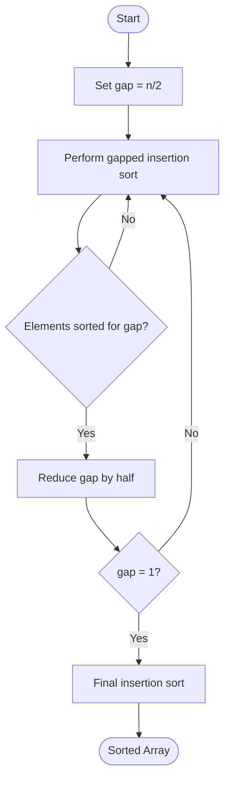

<AdsComponent />

**Shell Sort** is a generalization of insertion sort that allows the exchange of elements that are far apart from each other. It starts with a large gap between compared elements and progressively reduces the gap, eventually performing a standard insertion sort when the gap is 1. This approach significantly improves the efficiency of insertion sort, especially for larger datasets, making it a practical choice for moderate-sized arrays.

## Video Explanation

<LiteYouTubeEmbed
  id="9crZRd8GPWM"
  params="autoplay=1&autohide=1&showinfo=0&rel=0"
  title="7.11 Shell Sort | Sorting Algorithms | Full explanation with Code | DSA Course"
  poster="maxresdefault"
  lazyLoad={true}
  webp
/>

<ShellSortVisualization />

## Algorithm

1. Choose an initial gap value (typically n/2, where n is the array length).
2. Perform a gapped insertion sort using the current gap:
   - Compare elements that are gap positions apart
   - Swap them if they are in the wrong order
   - Move to the next element and repeat
3. Reduce the gap (typically by dividing by 2).
4. Repeat steps 2-3 until the gap becomes 1.
5. When gap is 1, perform a final insertion sort.
6. The array is now sorted.
title: Arrays - Shell Sort
sidebar_label: Shell Sort
description: "Shell Sort is an in-place comparison sort algorithm that generalizes insertion sort by allowing the exchange of elements that are far apart. It starts by sorting pairs of elements far apart from each other, then progressively reducing the gap between elements to be compared."
tags: [dsa, arrays, sorting, shell-sort, gap-sort, sorting-algorithms]
---

<br />

:::info Key Points
- **Type:** Sorting Algorithm (In-place, Generalization of Insertion Sort)
- **Time Complexity:**
  - **Best Case:** $O(n \log n)$
  - **Average Case:** Depends on gap sequence — approximately $O(n^{1.5})$
  - **Worst Case:** $O(n^2)$ (with poor gap sequence) or $O(n \log^2 n)$ (with good sequence)
- **Space Complexity:** $O(1)$
- **Stable:** No
- **In-Place:** Yes
- **Comparison Sort:** Yes
:::

:::tip Real-World Analogy
Imagine you have a large pile of unsorted library books to arrange by number. Instead of comparing each book with its immediate neighbor, you first compare books that are 8 shelves apart, then 4, then 2, then 1. By the time you do the final single-step pass, the books are nearly sorted, making that final step very fast.
:::

## How Shell Sort Works?

Shell Sort works by defining a **gap sequence** (e.g., `n/2, n/4, ..., 1`) and performing a gapped insertion sort for each gap value:

Consider an array `arr = [64, 34, 25, 12, 22, 11, 90]` with `n = 7`:

1. **Gap = 3:** Compare and sort elements 3 positions apart → `[12, 11, 25, 64, 22, 34, 90]`
2. **Gap = 1:** Standard Insertion Sort on the now-nearly-sorted array → `[11, 12, 22, 25, 34, 64, 90]` ✅

The key insight: by the time the gap is 1, the array is almost sorted, so Insertion Sort runs in near-linear time.

## Algorithm

1. Start with a large gap (typically `n/2`).
2. For each gap value, perform a gapped Insertion Sort:
   - For every element from `gap` to `n-1`, insert it into the correct position among the elements separated by `gap`.
3. Halve the gap and repeat until gap = 0.

## Pseudocode

```plaintext title="Shell Sort"
procedure shellSort(arr, size)
    for gap = size / 2; gap > 0; gap = gap / 2 do
        for i = gap; i < size; i = i + 1 do
procedure shellSort(arr, n)
    gap = floor(n / 2)

    while gap > 0 do
        for i = gap to n - 1 do
            temp = arr[i]
            j = i
            while j >= gap and arr[j - gap] > temp do
                arr[j] = arr[j - gap]
                j = j - gap
            end while
            arr[j] = temp
        end for
    end for
        gap = floor(gap / 2)
    end while
end procedure
```

<AdsComponent />

## Diagram



## Example

```js title="Shell Sort"
function shellSort(arr) {
  const n = arr.length;
  
    A([Start]) --> B["gap = n / 2"]
    B --> C{"gap > 0?"}
    C -->|No| D([Sorted Array])
    C -->|Yes| E["Gapped Insertion Sort with current gap"]
    E --> F["gap = gap / 2"]
    F --> C
```

## Implementation

<Tabs>
  <TabItem value="javascript" label="JavaScript">

```javascript title="Shell Sort"
function shellSort(arr) {
  const n = arr.length;

  for (let gap = Math.floor(n / 2); gap > 0; gap = Math.floor(gap / 2)) {
    for (let i = gap; i < n; i++) {
      const temp = arr[i];
      let j = i;
      while (j >= gap && arr[j - gap] > temp) {
        arr[j] = arr[j - gap];
        j -= gap;
      }
      
      arr[j] = temp;
    }
  }
  
  return arr;
}

let arr = [64, 34, 25, 12, 22, 11, 90];
console.log(shellSort(arr)); // [ 11, 12, 22, 25, 34, 64, 90 ]
```

## Complexity

- **Time Complexity**: Depends on gap sequence
  - Best Case: O(n log n)
  - Average Case: O(n log² n)
  - Worst Case: O(n²)
- **Space Complexity**: O(1) - in-place sorting algorithm
- **Stable**: No - can disrupt the relative order of equal elements

## Live Example

```js live
function shellSort() {
  const arr = [64, 34, 25, 12, 22, 11, 90];
  const n = arr.length;
  
  for (let gap = Math.floor(n / 2); gap > 0; gap = Math.floor(gap / 2)) {
    for (let i = gap; i < n; i++) {
      const temp = arr[i];
      let j = i;
      
      while (j >= gap && arr[j - gap] > temp) {
        arr[j] = arr[j - gap];
        j -= gap;
      }
      
      arr[j] = temp;
    }
  }
  
  return (
    <div>
      <h3>Shell Sort</h3>
      <p><b>Array:</b> [64, 34, 25, 12, 22, 11, 90]</p>
      <p>
        <b>Sorted Array:</b> [{arr.join(", ")}]
      </p>
    </div>
  )
}
```

## Explanation

In the above example, we have an array of numbers `[64, 34, 25, 12, 22, 11, 90]`. We use the shell sort algorithm to sort the array in ascending order. The algorithm works by first comparing and sorting elements that are far apart (using a gap), then progressively reducing the gap until the entire array is sorted with gap = 1 (which is essentially insertion sort). This approach moves elements towards their correct position faster than standard insertion sort. The sorted array is `[11, 12, 22, 25, 34, 64, 90]`.

:::info Try it yourself
Change the array values and see how the shell sort algorithm sorts the array using different gap sequences.
:::

<AdsComponent />

:::tip 📝 Note
Shell Sort is an efficient general-purpose sorting algorithm that bridges the gap between simple quadratic algorithms and more complex divide-and-conquer approaches.

The main advantage of shell sort is that it requires only O(1) extra space and performs significantly better than insertion sort for larger datasets with an average-case complexity of O(n log² n).

The performance of shell sort heavily depends on the choice of gap sequence. Different sequences like Shell's original (n/2, n/4, ..., 1), Hibbard's sequence (1, 3, 7, 15, ..., 2ⁿ-1), and Sedgewick's sequence offer different performance characteristics.

Shell sort is particularly useful when memory is limited, as it is an in-place algorithm. However, it is not stable, so it may not preserve the relative order of equal elements.

:::

## Gap Sequences

- **Shell's Original**: n/2, n/4, ..., 1 (simplest but not optimal)
- **Hibbard's**: 1, 3, 7, 15, 31, ..., 2ⁿ-1 (better average performance)
- **Sedgewick's**: More complex formula providing excellent performance for large arrays

## References

- [Wikipedia](https://en.wikipedia.org/wiki/Shellsort)
- [GeeksforGeeks](https://www.geeksforgeeks.org/shellsort/)
- [Programiz](https://www.programiz.com/dsa/shell-sort)
- [TutorialsPoint](https://www.tutorialspoint.com/data_structures_algorithms/shell_sort_algorithm.htm)
- [StudyTonight](https://www.studytonight.com/data-structures/shell-sort)

## Related

Insertion Sort, Bubble Sort, Quick Sort, Merge Sort, Heap Sort, etc.

<AdsComponent />

## Quiz

1. What is the average-case time complexity of shell sort?
   - [ ] O(n)
   - [ ] O(n log n)
   - [x] O(n log² n)     ✔
   - [ ] O(n²)

2. Is shell sort a stable sorting algorithm?
   - [ ] Yes
   - [x] No    ✔
   - [ ] Maybe
   - [ ] Not sure

3. What is the space complexity of shell sort?
   - [x] O(1)   ✔
   - [ ] O(n)
   - [ ] O(log n)
   - [ ] O(n²)

4. What does the "gap" represent in shell sort?
   - [x] The distance between elements being compared     ✔
   - [ ] The number of passes through the array
   - [ ] The pivot element
   - [ ] The sorted portion of the array

5. How is the gap reduced in the original shell sort algorithm?
   - [ ] Subtract 1 each time
   - [x] Divide by 2 each time     ✔
   - [ ] Divide by 3 each time
   - [ ] Use a fixed sequence

## Conclusion

In this tutorial, we learned about the shell sort algorithm. We discussed how it extends insertion sort through the use of gap sequences, explored different gap strategies, and analyzed its time and space complexity. Shell sort is a versatile algorithm that offers a good balance between simplicity and efficiency, making it suitable for moderate-sized datasets and memory-constrained environments. Feel free to share your thoughts in the comments below.
      arr[j] = temp;
    }
  }

  return arr;
}

console.log(shellSort([64, 34, 25, 12, 22, 11, 90]));
// Output: [11, 12, 22, 25, 34, 64, 90]
```

  </TabItem>
  <TabItem value="python" label="Python">

```python title="Shell Sort"
def shell_sort(arr):
    n = len(arr)
    gap = n // 2

    while gap > 0:
        for i in range(gap, n):
            temp = arr[i]
            j = i
            while j >= gap and arr[j - gap] > temp:
                arr[j] = arr[j - gap]
                j -= gap
            arr[j] = temp
        gap //= 2

    return arr

print(shell_sort([64, 34, 25, 12, 22, 11, 90]))
# Output: [11, 12, 22, 25, 34, 64, 90]
```

  </TabItem>
  <TabItem value="cpp" label="C++">

```cpp title="Shell Sort"
#include <iostream>
#include <vector>
using namespace std;

void shellSort(vector<int>& arr) {
    int n = arr.size();

    for (int gap = n / 2; gap > 0; gap /= 2) {
        for (int i = gap; i < n; i++) {
            int temp = arr[i];
            int j = i;

            while (j >= gap && arr[j - gap] > temp) {
                arr[j] = arr[j - gap];
                j -= gap;
            }
            arr[j] = temp;
        }
    }
}
```

  </TabItem>
  <TabItem value="java" label="Java">

```java title="Shell Sort"
public class ShellSort {
    static void shellSort(int[] arr) {
        int n = arr.length;

        for (int gap = n / 2; gap > 0; gap /= 2) {
            for (int i = gap; i < n; i++) {
                int temp = arr[i];
                int j = i;

                while (j >= gap && arr[j - gap] > temp) {
                    arr[j] = arr[j - gap];
                    j -= gap;
                }
                arr[j] = temp;
            }
        }
    }
}
```

  </TabItem>
</Tabs>

## Complexity Analysis

| Case | Time Complexity | Space Complexity |
|------|----------------|-----------------|
| Best | $O(n \log n)$ | $O(1)$ |
| Average | $O(n^{1.5})$ | $O(1)$ |
| Worst | $O(n^2)$ | $O(1)$ |

Shell Sort's time complexity depends heavily on the **gap sequence** chosen:
- **Shell's original sequence** (`n/2, n/4, ..., 1`) → $O(n^2)$ worst case
- **Hibbard's sequence** (`1, 3, 7, 15, ...`) → $O(n^{3/2})$ worst case
- **Sedgewick's sequence** → $O(n^{4/3})$ worst case

:::tip When to Use Shell Sort
- When you need an **in-place** sort with better performance than $O(n^2)$ algorithms
- When you cannot use $O(n)$ extra space (rules out Merge Sort)
- Suitable for **medium-sized** datasets
- Used in **embedded systems** where memory is constrained
:::

## Shell Sort vs Insertion Sort

| Feature | Shell Sort | Insertion Sort |
|---------|-----------|----------------|
| Time (Best) | $O(n \log n)$ | $O(n)$ |
| Time (Worst) | $O(n^2)$ | $O(n^2)$ |
| Space | $O(1)$ | $O(1)$ |
| Stable | ❌ No | ✅ Yes |
| Practical Speed | Much faster | Slow on large data |

## Quiz

1. Shell Sort is an improved version of which algorithm?
   - [ ] Bubble Sort
   - [x] Insertion Sort ✔
   - [ ] Merge Sort
   - [ ] Quick Sort

2. Is Shell Sort an in-place algorithm?
   - [x] Yes ✔
   - [ ] No

3. Is Shell Sort stable?
   - [ ] Yes
   - [x] No ✔

4. What does the "gap" represent in Shell Sort?
   - [x] The distance between elements being compared ✔
   - [ ] The number of elements sorted
   - [ ] The size of the subarray
   - [ ] The number of passes

## References

- [Wikipedia - Shell Sort](https://en.wikipedia.org/wiki/Shellsort)
- [GeeksforGeeks - Shell Sort](https://www.geeksforgeeks.org/shellsort/)
- [Programiz - Shell Sort](https://www.programiz.com/dsa/shell-sort)
- [TutorialsPoint - Shell Sort](https://www.tutorialspoint.com/data_structures_algorithms/shell_sort_algorithm.htm)

<AdsComponent />

## Conclusion

Shell Sort bridges the gap between simple $O(n^2)$ algorithms and complex $O(n \log n)$ algorithms. It is particularly useful when memory space is constrained (unlike Merge Sort) and when a simple implementation with decent performance is required for medium-sized datasets.
