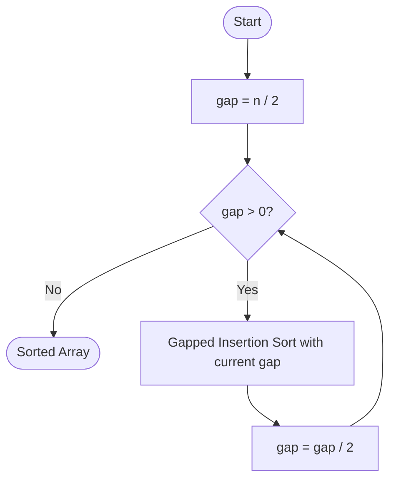

import AdsComponent from '@site/src/components/AdsComponent';

**Shell Sort** is a highly efficient in-place sorting algorithm and an improved version of Insertion Sort. It allows the exchange of items that are far apart, unlike Insertion Sort which only exchanges adjacent items. The idea is to arrange the list of elements so that, starting anywhere, taking every $h$-th element produces a sorted list — such a list is said to be **h-sorted**.

## Video Explanation

<LiteYouTubeEmbed
  id="9crZRd8GPWM"
  params="autoplay=1&autohide=1&showinfo=0&rel=0"
  title="7.11 Shell Sort | Sorting Algorithms | Full explanation with Code | DSA Course"
  poster="maxresdefault"
  lazyLoad={true}
  webp
/>


<AdsComponent />

<ShellSortVisualization />

<br />

:::info Key Points
- **Type:** Sorting Algorithm (In-place, Generalization of Insertion Sort)
- **Time Complexity:**
  - **Best Case:** $O(n \log n)$
  - **Average Case:** Depends on gap sequence — approximately $O(n^{1.5})$
  - **Worst Case:** $O(n^2)$ (with poor gap sequence) or $O(n \log^2 n)$ (with good sequence)
- **Space Complexity:** $O(1)$
- **Stable:** No
- **In-Place:** Yes
- **Comparison Sort:** Yes
:::

:::tip Real-World Analogy
Imagine you have a large pile of unsorted library books to arrange by number. Instead of comparing each book with its immediate neighbor, you first compare books that are 8 shelves apart, then 4, then 2, then 1. By the time you do the final single-step pass, the books are nearly sorted, making that final step very fast.
:::

## How Shell Sort Works?

Shell Sort works by defining a **gap sequence** (e.g., `n/2, n/4, ..., 1`) and performing a gapped insertion sort for each gap value:

Consider an array `arr = [64, 34, 25, 12, 22, 11, 90]` with `n = 7`:

1. **Gap = 3:** Compare and sort elements 3 positions apart → `[12, 11, 25, 64, 22, 34, 90]`
2. **Gap = 1:** Standard Insertion Sort on the now-nearly-sorted array → `[11, 12, 22, 25, 34, 64, 90]` ✅

The key insight: by the time the gap is 1, the array is almost sorted, so Insertion Sort runs in near-linear time.

## Algorithm

1. Start with a large gap (typically `n/2`).
2. For each gap value, perform a gapped Insertion Sort:
   - For every element from `gap` to `n-1`, insert it into the correct position among the elements separated by `gap`.
3. Halve the gap and repeat until gap = 0.

## Pseudocode

```plaintext title="Shell Sort"
procedure shellSort(arr, n)
    gap = floor(n / 2)

    while gap > 0 do
        for i = gap to n - 1 do
            temp = arr[i]
            j = i
            while j >= gap and arr[j - gap] > temp do
                arr[j] = arr[j - gap]
                j = j - gap
            end while
            arr[j] = temp
        end for
        gap = floor(gap / 2)
    end while
end procedure
```

<AdsComponent />

## Diagram



## Implementation

<Tabs>
  <TabItem value="javascript" label="JavaScript">

```javascript title="Shell Sort"
function shellSort(arr) {
  const n = arr.length;

  for (let gap = Math.floor(n / 2); gap > 0; gap = Math.floor(gap / 2)) {
    for (let i = gap; i < n; i++) {
      const temp = arr[i];
      let j = i;

      while (j >= gap && arr[j - gap] > temp) {
        arr[j] = arr[j - gap];
        j -= gap;
      }
      arr[j] = temp;
    }
  }

  return arr;
}

console.log(shellSort([64, 34, 25, 12, 22, 11, 90]));
// Output: [11, 12, 22, 25, 34, 64, 90]
```

  </TabItem>
  <TabItem value="python" label="Python">

```python title="Shell Sort"
def shell_sort(arr):
    n = len(arr)
    gap = n // 2

    while gap > 0:
        for i in range(gap, n):
            temp = arr[i]
            j = i
            while j >= gap and arr[j - gap] > temp:
                arr[j] = arr[j - gap]
                j -= gap
            arr[j] = temp
        gap //= 2

    return arr

print(shell_sort([64, 34, 25, 12, 22, 11, 90]))
# Output: [11, 12, 22, 25, 34, 64, 90]
```

  </TabItem>
  <TabItem value="cpp" label="C++">

```cpp title="Shell Sort"
#include <iostream>
#include <vector>
using namespace std;

void shellSort(vector<int>& arr) {
    int n = arr.size();

    for (int gap = n / 2; gap > 0; gap /= 2) {
        for (int i = gap; i < n; i++) {
            int temp = arr[i];
            int j = i;

            while (j >= gap && arr[j - gap] > temp) {
                arr[j] = arr[j - gap];
                j -= gap;
            }
            arr[j] = temp;
        }
    }
}
```

  </TabItem>
  <TabItem value="java" label="Java">

```java title="Shell Sort"
public class ShellSort {
    static void shellSort(int[] arr) {
        int n = arr.length;

        for (int gap = n / 2; gap > 0; gap /= 2) {
            for (int i = gap; i < n; i++) {
                int temp = arr[i];
                int j = i;

                while (j >= gap && arr[j - gap] > temp) {
                    arr[j] = arr[j - gap];
                    j -= gap;
                }
                arr[j] = temp;
            }
        }
    }
}
```

  </TabItem>
</Tabs>

## Complexity Analysis

| Case | Time Complexity | Space Complexity |
|------|----------------|-----------------|
| Best | $O(n \log n)$ | $O(1)$ |
| Average | $O(n^{1.5})$ | $O(1)$ |
| Worst | $O(n^2)$ | $O(1)$ |

Shell Sort's time complexity depends heavily on the **gap sequence** chosen:
- **Shell's original sequence** (`n/2, n/4, ..., 1`) → $O(n^2)$ worst case
- **Hibbard's sequence** (`1, 3, 7, 15, ...`) → $O(n^{3/2})$ worst case
- **Sedgewick's sequence** → $O(n^{4/3})$ worst case

:::tip When to Use Shell Sort
- When you need an **in-place** sort with better performance than $O(n^2)$ algorithms
- When you cannot use $O(n)$ extra space (rules out Merge Sort)
- Suitable for **medium-sized** datasets
- Used in **embedded systems** where memory is constrained
:::

## Shell Sort vs Insertion Sort

| Feature | Shell Sort | Insertion Sort |
|---------|-----------|----------------|
| Time (Best) | $O(n \log n)$ | $O(n)$ |
| Time (Worst) | $O(n^2)$ | $O(n^2)$ |
| Space | $O(1)$ | $O(1)$ |
| Stable | ❌ No | ✅ Yes |
| Practical Speed | Much faster | Slow on large data |

## Quiz

1. Shell Sort is an improved version of which algorithm?
   - [ ] Bubble Sort
   - [x] Insertion Sort ✔
   - [ ] Merge Sort
   - [ ] Quick Sort

2. Is Shell Sort an in-place algorithm?
   - [x] Yes ✔
   - [ ] No

3. Is Shell Sort stable?
   - [ ] Yes
   - [x] No ✔

4. What does the "gap" represent in Shell Sort?
   - [x] The distance between elements being compared ✔
   - [ ] The number of elements sorted
   - [ ] The size of the subarray
   - [ ] The number of passes

## References

- [Wikipedia - Shell Sort](https://en.wikipedia.org/wiki/Shellsort)
- [GeeksforGeeks - Shell Sort](https://www.geeksforgeeks.org/shellsort/)
- [Programiz - Shell Sort](https://www.programiz.com/dsa/shell-sort)
- [TutorialsPoint - Shell Sort](https://www.tutorialspoint.com/data_structures_algorithms/shell_sort_algorithm.htm)

<AdsComponent />

## Conclusion

Shell Sort bridges the gap between simple $O(n^2)$ algorithms and complex $O(n \log n)$ algorithms. It is particularly useful when memory space is constrained (unlike Merge Sort) and when a simple implementation with decent performance is required for medium-sized datasets.
