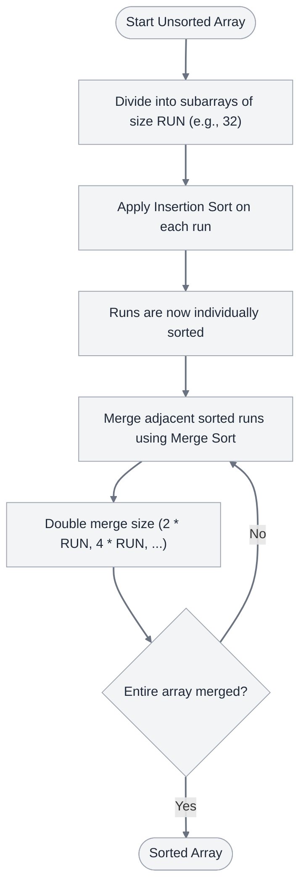

import Tabs from '@theme/Tabs';
import TabItem from '@theme/TabItem';
import AdsComponent from '@site/src/components/AdsComponent';

<AdsComponent />

**Tim Sort** is a hybrid, stable, and adaptive sorting algorithm derived from **Merge Sort** and **Insertion Sort**. It was designed by Tim Peters in 2002 for use in the Python programming language. Tim Sort is highly optimized to perform exceptionally well on real-world datasets, which frequently contain pre-sorted runs of data (either ascending or descending).

Today, Tim Sort is the default sorting algorithm used by:
- **Python** (for `list.sort()` and `sorted()`)
- **Java** (for `Arrays.sort()` on non-primitive types)
- **V8 JavaScript Engine** (for `Array.prototype.sort()` in Chrome/Node.js)
- **Android SDK** and **Rust** (for stable sorting)

<TimSortVisualization />

<AdsComponent />

:::info Key Points
- **Type:** Hybrid, Adaptive, Stable, Comparison-based Sorting Algorithm
- **Time Complexity:**
  - **Best Case:** $O(n)$ (when the array is already sorted or nearly sorted)
  - **Average Case:** $O(n \log n)$
  - **Worst Case:** $O(n \log n)$
- **Space Complexity:** $O(n)$ auxiliary space (to merge runs)
- **Stable:** ✅ Yes (preserves the relative order of duplicate elements)
- **In-place:** ❌ No (requires auxiliary memory for merging)
:::

:::tip Real-World Analogy
Imagine organizing a large archive of client folders. Instead of starting from scratch to compare every single folder (like Quick Sort) or splitting everything into tiny single-folder pieces (like Merge Sort), you look for naturally ordered piles (e.g., a stack already sorted from A to G). You quickly sort any small unorganized stacks using a simple insert-in-place method, and then merge the large organized piles together. This combines the speed of insertion for small groups and the power of merging for large ones!
:::

---

## How Tim Sort Works?

Tim Sort operates by breaking down the array sorting process into three main steps:

1. **Calculate the Minimum Run Size (`minRun`):**
   - The array is divided into small segments called **runs**.
   - A minimum run length (`minRun`) is chosen (usually between 32 and 64) such that the size of the array divided by `minRun` is equal to or slightly less than a power of two. This ensures that the subsequent merge operations are perfectly balanced.

2. **Insertion Sort on Small Runs:**
   - The algorithm iterates through the array, finding natural sequential runs (either increasing or decreasing).
   - If a run is smaller than `minRun`, the algorithm extends the run using **Insertion Sort** on the subsequent elements.
   - Insertion sort is highly efficient for small arrays because of cache locality and low overhead.

3. **Merge Runs using Merge Sort:**
   - Once all runs are sorted, they are merged pairwise using a stack-based merge mechanism.
   - Tim Sort uses a stack to keep track of the runs and merges adjacent runs when certain criteria are met (to keep the stack balanced, similar to the Fibonacci sequence).
   - It also employs **Galloping Mode**, a search optimization that speeds up merging when one run consistently has smaller elements than another.

---

## Algorithm

1. Divide the array into blocks of size `RUN` (typically 32).
2. Sort each block using a modified **Insertion Sort**.
3. Merge the sorted blocks one by one using the merge process from **Merge Sort**:
   - Merge subarrays of size `RUN` to create sorted subarrays of size `2 * RUN`.
   - Merge subarrays of size `2 * RUN` to create sorted subarrays of size `4 * RUN`, and so on.
   - Continue doubling the size of the merged blocks until the entire array is sorted.

---

## Pseudocode

```plaintext title="Tim Sort"
procedure insertionSort(arr, left, right)
    for i = left + 1 to right do
        temp = arr[i]
        j = i - 1
        while j >= left and arr[j] > temp do
            arr[j + 1] = arr[j]
            j = j - 1
        end while
        arr[j + 1] = temp
    end for
end procedure

procedure merge(arr, left, mid, right)
    len1 = mid - left + 1
    len2 = right - mid
    
    create arrays L[len1] and R[len2]
    
    for i = 0 to len1 - 1 do
        L[i] = arr[left + i]
    end for
    for j = 0 to len2 - 1 do
        R[j] = arr[mid + 1 + j]
    end for
    
    i = 0, j = 0, k = left
    
    while i < len1 and j < len2 do
        if L[i] <= R[j] then
            arr[k] = L[i]
            i = i + 1
        else
            arr[k] = R[j]
            j = j + 1
        end if
        k = k + 1
    end while
    
    while i < len1 do
        arr[k] = L[i]
        i = i + 1
        k = k + 1
    end while
    
    while j < len2 do
        arr[k] = R[j]
        j = j + 1
        k = k + 1
    end while
end procedure

procedure timSort(arr, n)
    RUN = 32
    
    // Sort individual subarrays of size RUN
    for i = 0 to n - 1 step RUN do
        insertionSort(arr, i, min(i + RUN - 1, n - 1))
    end for
    
    // Start merging from size RUN. It will double at each iteration.
    for size = RUN to n - 1 step 2 * size do
        for left = 0 to n - 1 step 2 * size do
            mid = left + size - 1
            right = min(left + 2 * size - 1, n - 1)
            
            if mid < right then
                merge(arr, left, mid, right)
            end if
        end for
    end for
end procedure
```

---

## Diagram



---

## Implementation

<Tabs>
  <TabItem value="javascript" label="JavaScript">

```javascript title="Tim Sort"
const RUN = 32;

// Insertion Sort helper function
function insertionSort(arr, left, right) {
  for (let i = left + 1; i <= right; i++) {
    const temp = arr[i];
    let j = i - 1;
    while (j >= left && arr[j] > temp) {
      arr[j + 1] = arr[j];
      j--;
    }
    arr[j + 1] = temp;
  }
}

// Merge helper function
function merge(arr, l, m, r) {
  const len1 = m - l + 1;
  const len2 = r - m;
  const left = new Array(len1);
  const right = new Array(len2);

  for (let i = 0; i < len1; i++) {
    left[i] = arr[l + i];
  }
  for (let i = 0; i < len2; i++) {
    right[i] = arr[m + 1 + i];
  }

  let i = 0, j = 0, k = l;

  while (i < len1 && j < len2) {
    if (left[i] <= right[j]) {
      arr[k] = left[i];
      i++;
    } else {
      arr[k] = right[j];
      j++;
    }
    k++;
  }

  while (i < len1) {
    arr[k] = left[i];
    i++;
    k++;
  }

  while (j < len2) {
    arr[k] = right[j];
    j++;
    k++;
  }
}

// Main Tim Sort function
function timSort(arr) {
  const n = arr.length;

  // Step 1: Sort individual subarrays of size RUN
  for (let i = 0; i < n; i += RUN) {
    insertionSort(arr, i, Math.min(i + RUN - 1, n - 1));
  }

  // Step 2: Merge sorted runs
  for (let size = RUN; size < n; size = 2 * size) {
    for (let left = 0; left < n; left += 2 * size) {
      const mid = left + size - 1;
      const right = Math.min(left + 2 * size - 1, n - 1);

      if (mid < right) {
        merge(arr, left, mid, right);
      }
    }
  }

  return arr;
}

// Example usage:
const arr = [64, 34, 25, 12, 22, 11, 90, 45, 23, 87, 10, 5, 80, 55, 72];
console.log("Original Array:", arr);
console.log("Sorted Array:  ", timSort(arr));
```

  </TabItem>
  <TabItem value="python" label="Python">

```python title="Tim Sort"
RUN = 32

def insertion_sort(arr, left, right):
    for i in range(left + 1, right + 1):
        temp = arr[i]
        j = i - 1
        while j >= left and arr[j] > temp:
            arr[j + 1] = arr[j]
            j -= 1
        arr[j + 1] = temp

def merge(arr, l, m, r):
    len1, len2 = m - l + 1, r - m
    left, right = [], []
    for i in range(0, len1):
        left.append(arr[l + i])
    for i in range(0, len2):
        right.append(arr[m + 1 + i])

    i, j, k = 0, 0, l

    while i < len1 and j < len2:
        if left[i] <= right[j]:
            arr[k] = left[i]
            i += 1
        else:
            arr[k] = right[j]
            j += 1
        k += 1

    while i < len1:
        arr[k] = left[i]
        i += 1
        k += 1

    while j < len2:
        arr[k] = right[j]
        j += 1
        k += 1

def tim_sort(arr):
    n = len(arr)

    # Sort individual subarrays of size RUN
    for i in range(0, n, RUN):
        insertion_sort(arr, i, min((i + RUN - 1), (n - 1)))

    # Merge runs starting from size RUN
    size = RUN
    while size < n:
        for left in range(0, n, 2 * size):
            mid = left + size - 1
            right = min((left + 2 * size - 1), (n - 1))

            if mid < right:
                merge(arr, left, mid, right)
        size = 2 * size
    return arr

# Example usage:
arr = [64, 34, 25, 12, 22, 11, 90, 45, 23, 87, 10, 5, 80, 55, 72]
print("Sorted Array is:", tim_sort(arr))
```

  </TabItem>
  <TabItem value="cpp" label="C++">

```cpp title="Tim Sort"
#include <iostream>
#include <vector>
#include <algorithm>

using namespace std;

const int RUN = 32;

void insertionSort(vector<int>& arr, int left, int right) {
    for (int i = left + 1; i <= right; i++) {
        int temp = arr[i];
        int j = i - 1;
        while (j >= left && arr[j] > temp) {
            arr[j + 1] = arr[j];
            j--;
        }
        arr[j + 1] = temp;
    }
}

void merge(vector<int>& arr, int l, int m, int r) {
    int len1 = m - l + 1, len2 = r - m;
    vector<int> left(len1), right(len2);
    for (int i = 0; i < len1; i++)
        left[i] = arr[l + i];
    for (int i = 0; i < len2; i++)
        right[i] = arr[m + 1 + i];

    int i = 0, j = 0, k = l;

    while (i < len1 && j < len2) {
        if (left[i] <= right[j]) {
            arr[k] = left[i];
            i++;
        } else {
            arr[k] = right[j];
            j++;
        }
        k++;
    }

    while (i < len1) {
        arr[k] = left[i];
        i++;
        k++;
    }

    while (j < len2) {
        arr[k] = right[j];
        j++;
        k++;
    }
}

void timSort(vector<int>& arr) {
    int n = arr.size();

    // Sort individual subarrays of size RUN
    for (int i = 0; i < n; i += RUN)
        insertionSort(arr, i, min((i + RUN - 1), (n - 1)));

    // Merge runs starting from size RUN
    for (int size = RUN; size < n; size = 2 * size) {
        for (int left = 0; left < n; left += 2 * size) {
            int mid = left + size - 1;
            int right = min((left + 2 * size - 1), (n - 1));

            if (mid < right)
                merge(arr, left, mid, right);
        }
    }
}

int main() {
    vector<int> arr = {64, 34, 25, 12, 22, 11, 90, 45, 23, 87, 10, 5, 80, 55, 72};
    timSort(arr);
    cout << "Sorted Array: ";
    for (int x : arr) cout << x << " ";
    cout << endl;
    return 0;
}
```

  </TabItem>
  <TabItem value="java" label="Java">

```java title="Tim Sort"
import java.util.Arrays;

public class TimSort {
    private static final int RUN = 32;

    public static void insertionSort(int[] arr, int left, int right) {
        for (int i = left + 1; i <= right; i++) {
            int temp = arr[i];
            int j = i - 1;
            while (j >= left && arr[j] > temp) {
                arr[j + 1] = arr[j];
                j--;
            }
            arr[j + 1] = temp;
        }
    }

    public static void merge(int[] arr, int l, int m, int r) {
        int len1 = m - l + 1, len2 = r - m;
        int[] left = new int[len1];
        int[] right = new int[len2];
        System.arraycopy(arr, l, left, 0, len1);
        System.arraycopy(arr, m + 1, right, 0, len2);

        int i = 0, j = 0, k = l;

        while (i < len1 && j < len2) {
            if (left[i] <= right[j]) {
                arr[k] = left[i];
                i++;
            } else {
                arr[k] = right[j];
                j++;
            }
            k++;
        }

        while (i < len1) {
            arr[k] = left[i];
            i++;
            k++;
        }

        while (j < len2) {
            arr[k] = right[j];
            j++;
            k++;
        }
    }

    public static void timSort(int[] arr) {
        int n = arr.length;

        // Sort individual subarrays of size RUN
        for (int i = 0; i < n; i += RUN) {
            insertionSort(arr, i, Math.min((i + RUN - 1), (n - 1)));
        }

        // Merge runs starting from size RUN
        for (int size = RUN; size < n; size = 2 * size) {
            for (int left = 0; left < n; left += 2 * size) {
                int mid = left + size - 1;
                int right = Math.min((left + 2 * size - 1), (n - 1));

                if (mid < right) {
                    merge(arr, left, mid, right);
                }
            }
        }
    }

    public static void main(String[] args) {
        int[] arr = {64, 34, 25, 12, 22, 11, 90, 45, 23, 87, 10, 5, 80, 55, 72};
        timSort(arr);
        System.out.println("Sorted Array: " + Arrays.toString(arr));
    }
}
```

  </TabItem>
</Tabs>

---

## Complexity Analysis

| Case | Time Complexity | Space Complexity | stability | In-Place |
|---|---|---|---|---|
| **Best Case** | $O(n)$ | $O(n)$ | Stable | No |
| **Average Case** | $O(n \log n)$ | $O(n)$ | Stable | No |
| **Worst Case** | $O(n \log n)$ | $O(n)$ | Stable | No |

### Analysis Highlights:
- **Best-Case Complexity ($O(n)$):** When the array is already sorted (fully or nearly), the algorithm identifies natural runs without needing to do insertions or merge passes, rendering it linear.
- **Space Complexity ($O(n)$):** Although Insertion Sort is in-place, the Merge phase requires temporary memory space to store and merge runs. Thus, Tim Sort has an overall space complexity of $O(n)$.
- **Stability:** By retaining the relative order of elements during both insertion sorting and merging, Tim Sort is guaranteed to be stable.

---

## Live Example

```js live
function timSortLive() {
  const arr = [64, 34, 25, 12, 22, 11, 90, 45, 23, 87, 10, 5, 80, 55, 72];
  
  function insertionSort(arr, left, right) {
    for (let i = left + 1; i <= right; i++) {
      const temp = arr[i];
      let j = i - 1;
      while (j >= left && arr[j] > temp) {
        arr[j + 1] = arr[j];
        j--;
      }
      arr[j + 1] = temp;
    }
  }

  function merge(arr, l, m, r) {
    const len1 = m - l + 1;
    const len2 = r - m;
    const left = new Array(len1);
    const right = new Array(len2);
    for (let i = 0; i < len1; i++) left[i] = arr[l + i];
    for (let i = 0; i < len2; i++) right[i] = arr[m + 1 + i];

    let i = 0, j = 0, k = l;
    while (i < len1 && j < len2) {
      if (left[i] <= right[j]) {
        arr[k++] = left[i++];
      } else {
        arr[k++] = right[j++];
      }
    }
    while (i < len1) arr[k++] = left[i++];
    while (j < len2) arr[k++] = right[j++];
  }

  function doTimSort(arr) {
    const n = arr.length;
    const RUN = 4; // Smaller RUN size for demonstration on small array
    for (let i = 0; i < n; i += RUN) {
      insertionSort(arr, i, Math.min(i + RUN - 1, n - 1));
    }
    for (let size = RUN; size < n; size = 2 * size) {
      for (let left = 0; left < n; left += 2 * size) {
        const mid = left + size - 1;
        const right = Math.min(left + 2 * size - 1, n - 1);
        if (mid < right) {
          merge(arr, left, mid, right);
        }
      }
    }
    return arr;
  }

  const sorted = doTimSort([...arr]);

  return (
    <div>
      <h3>Tim Sort Live Demo</h3>
      <p><b>Original Array:</b> [{arr.join(", ")}]</p>
      <p><b>Sorted Array:</b> [{sorted.join(", ")}]</p>
    </div>
  );
}
```

---

## Explanation

In the JavaScript implementation, we showcase the core concept of Tim Sort:
1. We define `RUN = 32`.
2. First, we call `insertionSort` on segments of length 32. This partitions the array into sorted chunks quickly.
3. Then, starting from `size = 32`, we perform pairwise merging of these chunks:
   - Blocks of size 32 merge to size 64.
   - Blocks of size 64 merge to size 128, and so on.
4. When the loop terminates, the array is completely sorted in a stable manner.

:::info Try it yourself
Change the values in the array inside the live editor above to see how Tim Sort correctly sorts any integer sequence.
:::

---

## References

- [Wikipedia - Timsort](https://en.wikipedia.org/wiki/Timsort)
- [GeeksforGeeks - Timsort](https://www.geeksforgeeks.org/timsort/)
- [Python's listsort implementation details](https://github.com/python/cpython/blob/main/Objects/listsort.txt)

## Related

Insertion Sort, Merge Sort, Quick Sort, Bubble Sort, Radix Sort, Counting Sort.

<AdsComponent />

---

## Quiz

1. Tim Sort is a hybrid of which two sorting algorithms?
   - [ ] Bubble Sort and Merge Sort
   - [ ] Selection Sort and Quick Sort
   - [x] Insertion Sort and Merge Sort ✔
   - [ ] Insertion Sort and Heap Sort

2. What is the best-case time complexity of Tim Sort?
   - [ ] O(n log n)
   - [x] O(n) ✔
   - [ ] O(n²)
   - [ ] O(1)

3. Is Tim Sort a stable sorting algorithm?
   - [x] Yes ✔
   - [ ] No

4. Which engine/language does NOT use Tim Sort as its default sorting algorithm for objects/general arrays?
   - [ ] Python
   - [ ] Java
   - [ ] V8 JavaScript engine (Chrome/Node.js)
   - [x] C++ standard template library (std::sort uses IntroSort) ✔

---

## Conclusion

Tim Sort combines the best aspects of Insertion Sort (efficient for small, already-sorted chunks) and Merge Sort (guaranteed $O(n \log n)$ scaling). By adaptively identifying sorted segments and merging them in a balanced sequence, it performs exceptionally well on real-world inputs, cementing its status as the default sorting tool for many modern languages.

<style>{`
  html:not([data-theme='dark']) .timsort-visualizer-card {
    background-color: #f8fafc !important;
    color: #0f172a !important;
    border-color: #cbd5e1 !important;
  }
  html:not([data-theme='dark']) .timsort-visualizer-card .button-group button {
    border-color: #d97706 !important;
    color: #d97706 !important;
  }
  html:not([data-theme='dark']) .timsort-visualizer-card .button-group button:hover {
    background-color: #d97706 !important;
    color: #ffffff !important;
  }
  html:not([data-theme='dark']) .timsort-visualizer-card .slider-wrapper label {
    color: #0f172a !important;
  }
`}</style>
