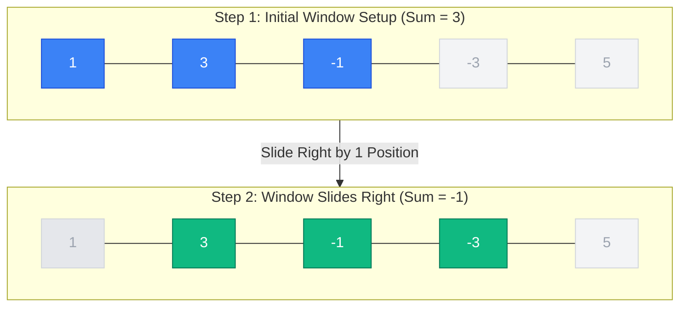

The **Sliding Window Technique** is a powerful algorithmic optimization used to perform required operations on a specific window size of a linear data structure (like an array, list, or string) without recalculating the entire overlapping region from scratch. 

By maintaining a running state between two pointers (left and right), this approach converts inefficient brute-force $O(N^2)$ solutions into highly optimized $O(N)$ linear-time solutions.

---

## 1. Video Explanation

<LiteYouTubeEmbed
  id="9kdHxplyl5I"
  params="autoplay=1&autohide=1&showinfo=0&rel=0"
  title="L1. Introduction to Sliding Window and 2 Pointers | Templates | Patterns"
  poster="maxresdefault"
  lazyLoad={true}
  webp
/>

---

## 2. Core Concept

In problems involving contiguous subarrays or substrings, a brute-force approach often uses nested loops to recalculate properties for every possible window. The sliding window technique removes this redundancy. As the window "slides" forward, you add the element entering the window from the right and remove the element leaving the window from the left.

$$\text{New Window State} = \text{Previous Window State} + \text{Entering Element} - \text{Leaving Element}$$

---

## 3. Visual Representation

Here is a visual representation of a fixed window of size $K = 3$ moving across an array:



---

## 4. Classifications

### A. Fixed-size Sliding Window
Used when the window length $K$ is constant and explicitly specified. The objective is typically to find an optimal state (maximum, minimum, or target match) among all valid windows of size $K$.

#### Problem Example: Maximum Sum Subarray of Size K
Given an array of integers and a number $K$, find the maximum sum of any contiguous subarray of size $K$.

```cpp
#include <vector>
#include <algorithm>
#include <iostream>

int maxSubarraySum(const std::vector<int>& arr, int k) {
    int n = arr.size();
    if (n < k) {
        return -1; // Invalid input case
    }

    // Compute the sum of the first window
    int window_sum = 0;
    for (int i = 0; i < k; ++i) {
        window_sum += arr[i];
    }

    int max_sum = window_sum;

    // Slide the window from index k to n-1
    for (int i = k; i < n; ++i) {
        window_sum += arr[i] - arr[i - k]; // Add next element, slide out oldest
        max_sum = std::max(max_sum, window_sum);
    }

    return max_sum;
}
```

### B. Variable-size Sliding Window
Used when the window length expands or contracts dynamically based on a given constraint or condition (e.g., "Find the longest subarray with a sum less than or equal to $X$").

#### Problem Example: Longest Subarray with Sum $\le$ Target
Given an array of positive integers and a target value, find the maximum length of a contiguous subarray whose sum is less than or equal to the target.
```cpp
#include <vector>
#include <algorithm>
#include <iostream>

int longestSubarrayWithSumK(const std::vector<int>& arr, int target) {
    int n = arr.size();
    int left = 0;
    int current_sum = 0;
    int max_length = 0;

    for (int right = 0; right < n; ++right) {
        current_sum += arr[right]; // Expand the window

        // Contract the window from the left until the condition is satisfied
        while (current_sum > target && left <= right) {
            current_sum -= arr[left];
            left++;
        }

        // Calculate the maximum valid window size found so far
        max_length = std::max(max_length, right - left + 1);
    }

    return max_length;
}
```

---

## 5. Multi-Language Snippets

### Python
```py
def longest_subarray_with_sum_k(arr, target):
n = len(arr)
left = 0
current_sum = 0
max_length = 0

for right in range(n):
    current_sum += arr[right] # Expand the window

    # Contract the window from the left until the condition is satisfied
    while current_sum > target and left <= right:
        current_sum -= arr[left]
        left += 1

    # Calculate the maximum valid window size found so far
    max_length = max(max_length, right - left + 1)

return max_length
```

### Java
```java
public class Solution {
public static int longestSubarrayWithSumK(int[] arr, int target) {
int n = arr.length;
int left = 0;
int currentSum = 0;
int maxLength = 0;

    for (int right = 0; right < n; ++right) {
        currentSum += arr[right]; // Expand the window

        // Contract the window from the left until the condition is satisfied
        while (currentSum > target && left <= right) {
            currentSum -= arr[left];
            left++;
        }

        // Calculate the maximum valid window size found so far
        maxLength = Math.max(maxLength, right - left + 1);
    }

    return maxLength;
}
}
```

### JavaScript
```js
function longestSubarrayWithSumK(arr, target) {
const n = arr.length;
let left = 0;
let currentSum = 0;
let maxLength = 0;

for (let right = 0; right < n; right++) {
    currentSum += arr[right]; // Expand the window

    // Contract the window from the left until the condition is satisfied
    while (currentSum > target && left <= right) {
        currentSum -= arr[left];
        left++;
    }

    // Calculate the maximum valid window size found so far
    maxLength = Math.max(maxLength, right - left + 1);
}

return maxLength;
}
```

---

## 6. Complexity Analysis

* **Time Complexity:** $O(N)$
  Even though there is a nested loop (the `while` loop in the variable-sized window variation), each element is processed at most twice: once when entering the window via the `right` pointer, and at most once when leaving the window via the `left` pointer. This yields a total runtime performance of $2N$, which simplifies to linear $O(N)$ time.

* **Space Complexity:** $O(1)$
  The optimization is executed entirely in-place, consuming only a static, constant amount of auxiliary memory for pointers and tracking variables.