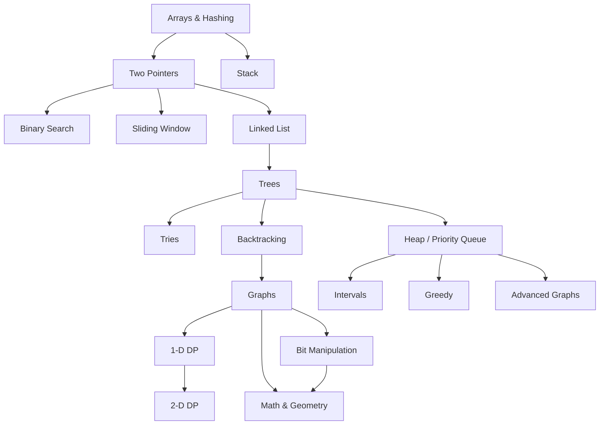

import DSALearningRoadmap from '@site/src/components/DSALearningRoadmap';

Let’s be honest: trying to learn Data Structures and Algorithms by randomly solving problems is a recipe for burnout. You hit a wall, get frustrated, and feel like you aren't cut out for software engineering. 

The secret to mastering DSA isn't brilliant intelligence—it is **proper sequencing**. You need to build your knowledge layer by layer, ensuring that every new concept you learn leverages the tools you just mastered. This roadmap is a battle-tested, structured path designed to take you from writing basic code to conquering complex optimization problems.

:::tip External references for reading or writing docs
If you are browsing or contributing to Algo's documentation, see [Recommended reading in CONTRIBUTING.md](https://github.com/ajay-dhangar/algo/blob/main/CONTRIBUTING.md#recommended-reading) for links to Docusaurus, Markdown, MDX, Mermaid, and React. Learners following this roadmap can use [learn.md](https://github.com/ajay-dhangar/algo/blob/main/learn.md#documentation-and-tooling) for the same pointers.
:::

<AdsComponent />

## Phase 1: Core Concepts & Dependencies

Mastering DSA begins with understanding the core relationships between data structures. Attempting advanced graphs or dynamic programming before mastering arrays and pointers is like trying to run a marathon before learning to walk.

Follow this progression structure closely:

### Milestone Breakdown

### 1. The Foundation: Arrays & Hashing

Everything starts here. **Arrays** teach you how data is stored sequentially in memory, while **Hashing** teaches you how to map data for instant retrieval. Master these two first, because almost every complex data structure down the line uses them under the hood.

### 2. Pointer & Window Mechanics (Two Pointers, Sliding Window)

Once you can store data, you need to navigate it efficiently. **Two Pointers** and **Sliding Window** techniques train you to scan arrays and strings without using slow, nested loops. This is your first real taste of optimizing time complexity.

### 3. Linear Constraints (Stacks & Linked Lists)

Next, you step away from traditional arrays. **Linked Lists** open your mind to dynamic memory allocations and pointers. **Stacks** introduce structural rules like LIFO (Last-In, First-Out), which are foundational for how computers process function calls and undo histories.

### 4. Branching Out (Trees & Graphs)

Real-world data is highly interconnected. **Trees** introduce you to hierarchical structures (like folders or HTML elements), while **Graphs** represent full network systems (like social networks or map routes). Mastering these requires a deep comfort with recursion.

### 5. Advanced Search & Traversal (Tries & Backtracking)

With trees and graphs handled, you can tackle specialized search challenges. **Tries** are high-performance structures built specifically for string parsing (like autocomplete engines), while **Backtracking** is an elegant, recursive trial-and-error approach used to solve combinatorial puzzles.

### 6. Priority & Local Decisions (Heaps & Greedy Algorithms)

When an application needs to constantly fetch the "highest priority" item instantly, you use a **Heap**. Learning how heaps track data sets you up perfectly for **Greedy Algorithms**, where you make the absolute best localized decision at every single step to find a solution.

### 7. The Final Boss: Dynamic Programming (1-D & 2-D DP)

Dynamic Programming (DP) is where most developers struggle, but because you built up your recursive thinking in the previous phases, you'll be ready. DP teaches you to break massive problems into tiny pieces, solve them once, and cache the answers so you never waste CPU power re-computing them.

### 8. Low-Level Bits & Math Optimization

Finally, finish your journey by learning **Bit Manipulation**, **Math**, and **Geometry** algorithms. These give you a deep appreciation for machine-level optimization, cryptography foundations, and spatial computation.

### Interactive Progress Tracker

Take ownership of your learning. Use the custom tracker below to turn each stage into measurable checkpoints, track your completed topics, and watch your progress update automatically.

## Phase 2: Put Your Skills to the Test

Theoretical knowledge is useless without muscle memory. Once you understand *how* a data structure works conceptually, you must pivot immediately into active implementation and code practice.

```mermaid
flowchart TD
    subgraph central_flowchart [The Continuous Practice Loop]
        direction TB
        A[Start Practicing DSA] --> B[Join Coding Platforms]
        B --> C[Engage in Daily Coding Challenges]
        C --> D[Implement DSA inside Real Projects]
        D --> E[Simulate Real-world Application Scenarios]
        E --> F[Prepare for Technical Interviews]
        F --> G[Practice Blind Mock Interview Questions]
        G --> H[Participate in Live Competitive Programming]
        H --> I[Review and Reflect on Runtime Failures]
        I --> J[Seek Peer Feedback & Refactor Code]
        J --> K[Reach Practical Mastery]
    end
    style central_flowchart fill:#131727  ,stroke:#131c40 ,stroke-width:3px

```

### Tips for Active Practice:

* **Don't Memorize Solutions:** If you are staring at a problem for more than 30 minutes, look at the solution, close it, and try to re-architect the logic yourself from scratch.
* **Focus on Quality over Quantity:** Solving 300 problems blindly won't help you as much as solving 75 problems where you deeply analyze the execution runtime, space usage, and alternative edge cases.

## Conclusion

Mastering DSA is a marathon, not a sprint. Consistency trumps intensity every single time. Spending 45 minutes a day practicing a single concept will do infinitely more for your engineering career than cramming for 10 hours straight over a single weekend.

Embrace the struggle, accept that hitting bugs is a normal part of the learning cycle, and keep pushing forward!