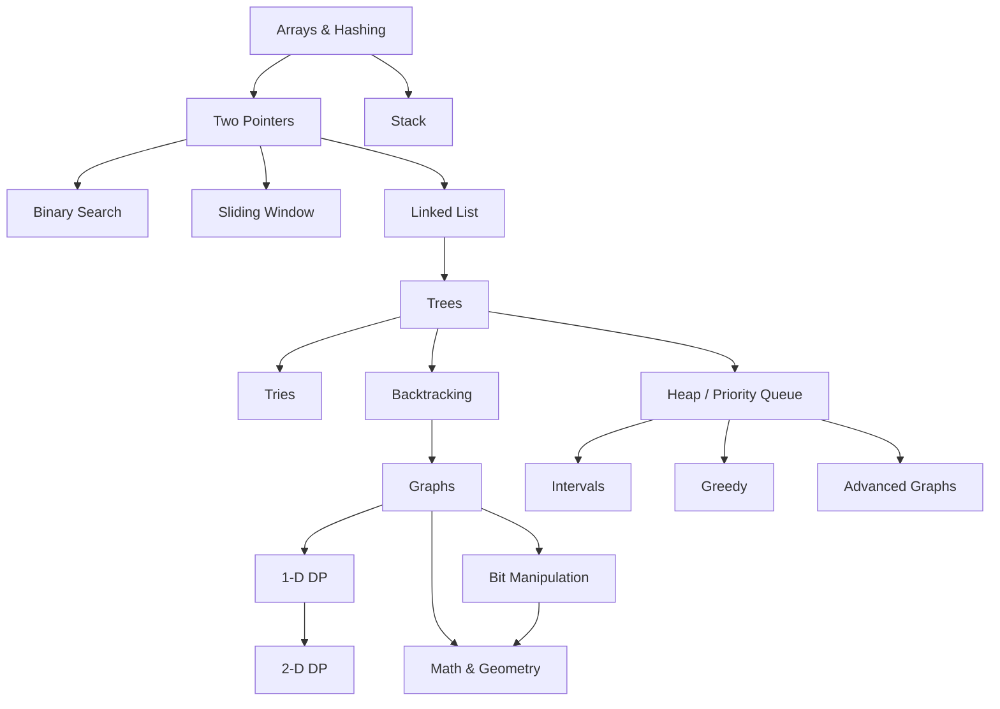

# Roadmap to Learning Data Structures and Algorithms (DSA)

Understanding Data Structures and Algorithms (DSA) is crucial for solving complex problems efficiently. DSA forms the foundation of computer science, providing the necessary tools to manage and manipulate data effectively. This roadmap outlines a structured approach to mastering DSA, designed for both beginners and experienced programmers.

<AdsComponent />

## Your Learning Journey

### Learning DSA

Mastering DSA begins with understanding the fundamental concepts. Here’s a structured flowchart to guide your learning:

### Key Concepts and their Order:

1. **Arrays & Hashing**:

   - **Why**: Arrays are a fundamental data structure used to store collections of data. Hashing adds efficient data retrieval, making it essential for solving problems quickly.
   - **Next Steps**: Learning arrays and hashing prepares you for exploring patterns within data sequences.

2. **Two Pointers and Sliding Window**:

   - **Why**: These are specific techniques for processing sequences like arrays and strings. They optimize algorithms by reducing the need for nested loops, which is useful for problems related to subarrays, substrings, or intervals.
   - **Next Steps**: After grasping these techniques, you’ll be ready to tackle more structured data types, like linked lists and stacks.

3. **Stack and Linked List**:

   - **Why**: Stacks are essential for problems involving LIFO (Last In, First Out) operations, such as evaluating expressions and handling recursive function calls. Linked lists provide a different way of storing sequences, enabling efficient insertion and deletion.
   - **Next Steps**: These structures are often prerequisites for understanding hierarchical data structures like trees.

4. **Trees and Graphs**:

   - **Why**: Trees model hierarchical relationships, and graphs represent complex networks. They are critical for understanding problems related to navigation, dependencies, and hierarchical data.
   - **Next Steps**: Mastery of trees and graphs allows you to explore specialized algorithms like backtracking, dynamic programming, and advanced graph algorithms.

5. **Tries, Backtracking, and Advanced Tree Structures**:

   - **Why**: Tries are specialized trees useful for storing and retrieving strings. Backtracking is a general problem-solving approach that involves exploring all possibilities. Both concepts deepen your understanding of trees and help solve complex recursive problems.
   - **Next Steps**: With these skills, you can move on to dynamic programming and more complex graph algorithms.

6. **Heap / Priority Queue, Intervals, and Greedy Algorithms**:

   - **Why**: Heaps are used for efficiently finding minimum or maximum elements, often required in scheduling and optimization problems. Greedy algorithms provide quick, local solutions that are globally optimal in certain cases.
   - **Next Steps**: Learning these prepares you for tackling problems in optimization and scheduling and allows for a smooth transition into dynamic programming.

7. **Dynamic Programming (1-D and 2-D DP)**:

   - **Why**: DP is used to solve optimization problems by breaking them down into overlapping subproblems. Learning 1-D and 2-D DP helps you understand how to store and reuse solutions, making your algorithms more efficient.
   - **Next Steps**: Once you're comfortable with DP, you can delve into specific mathematical and geometric challenges.

8. **Bit Manipulation, Math & Geometry**:
   - **Why**: Bit manipulation is essential for low-level optimization, and math & geometry cover specialized problem-solving techniques that are useful in fields like computer graphics and cryptography.
   - **Final Steps**: These advanced topics can help you tackle a wide range of problems, providing a well-rounded understanding of DSA.

This roadmap provides a sequential approach, where each step builds on the previous concepts, giving you a solid foundation and gradually preparing you for more complex problem-solving.

### Practice and Applications

Once you have a firm grasp of the concepts, it’s essential to apply your knowledge practically. Here’s a flowchart that centers on the application and practice of DSA:

```mermaid
flowchart TD
    subgraph central_flowchart [ ]
        direction TB
        A[Start Practicing DSA] --> B[Join Coding Platforms]
        B --> C[Engage in Coding Challenges]
        C --> D[Implement DSA in Projects]
        D --> E[Real-world Application Scenarios]
        E --> F[Prepare for Technical Interviews]
        F --> G[Practice Common Interview Questions]
        G --> H[Participate in Competitive Programming]
        H --> I[Review and Reflect on Learning]
        I --> J[Seek Feedback and Improve]
        J --> K[End Practice Journey]
    end
    style central_flowchart fill:#131727  ,stroke:##131c40 ,stroke-width:3px


```

### Conclusion

These roadmaps provides a comprehensive guide to learning DSA, emphasizing the importance of understanding core concepts and applying them in practice. By following this path, you'll enhance your problem-solving abilities and be well-prepared for coding interviews, competitive programming, and real-world software development.

Remember, mastering DSA is a journey that requires consistent practice and engagement. Embrace challenges and keep pushing your limits!
