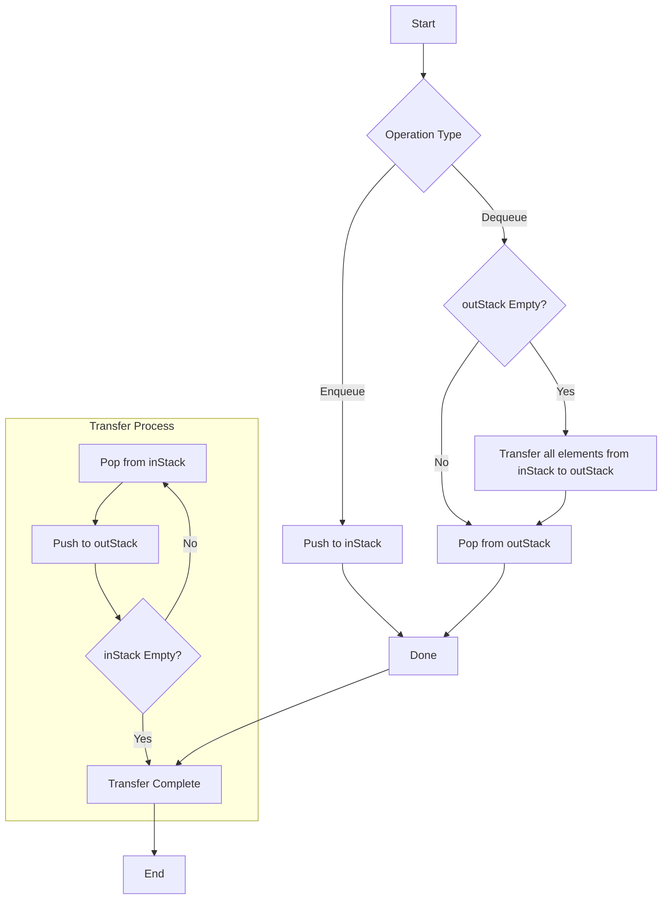

# Two-Stack Queue Implementation

This project implements a queue data structure using two stacks with a lazy transfer approach. The implementation provides O(1) amortized time complexity for both enqueue and dequeue operations.

## Algorithm Overview

The implementation uses two stacks:
- `inStack`: Used for enqueueing elements
- `outStack`: Used for dequeueing elements

### Key Operations

1. **Enqueue**: Push elements directly onto `inStack` - O(1)
2. **Dequeue**: 
    - If `outStack` is empty, transfer all elements from `inStack` to `outStack`
    - Pop and return the top element from `outStack`
    - Amortized O(1)

## Implementation

```c
#include <stdio.h>
#include <stdlib.h>
#include <stdbool.h>

#define MAX_SIZE 100

typedef struct {
     int items[MAX_SIZE];
     int top;
} Stack;

typedef struct {
     Stack* inStack;
     Stack* outStack;
} Queue;

// Stack operations
void initStack(Stack* s) {
     s->top = -1;
}

bool isEmpty(Stack* s) {
     return s->top == -1;
}

bool isFull(Stack* s) {
     return s->top == MAX_SIZE - 1;
}

void push(Stack* s, int value) {
     if (!isFull(s)) {
          s->items[++s->top] = value;
     }
}

int pop(Stack* s) {
     if (!isEmpty(s)) {
          return s->items[s->top--];
     }
     return -1;  // Error value
}

Queue* createQueue() {
     Queue* q = (Queue*)malloc(sizeof(Queue));
     q->inStack = (Stack*)malloc(sizeof(Stack));
     q->outStack = (Stack*)malloc(sizeof(Stack));
     initStack(q->inStack);
     initStack(q->outStack);
     return q;
}

void enqueue(Queue* q, int value) {
     push(q->inStack, value);
}

int dequeue(Queue* q) {
     if (isEmpty(q->outStack)) {
          // Transfer elements from inStack to outStack
          while (!isEmpty(q->inStack)) {
                push(q->outStack, pop(q->inStack));
          }
     }
     return pop(q->outStack);
}

bool isQueueEmpty(Queue* q) {
     return isEmpty(q->inStack) && isEmpty(q->outStack);
}

void destroyQueue(Queue* q) {
     free(q->inStack);
     free(q->outStack);
     free(q);
}
```

## Usage Example

```c
int main() {
     Queue* q = createQueue();
     
     enqueue(q, 1);
     enqueue(q, 2);
     enqueue(q, 3);
     
     printf("%d\n", dequeue(q));  // Output: 1
     printf("%d\n", dequeue(q));  // Output: 2
     
     enqueue(q, 4);
     
     printf("%d\n", dequeue(q));  // Output: 3
     printf("%d\n", dequeue(q));  // Output: 4
     
     destroyQueue(q);
     return 0;
}
```
### Complexity

- **Time Complexity**:
    - **Enqueue**: $O(1)$
    - **Dequeue**: Amortized $O(1)$
- **Space Complexity**: $O(n)$, where $n$ is the number of elements in the queue.

### Example

Consider a queue with the following operations:

1. **Enqueue 1**
2. **Enqueue 2**
3. **Dequeue**
4. **Enqueue 3**
5. **Dequeue**

**Operations Breakdown**:

- **Enqueue 1**:
    - `inStack`: [1]
    - `outStack`: []

- **Enqueue 2**:
    - `inStack`: [1, 2]
    - `outStack`: []

- **Dequeue**:
    - Transfer elements from `inStack` to `outStack`: 
        - `inStack`: []
        - `outStack`: [2, 1]
    - Pop from `outStack`: 1
    - Result:
        - `inStack`: []
        - `outStack`: [2]

- **Enqueue 3**:
    - `inStack`: [3]
    - `outStack`: [2]

- **Dequeue**:
    - Pop from `outStack`: 2
    - Result:
        - `inStack`: [3]
        - `outStack`: []

### Conclusion

Implementing a queue using two stacks is an efficient way to achieve the FIFO behavior with LIFO structures. This approach ensures that both the **enqueue** and **dequeue** operations have an amortized constant time complexity, making it suitable for applications where performance and resource management are critical.

## Flowchart

