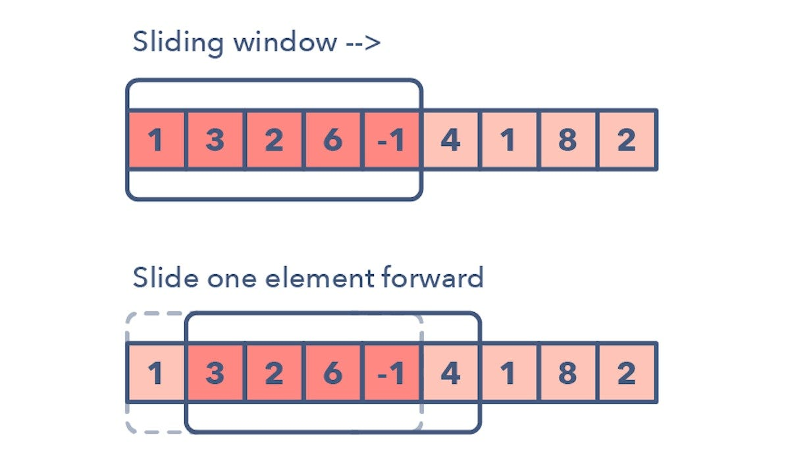

## Sliding Window Algorithm



### Definition:
The **Sliding Window** is an efficient technique used to solve problems involving arrays or strings where we need to find a subrange that satisfies a particular condition. Instead of recomputing the entire range from scratch every time, we slide a window over the array/string and update the solution incrementally.

This technique reduces the time complexity significantly for problems that involve working with subarrays or substrings.

### Characteristics:

- **Window Definition**:
  - The sliding window represents a subarray or substring of a fixed or variable size that slides over the data structure (array or string) one element at a time.

- **Efficiency**:
  - Sliding window helps in solving problems where recalculating the entire range for each position would be inefficient. By sliding the window and updating only the necessary elements, it can reduce the time complexity.

- **Fixed vs. Dynamic Window**:
  - The window size can either be fixed, where the window is of constant length, or dynamic, where the window grows or shrinks based on the problem requirements.

### Common Use Cases:

- **Finding the maximum/minimum sum of a subarray of size k**.
- **Finding the longest substring with k distinct characters**.
- **Finding an anagram of one string within another string**.
- **Finding a subarray with a sum equal to a target**.

### Time Complexity:
- **O(n)**, where n is the size of the array or string. The sliding window ensures that we traverse the array/string only once.

### Space Complexity:
- **O(1)** for most problems if we're just calculating sums or counts.
- **O(k)** for problems where additional space is required to store intermediate results, like distinct elements in the window.

### C++ Implementation (Fixed Window Example):

Let's take the example of finding the **maximum sum of any subarray of size k** in an array.

```cpp
#include <iostream>
#include <vector>
#include <climits>
using namespace std;

int maxSumSubarray(const vector<int>& arr, int k) {
    int n = arr.size();
    if (n < k) {
        cout << "Invalid input, array size is smaller than k." << endl;
        return -1;
    }

    int max_sum = INT_MIN, current_sum = 0;

    // Compute the sum of the first window
    for (int i = 0; i < k; i++) {
        current_sum += arr[i];
    }

    max_sum = current_sum;

    // Slide the window across the array
    for (int i = k; i < n; i++) {
        current_sum += arr[i] - arr[i - k];  // Slide the window
        max_sum = max(max_sum, current_sum);  // Update max sum
    }

    return max_sum;
}

int main() {
    vector<int> arr = {2, 1, 5, 1, 3, 2};
    int k = 3;

    int result = maxSumSubarray(arr, k);
    cout << "Maximum sum of subarray of size " << k << ": " << result << endl;

    return 0;
}
```

### Python Code Implementation

```python

def max_sum_subarray(arr, k):
    n = len(arr)
    if n < k:
        print("Invalid input, array size is smaller than k.")
        return -1

    max_sum = -1 #set max sum 
    current_sum = sum(arr[:k])  # Compute the sum of the first window

    max_sum = current_sum

    # Slide the window across the array
    for i in range(k, n):
        current_sum += arr[i] - arr[i - k]  # Slide the window
        max_sum = max(max_sum, current_sum)  # Update max sum

    return max_sum

# Test the function
arr = [2, 1, 5, 1, 3, 2]
k = 3
result = max_sum_subarray(arr, k)
print(f"Maximum sum of subarray of size {k}: {result}")
```

### Java Code Implementation

```java
public class MaxSumSubarray {

    public static int maxSumSubarray(int[] arr, int k) {
        int n = arr.length;
        if (n < k) {
            System.out.println("Invalid input, array size is smaller than k.");
            return -1;
        }

        int maxSum = -1;  // Set max sum
        int currentSum = 0;

        // Compute the sum of the first window
        for (int i = 0; i < k; i++) {
            currentSum += arr[i];
        }
        maxSum = currentSum;

        // Slide the window across the array
        for (int i = k; i < n; i++) {
            currentSum += arr[i] - arr[i - k];  // Slide the window
            maxSum = Math.max(maxSum, currentSum);  // Update max sum
        }

        return maxSum;
    }

    public static void main(String[] args) {
        int[] arr = {2, 1, 5, 1, 3, 2};
        int k = 3;
        int result = maxSumSubarray(arr, k);
        System.out.println("Maximum sum of subarray of size " + k + ": " + result);
    }
}
```

### Explanation:
The first `for` loop calculates the sum of the first subarray (window) of size `k`.  
The second `for` loop slides the window one element at a time, adjusting the sum by adding the new element and removing the element that is no longer in the window.  
This ensures the sum of each subarray of size `k` is calculated in **O(1)** time after the initial window, resulting in an overall time complexity of **O(n)**.

### Summary:
The Sliding Window technique is a powerful optimization method for problems where subarray or substring operations are frequent. It reduces the brute-force time complexity from **O(n * k)** to **O(n)** by keeping track of changes incrementally.
