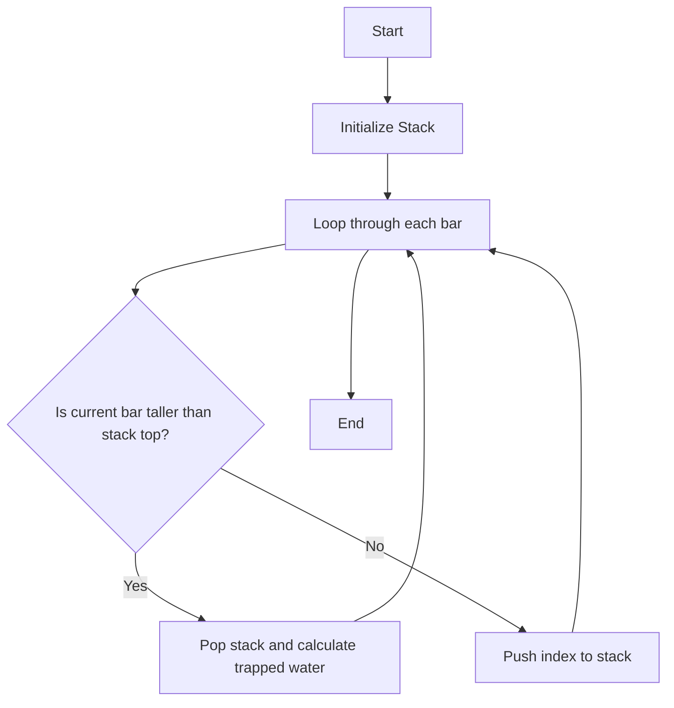

# Trapping Rain Water

The **Trapping Rain Water** algorithm calculates the amount of water that can be trapped between bars of varying heights.

## Problem Statement
Given an array of non-negative integers representing the heights of bars, calculate how much water can be trapped after raining.

## Approach
1. Use a stack to keep track of the indices of the bars.
2. Iterate through each bar in the array.
3. For each bar, if it's taller than the one on the stack's top, calculate the trapped water.
4. Repeat until all bars are processed.

### Code Implementation
Below is a C++ implementation of the Trapping Rain Water algorithm.

```cpp
#include <iostream>
#include <vector>
#include <stack>
using namespace std;

int maxWater(vector<int>& arr) {
    stack<int> st;
    int res = 0;
    for (int i = 0; i < arr.size(); i++) {
        while (!st.empty() && arr[st.top()] < arr[i]) {
            int pop_height = arr[st.top()];
            st.pop();
            if (st.empty()) break;
            int distance = i - st.top() - 1;
            int water = min(arr[st.top()], arr[i]) - pop_height;
            res += distance * water;
        }
        st.push(i);
    }
    return res;
}
```

### Math Formulas
The formula for trapped water between two bars can be expressed as:

$$ \text{Water} = \text{distance} \times (\min(\text{height}_{left}, \text{height}_{right}) - \text{height}_{current}) $$

### Diagrams
The following Mermaid diagram represents the steps for processing bars to trap water:




