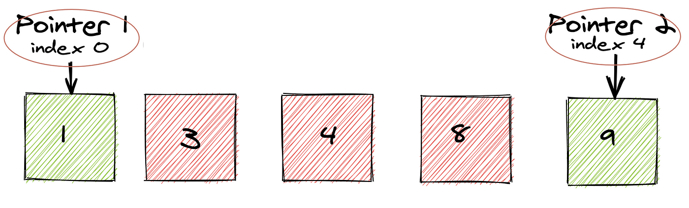

## Two Pointers Algorithm



### Definition:
The **Two Pointers** technique is a widely used algorithmic pattern that utilizes two pointers (or indices) to traverse a data structure, usually an array or a string. This approach is particularly useful for problems that require searching, comparing, or modifying elements based on specific conditions.

### Characteristics:

- **Pointer Definition**:
  - Two pointers can start at different positions in the data structure and move towards each other (or in the same direction) based on the problem requirements.

- **Efficiency**:
  - The Two Pointers technique helps to reduce the time complexity by avoiding nested loops, which can lead to inefficient solutions. By incrementing or decrementing pointers based on certain conditions, we can often achieve a linear time complexity.

- **Types of Two Pointers**:
  - **Moving Inward**: Both pointers move towards each other (e.g., finding a pair that sums to a target).
  - **Moving Outward**: Both pointers move in the same direction (e.g., finding subarrays or substrings).

### Common Use Cases:

- **Finding pairs in an array that sum to a target**.
- **Reversing a string**.
- **Merging two sorted arrays**.
- **Finding the longest substring with at most K distinct characters**.

### Time Complexity:
- **O(n)**, where n is the size of the array or string. The two pointers ensure that we traverse the data structure only once.

### Space Complexity:
- **O(1)**, as the approach typically uses a constant amount of extra space regardless of the input size.

### C++ Implementation (Finding a Pair with a Given Sum):

Let's take the example of finding two numbers in a sorted array that add up to a target sum.

```cpp
#include <iostream>
#include <vector>
using namespace std;

pair<int, int> findPairWithSum(const vector<int>& arr, int target) {
    int left = 0;
    int right = arr.size() - 1;

    while (left < right) {
        int current_sum = arr[left] + arr[right];

        if (current_sum == target) {
            return {arr[left], arr[right]};  // Pair found
        } else if (current_sum < target) {
            left++;  // Move left pointer right to increase sum
        } else {
            right--;  // Move right pointer left to decrease sum
        }
    }

    return {-1, -1};  // No pair found
}

int main() {
    vector<int> arr = {1, 2, 3, 4, 6};
    int target = 5;

    pair<int, int> result = findPairWithSum(arr, target);
    if (result.first != -1) {
        cout << "Pair found: " << result.first << ", " << result.second << endl;
    } else {
        cout << "No pair found." << endl;
    }

    return 0;
}
```

### Explanation:
In this example, the `while` loop continues until the two pointers meet.  
The sum of the elements at the two pointers is compared to the target. If they match, the pair is returned. If the current sum is less than the target, the left pointer is moved to the right to increase the sum. If the current sum is greater than the target, the right pointer is moved to the left to decrease the sum.  
This ensures that we check each pair only once, resulting in an overall time complexity of **O(n)**.

### Summary:
The Two Pointers technique is a versatile approach that optimizes many problems involving arrays and strings. By leveraging two pointers, we can reduce the time complexity from **O(n²)** (for nested loops) to **O(n)**, making our solutions more efficient and scalable.

---
### Beginner Intuition: How Two Pointers Work
 
> [!NOTE]

> This section is for those new to the technique.

 
When you first see this technique, it might not be obvious why it works. Here's a simple way to think about it.
 
Say you have a sorted array and you're looking for two numbers that add up to a target. The naive way is to try every combination — that's O(n²) and gets slow fast. But because the array is **sorted**, you actually have useful information at every step.
 
Start with one pointer at the left end and one at the right. Check their sum:
- Too small? Move the left pointer right — you need a bigger number.
- Too big? Move the right pointer left — you need a smaller one.
- Exact match? You're done.
Every step rules out a chunk of possibilities. That's why you only need one pass through the array.
 
> [!TIP]

> Imagine two people starting at opposite ends of a hallway, walking toward each other. They'll meet somewhere in the middle — and neither one backtracks. That's exactly what the two pointers are doing.

 
---
 
### Step-by-Step Dry Run Example
 
Let's walk through the algorithm by hand so the pointer movement is clear.
 
**Array:** `[1, 3, 5, 7, 9, 11]` — **Target:** `12`
 
Start with `left = 0`, `right = 5`.
 
| Step | `left` | `right` | `arr[left]` | `arr[right]` | Sum | What happens |
|------|--------|---------|------------|-------------|-----|--------------|
| 1    | 0      | 5       | 1          | 11          | 12  | ✅ Match! Return `true` |
 
Lucky — got it on the first try. Let's try **target = 10** to see the pointers actually move:
 
| Step | `left` | `right` | `arr[left]` | `arr[right]` | Sum | What happens |
|------|--------|---------|------------|-------------|-----|--------------|
| 1    | 0      | 5       | 1          | 11          | 12  | Too big → move `right` left |
| 2    | 0      | 4       | 1          | 9           | 10  | ✅ Match! Return `true` |
 
And **target = 4** — no valid pair, so the pointers cross without finding anything:
 
| Step | `left` | `right` | `arr[left]` | `arr[right]` | Sum | What happens |
|------|--------|---------|------------|-------------|-----|--------------|
| 1    | 0      | 5       | 1          | 11          | 12  | Too big → move `right` left |
| 2    | 0      | 4       | 1          | 9           | 10  | Too big → move `right` left |
| 3    | 0      | 3       | 1          | 7           | 8   | Too big → move `right` left |
| 4    | 0      | 2       | 1          | 5           | 6   | Too big → move `right` left |
| 5    | 0      | 1       | 1          | 3           | 4   | ✅ Match! Return `true` |
 
:::info The core rule
Sum too low → `left++`. Sum too high → `right--`. Stop when `left >= right`. That's the whole algorithm.
:::
 
---
 
### Real-World Applications
 
This pattern shows up more often than you'd think outside of coding problems:
 
- **Spell checkers** use a two-pointer style approach when comparing two versions of a word to find where they diverge.
- **Merging contact lists** — if two apps both have sorted lists of contacts, you can merge them in one pass instead of re-sorting from scratch.
- **Finding duplicates in logs** — with sorted timestamps, two pointers can scan for repeated entries without a hash map.
- **Memory-efficient string comparison** — checking if a string is a palindrome without allocating a reversed copy.
- **Partitioning data** — separating positive and negative numbers (or any two groups) in-place without extra arrays.
---
 
### Advantages of the Technique
 
- Gets you from O(n²) down to O(n) in a lot of problems — that's the difference between a solution that times out and one that passes.
- Uses O(1) extra space. No hash maps, no auxiliary arrays — just two index variables.
- Once you recognize the pattern, the code almost writes itself. It's one of those techniques that feels elegant once it clicks.
- Works across arrays, strings, and linked lists with barely any changes to the core idea.
- Combines naturally with sorting — sort first, then apply two pointers, and you often get an optimal solution.
---
 
### Popular Interview Problems Using Two Pointers
 
If you want to get comfortable with this pattern, these are worth working through:
 
| Problem | Link | Difficulty | What to focus on |
|---------|------|------------|-----------------|
| Two Sum II | LeetCode #167 | Easy | The foundation — start here |
| Valid Palindrome | LeetCode #125 | Easy | Two pointers on a string |
| 3Sum | LeetCode #15 | Medium | Fix one element, two-pointer for the rest |
| Container With Most Water | LeetCode #11 | Medium | Greedy pointer movement |
| Remove Duplicates from Sorted Array | LeetCode #26 | Easy | Slow/fast pointer variant |
| Trapping Rain Water | LeetCode #42 | Hard | Tracking left/right max as you go |
| Sort Colors | LeetCode #75 | Medium | Three pointers — a good extension |
| Merge Sorted Array | LeetCode #88 | Easy | Merging from the back |
 
> [!TIP]
> Do **#167** and **#125** first — they're short and will make the pattern click. Then move to **#15 (3Sum)**, which is where most interviews actually go with this technique.
 
---
 
### When Should You Use Two Pointers?
 
Here are the signs a problem is hinting at this pattern:
 
- The array or string is sorted (or sorting it first doesn't break anything).
- You're looking for a pair, triplet, or subarray that meets some condition.
- The problem says "in-place" — two pointers are your best bet for avoiding extra space.
- You're checking symmetry (palindromes, mirrored structures).
- A brute-force nested loop solution exists but feels obviously too slow.
> [!WARNING]

> Two pointers only works reliably on **sorted** input for most problems. If you apply it to an unsorted array and get wrong answers, that's usually why — sort first, then proceed.