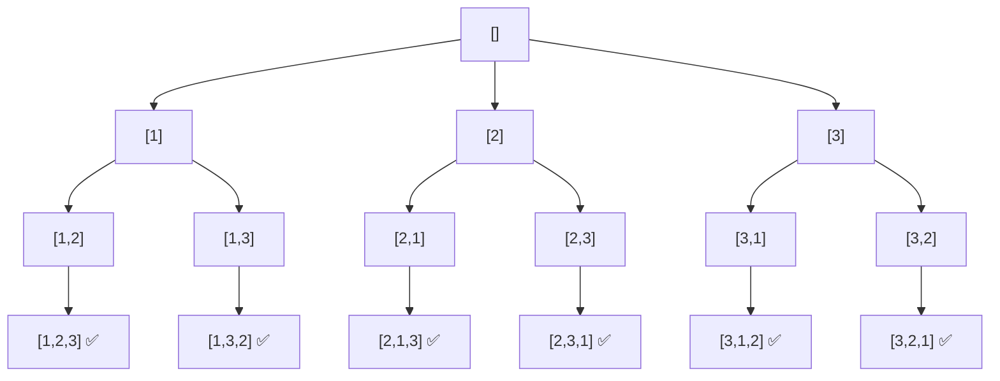
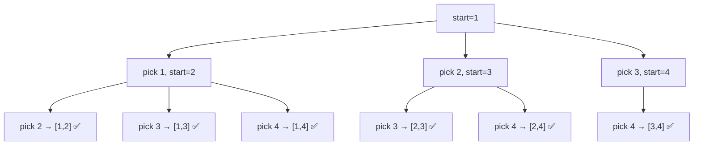

**Permutations** and **Combinations** are fundamental state-tree generation problems solved elegantly with backtracking. They form the backbone of many interview problems involving arrangement, selection, and enumeration.

## Definitions

| Concept | Definition | Order Matters? | Example (input: [1,2,3]) |
|---------|-----------|---------------|--------------------------|
| Permutation | All possible arrangements of elements | Yes | [1,2,3], [1,3,2], [2,1,3]... |
| Combination | All possible selections of k elements | No | [1,2], [1,3], [2,3] (k=2) |

## Part 1: Permutations

### Problem Statement (LeetCode 46)

Given an array of **distinct** integers, return all possible permutations.

### Approach

1. **Swap-based backtracking**: At each position `i`, swap `nums[i]` with every element from `i` to `n-1`
2. **Recurse** to fill the next position
3. **Backtrack** by swapping back to restore original order

### Time and Space Complexity — Permutations

| Metric | Complexity |
|--------|-----------|
| Time | `O(n × n!)` — n! permutations, each takes $O(n)$ to copy |
| Space | `O(n)` recursion stack + `O(n × n!)` output |

### C++ Implementation — Permutations 💻

```cpp title="Permutations - C++ Backtracking"
#include <iostream>
#include <vector>
using namespace std;

void backtrack(vector<int>& nums, int start, vector<vector<int>>& result) {
    if (start == nums.size()) {
        result.push_back(nums); // All positions filled — record permutation
        return;
    }

    for (int i = start; i < nums.size(); i++) {
        swap(nums[start], nums[i]); // Place nums[i] at position 'start'
        backtrack(nums, start + 1, result); // Recurse to fill next position
        swap(nums[start], nums[i]); // Backtrack — restore original order
    }
}

vector<vector<int>> permute(vector<int>& nums) {
    vector<vector<int>> result;
    backtrack(nums, 0, result);
    return result;
}

int main() {
    vector<int> nums = {1, 2, 3};
    auto result = permute(nums);

    for (auto& perm : result) {
        for (int x : perm) cout << x << " ";
        cout << endl;
    }
    // Output: 1 2 3 / 1 3 2 / 2 1 3 / 2 3 1 / 3 2 1 / 3 1 2
    return 0;
}
```

### Python Implementation — Permutations 🐍

```python title="Permutations - Python Backtracking"
from typing import List

def permute(nums: List[int]) -> List[List[int]]:
    result = []

    def backtrack(start):
        if start == len(nums):
            result.append(nums[:])  # Copy current permutation
            return

        for i in range(start, len(nums)):
            nums[start], nums[i] = nums[i], nums[start]  # Swap
            backtrack(start + 1)                          # Recurse
            nums[start], nums[i] = nums[i], nums[start]  # Backtrack

    backtrack(0)
    return result

print(permute([1, 2, 3]))
# [[1,2,3],[1,3,2],[2,1,3],[2,3,1],[3,2,1],[3,1,2]]
```

### JavaScript Implementation — Permutations 🌐

```js title="Permutations - JavaScript Backtracking"
function permute(nums) {
    const result = [];

    function backtrack(start) {
        if (start === nums.length) {
            result.push([...nums]); // Copy current state
            return;
        }

        for (let i = start; i < nums.length; i++) {
            [nums[start], nums[i]] = [nums[i], nums[start]]; // Swap
            backtrack(start + 1);                             // Recurse
            [nums[start], nums[i]] = [nums[i], nums[start]]; // Backtrack
        }
    }

    backtrack(0);
    return result;
}
```

### Permutations with Duplicates (LeetCode 47)

When the input contains duplicates, sort first and skip duplicate elements at the same recursion level:

```python title="Permutations II - Handle Duplicates"
def permuteUnique(nums: List[int]) -> List[List[int]]:
    result = []
    nums.sort()  # Sort to group duplicates together

    def backtrack(path, used):
        if len(path) == len(nums):
            result.append(path[:])
            return

        for i in range(len(nums)):
            if used[i]:
                continue  # Skip already used elements
            # Skip duplicate: same value as previous AND previous was not used in this branch
            if i > 0 and nums[i] == nums[i - 1] and not used[i - 1]:
                continue

            used[i] = True
            path.append(nums[i])
            backtrack(path, used)
            path.pop()
            used[i] = False

    backtrack([], [False] * len(nums))
    return result
```

---

## Part 2: Combinations

### Problem Statement (LeetCode 77)

Given two integers `n` and `k`, return all possible combinations of `k` numbers chosen from the range `[1, n]`.

### Approach

1. **Start from a given index** to avoid revisiting elements (order doesn't matter)
2. **Add to path** and recurse with `start + 1`
3. **Backtrack** by removing the last added element
4. **Pruning**: if remaining elements are fewer than needed, stop early

### Time and Space Complexity — Combinations

| Metric | Complexity |
|--------|-----------|
| Time | `O(C(n,k) × k)` — C(n,k) combinations, each takes $O(k)$ to copy |
| Space | `O(k)` recursion depth |

### C++ Implementation — Combinations 💻

```cpp title="Combinations - C++ Backtracking"
#include <iostream>
#include <vector>
using namespace std;

void backtrack(int start, int n, int k, vector<int>& path, vector<vector<int>>& result) {
    if (path.size() == k) {
        result.push_back(path); // Found a valid combination of size k
        return;
    }

    // Pruning: remaining elements must be enough to complete the combination
    for (int i = start; i <= n - (k - path.size()) + 1; i++) {
        path.push_back(i);                          // Choose i
        backtrack(i + 1, n, k, path, result);       // Recurse with next start
        path.pop_back();                            // Backtrack — remove i
    }
}

vector<vector<int>> combine(int n, int k) {
    vector<vector<int>> result;
    vector<int> path;
    backtrack(1, n, k, path, result);
    return result;
}

int main() {
    auto result = combine(4, 2);
    for (auto& combo : result) {
        for (int x : combo) cout << x << " ";
        cout << endl;
    }
    // Output: 1 2 / 1 3 / 1 4 / 2 3 / 2 4 / 3 4
    return 0;
}
```

### Python Implementation — Combinations 🐍

```python title="Combinations - Python Backtracking"
from typing import List

def combine(n: int, k: int) -> List[List[int]]:
    result = []

    def backtrack(start, path):
        if len(path) == k:
            result.append(path[:])  # Found valid combination
            return

        # Pruning: need at least (k - len(path)) more elements
        for i in range(start, n - (k - len(path)) + 2):
            path.append(i)          # Choose i
            backtrack(i + 1, path)  # Recurse
            path.pop()              # Backtrack

    backtrack(1, [])
    return result

print(combine(4, 2))
# [[1,2],[1,3],[1,4],[2,3],[2,4],[3,4]]
```

### JavaScript Implementation — Combinations 🌐

```js title="Combinations - JavaScript Backtracking"
function combine(n, k) {
    const result = [];

    function backtrack(start, path) {
        if (path.length === k) {
            result.push([...path]);
            return;
        }

        for (let i = start; i <= n - (k - path.length) + 1; i++) {
            path.push(i);           // Choose i
            backtrack(i + 1, path); // Recurse
            path.pop();             // Backtrack
        }
    }

    backtrack(1, []);
    return result;
}
```

## State Tree Visualization

### Permutations of [1, 2, 3]



### Combinations C(4,2)



## Key Differences

| Feature | Permutations | Combinations |
|---------|-------------|-------------|
| Order matters | Yes | No |
| Reuse same index | No | No |
| Start index in recursion | Same level (swap) | Always `i + 1` |
| Pruning | Skip duplicates | `n - (k - path.size()) + 1` |

## References

- [LeetCode 46 - Permutations](https://leetcode.com/problems/permutations/)
- [LeetCode 47 - Permutations II](https://leetcode.com/problems/permutations-ii/)
- [LeetCode 77 - Combinations](https://leetcode.com/problems/combinations/)
- [GeeksForGeeks - Permutations of a given string](https://www.geeksforgeeks.org/write-a-c-program-to-print-all-permutations-of-a-given-string/)
