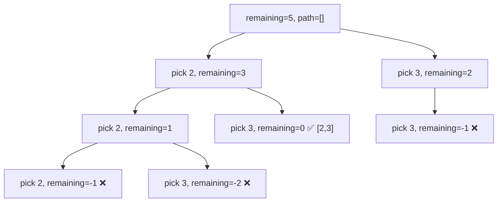
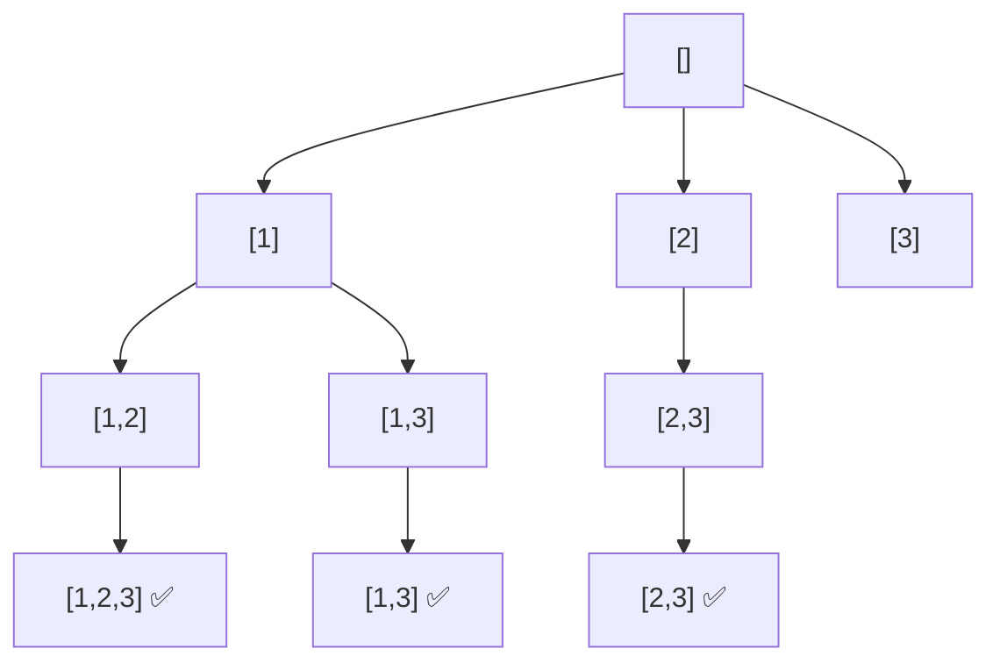

**Subset Sum** and **Combination Sum** are decision-tree exploration problems solved with backtracking. They involve finding subsets or combinations of numbers that satisfy a target sum constraint — a pattern that appears constantly in interviews.

## Problem Variants

| Problem | Description | Reuse elements? | Duplicates in input? |
|---------|-------------|----------------|---------------------|
| Subset Sum | Does any subset sum to target? | No | No |
| All Subsets | Generate all 2^n subsets | No | No |
| Combination Sum I | All combos summing to target | Yes | No |
| Combination Sum II | All unique combos summing to target | No | Yes |
| Combination Sum III | k numbers summing to n from 1-9 | No | No |

---

## Part 1: All Subsets (Power Set)

### Problem Statement (LeetCode 78)

Given an integer array of **unique** elements, return all possible subsets (the power set).

### Approach

At each element, make a **binary decision**: include it or exclude it. This generates a complete decision tree of depth `n` with `2^n` leaves.

### Time and Space Complexity

| Metric | Complexity |
|--------|-----------|
| Time | `O(n × 2^n)` — 2^n subsets, each takes $O(n)$ to copy |
| Space | `O(n)` recursion depth |

### C++ Implementation 💻

```cpp title="All Subsets - C++ Backtracking"
#include <iostream>
#include <vector>
using namespace std;

void backtrack(vector<int>& nums, int start, vector<int>& path, vector<vector<int>>& result) {
    result.push_back(path); // Add current subset (including empty set)

    for (int i = start; i < nums.size(); i++) {
        path.push_back(nums[i]);          // Include nums[i]
        backtrack(nums, i + 1, path, result); // Recurse with next elements
        path.pop_back();                  // Backtrack — exclude nums[i]
    }
}

vector<vector<int>> subsets(vector<int>& nums) {
    vector<vector<int>> result;
    vector<int> path;
    backtrack(nums, 0, path, result);
    return result;
}

int main() {
    vector<int> nums = {1, 2, 3};
    auto result = subsets(nums);

    for (auto& subset : result) {
        cout << "[";
        for (int i = 0; i < subset.size(); i++) {
            cout << subset[i];
            if (i + 1 < subset.size()) cout << ",";
        }
        cout << "] ";
    }
    // Output: [] [1] [1,2] [1,2,3] [1,3] [2] [2,3] [3]
    return 0;
}
```

### Python Implementation 🐍

```python title="All Subsets - Python Backtracking"
from typing import List

def subsets(nums: List[int]) -> List[List[int]]:
    result = []

    def backtrack(start, path):
        result.append(path[:])  # Record current subset

        for i in range(start, len(nums)):
            path.append(nums[i])       # Include nums[i]
            backtrack(i + 1, path)     # Recurse
            path.pop()                 # Backtrack

    backtrack(0, [])
    return result

print(subsets([1, 2, 3]))
# [[], [1], [1, 2], [1, 2, 3], [1, 3], [2], [2, 3], [3]]
```

### JavaScript Implementation 🌐

```js title="All Subsets - JavaScript Backtracking"
function subsets(nums) {
    const result = [];

    function backtrack(start, path) {
        result.push([...path]); // Record current subset

        for (let i = start; i < nums.length; i++) {
            path.push(nums[i]);       // Include
            backtrack(i + 1, path);   // Recurse
            path.pop();               // Backtrack
        }
    }

    backtrack(0, []);
    return result;
}
```

---

## Part 2: Combination Sum I (LeetCode 39)

### Problem Statement

Given an array of **distinct** integers and a target, return all unique combinations where the chosen numbers sum to target. The **same number may be used unlimited times**.

### Approach

- At each step, try including `candidates[i]` and recurse with the **same index** `i` (allows reuse)
- Subtract from remaining target on each inclusion
- Stop when `remaining == 0` (found solution) or `remaining < 0` (prune)

### C++ Implementation 💻

```cpp title="Combination Sum I - C++ Backtracking"
#include <iostream>
#include <vector>
#include <algorithm>
using namespace std;

void backtrack(vector<int>& candidates, int start, int remaining,
               vector<int>& path, vector<vector<int>>& result) {
    if (remaining == 0) {
        result.push_back(path); // Found valid combination
        return;
    }

    for (int i = start; i < candidates.size(); i++) {
        if (candidates[i] > remaining) break; // Pruning: sorted array, no point continuing

        path.push_back(candidates[i]);
        backtrack(candidates, i, remaining - candidates[i], path, result); // i (not i+1) allows reuse
        path.pop_back(); // Backtrack
    }
}

vector<vector<int>> combinationSum(vector<int>& candidates, int target) {
    sort(candidates.begin(), candidates.end()); // Sort for pruning
    vector<vector<int>> result;
    vector<int> path;
    backtrack(candidates, 0, target, path, result);
    return result;
}

int main() {
    vector<int> candidates = {2, 3, 6, 7};
    auto result = combinationSum(candidates, 7);

    for (auto& combo : result) {
        for (int x : combo) cout << x << " ";
        cout << endl;
    }
    // Output: 2 2 3 / 7
    return 0;
}
```

### Python Implementation 🐍

```python title="Combination Sum I - Python Backtracking"
from typing import List

def combinationSum(candidates: List[int], target: int) -> List[List[int]]:
    candidates.sort()  # Sort for pruning
    result = []

    def backtrack(start, remaining, path):
        if remaining == 0:
            result.append(path[:])  # Found valid combination
            return

        for i in range(start, len(candidates)):
            if candidates[i] > remaining:
                break  # Pruning — no need to continue

            path.append(candidates[i])
            backtrack(i, remaining - candidates[i], path)  # i allows reuse
            path.pop()  # Backtrack

    backtrack(0, target, [])
    return result

print(combinationSum([2, 3, 6, 7], 7))
# [[2, 2, 3], [7]]
```

---

## Part 3: Combination Sum II (LeetCode 40)

### Problem Statement

Given a collection of integers (may contain **duplicates**) and a target, return all unique combinations that sum to target. Each number may only be used **once**.

### Key Difference from Combination Sum I

- Sort the array first
- Use `i + 1` in recursion (no reuse)
- Skip duplicates at the same recursion level: `if i > start && candidates[i] == candidates[i-1]: skip`

### C++ Implementation 💻

```cpp title="Combination Sum II - C++ Backtracking"
#include <vector>
#include <algorithm>
using namespace std;

void backtrack(vector<int>& candidates, int start, int remaining,
               vector<int>& path, vector<vector<int>>& result) {
    if (remaining == 0) {
        result.push_back(path);
        return;
    }

    for (int i = start; i < candidates.size(); i++) {
        if (candidates[i] > remaining) break; // Pruning

        // Skip duplicate elements at the same recursion level
        if (i > start && candidates[i] == candidates[i - 1]) continue;

        path.push_back(candidates[i]);
        backtrack(candidates, i + 1, remaining - candidates[i], path, result); // i+1: no reuse
        path.pop_back();
    }
}

vector<vector<int>> combinationSum2(vector<int>& candidates, int target) {
    sort(candidates.begin(), candidates.end());
    vector<vector<int>> result;
    vector<int> path;
    backtrack(candidates, 0, target, path, result);
    return result;
}
```

### Python Implementation 🐍

```python title="Combination Sum II - Python Backtracking"
def combinationSum2(candidates: List[int], target: int) -> List[List[int]]:
    candidates.sort()
    result = []

    def backtrack(start, remaining, path):
        if remaining == 0:
            result.append(path[:])
            return

        for i in range(start, len(candidates)):
            if candidates[i] > remaining:
                break  # Pruning

            # Skip duplicates at the same level
            if i > start and candidates[i] == candidates[i - 1]:
                continue

            path.append(candidates[i])
            backtrack(i + 1, remaining - candidates[i], path)  # i+1: no reuse
            path.pop()

    backtrack(0, target, [])
    return result

print(combinationSum2([10,1,2,7,6,1,5], 8))
# [[1,1,6],[1,2,5],[1,7],[2,6]]
```

---

## Part 4: Combination Sum III (LeetCode 216)

### Problem Statement

Find all valid combinations of `k` numbers that sum to `n`, using only numbers 1–9, each used at most once.

```python title="Combination Sum III - Python Backtracking"
def combinationSum3(k: int, n: int) -> List[List[int]]:
    result = []

    def backtrack(start, remaining, path):
        if len(path) == k and remaining == 0:
            result.append(path[:])  # Found valid combination
            return
        if len(path) == k or remaining <= 0:
            return  # Pruning

        for i in range(start, 10):  # Only digits 1-9
            path.append(i)
            backtrack(i + 1, remaining - i, path)
            path.pop()

    backtrack(1, n, [])
    return result

print(combinationSum3(3, 7))  # [[1,2,4]]
print(combinationSum3(3, 9))  # [[1,2,6],[1,3,5],[2,3,4]]
```

---

## Decision Tree Visualization

### Combination Sum I — candidates=[2,3], target=5



### All Subsets of [1,2,3]



## Pruning Strategies

| Strategy | When to Apply | Effect |
|----------|--------------|--------|
| `candidates[i] > remaining` | Sorted array, current element exceeds target | Skip rest of loop |
| `i > start && nums[i] == nums[i-1]` | Sorted array with duplicates | Skip duplicate branches |
| `len(path) == k` | Fixed-size combination | Stop adding elements |
| `remaining < 0` | Any combination sum | Prune immediately |

## Summary

| Problem | Reuse | Duplicates | Key Trick |
|---------|-------|-----------|-----------|
| All Subsets | No | No | Record at every node |
| Combination Sum I | Yes | No | Recurse with same `i` |
| Combination Sum II | No | Yes | Skip `nums[i] == nums[i-1]` at same level |
| Combination Sum III | No | No | Limit range to 1-9 |

## References

- [LeetCode 78 - Subsets](https://leetcode.com/problems/subsets/)
- [LeetCode 39 - Combination Sum](https://leetcode.com/problems/combination-sum/)
- [LeetCode 40 - Combination Sum II](https://leetcode.com/problems/combination-sum-ii/)
- [LeetCode 216 - Combination Sum III](https://leetcode.com/problems/combination-sum-iii/)
- [GeeksForGeeks - Subset Sum Problem](https://www.geeksforgeeks.org/subset-sum-problem-dp-25/)
