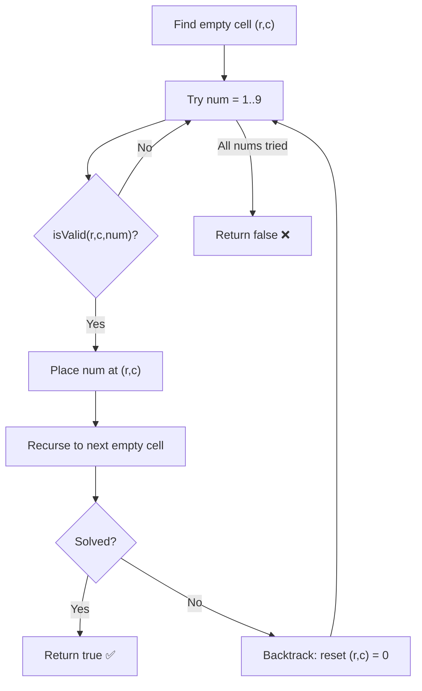

The **Sudoku Solver** is a classic constraint-satisfaction problem solved using backtracking. The goal is to fill a partially completed 9×9 grid so that every row, column, and 3×3 sub-box contains the digits 1–9 exactly once.

## Problem Statement

Given a 9×9 grid partially filled with digits (1–9), fill in the empty cells (represented as `0` or `.`) such that:
- Every **row** contains digits 1–9 with no repetition
- Every **column** contains digits 1–9 with no repetition
- Every **3×3 sub-box** contains digits 1–9 with no repetition

## Approach

The backtracking approach works as follows:

1. **Find an empty cell** — scan the grid for the next `0`
2. **Try digits 1–9** — for each digit, check if placing it is valid
3. **Validity check** — ensure the digit doesn't already exist in the same row, column, or 3×3 box
4. **Place and recurse** — if valid, place the digit and recurse to the next empty cell
5. **Backtrack** — if no digit works, reset the cell to `0` and return `false` to trigger backtracking

## Constraint Check

A digit `d` is valid at position `(row, col)` if:
- `d` does not appear in `grid[row][*]` (same row)
- `d` does not appear in `grid[*][col]` (same column)
- `d` does not appear in the 3×3 box starting at `(row/3 * 3, col/3 * 3)`

## Time and Space Complexity

| Metric | Complexity |
|--------|-----------|
| Time (worst case) | `O(9^m)` where `m` = number of empty cells |
| Space | `O(m)` recursion stack depth |

In practice, constraint pruning makes it much faster than the theoretical worst case.

## C++ Implementation 💻

```cpp title="Sudoku Solver - C++ Backtracking"
#include <iostream>
#include <vector>
using namespace std;

bool isValid(vector<vector<int>>& board, int row, int col, int num) {
    // Check row — num must not already exist in this row
    for (int j = 0; j < 9; j++) {
        if (board[row][j] == num) return false;
    }

    // Check column — num must not already exist in this column
    for (int i = 0; i < 9; i++) {
        if (board[i][col] == num) return false;
    }

    // Check 3x3 sub-box — find top-left corner of the box
    int boxRow = (row / 3) * 3;
    int boxCol = (col / 3) * 3;
    for (int i = 0; i < 3; i++) {
        for (int j = 0; j < 3; j++) {
            if (board[boxRow + i][boxCol + j] == num) return false;
        }
    }

    return true; // num is safe to place at (row, col)
}

bool solve(vector<vector<int>>& board) {
    for (int i = 0; i < 9; i++) {
        for (int j = 0; j < 9; j++) {
            if (board[i][j] == 0) { // Found an empty cell
                for (int num = 1; num <= 9; num++) {
                    if (isValid(board, i, j, num)) {
                        board[i][j] = num; // Place the digit

                        if (solve(board)) return true; // Recurse

                        board[i][j] = 0; // Backtrack — undo placement
                    }
                }
                return false; // No valid digit found — trigger backtrack
            }
        }
    }
    return true; // No empty cells remain — puzzle solved
}

void printBoard(vector<vector<int>>& board) {
    for (int i = 0; i < 9; i++) {
        for (int j = 0; j < 9; j++) {
            cout << board[i][j] << " ";
        }
        cout << endl;
    }
}

int main() {
    vector<vector<int>> board = {
        {5, 3, 0, 0, 7, 0, 0, 0, 0},
        {6, 0, 0, 1, 9, 5, 0, 0, 0},
        {0, 9, 8, 0, 0, 0, 0, 6, 0},
        {8, 0, 0, 0, 6, 0, 0, 0, 3},
        {4, 0, 0, 8, 0, 3, 0, 0, 1},
        {7, 0, 0, 0, 2, 0, 0, 0, 6},
        {0, 6, 0, 0, 0, 0, 2, 8, 0},
        {0, 0, 0, 4, 1, 9, 0, 0, 5},
        {0, 0, 0, 0, 8, 0, 0, 7, 9}
    };

    if (solve(board)) {
        printBoard(board);
    } else {
        cout << "No solution exists" << endl;
    }
    return 0;
}
```

## Python Implementation 🐍

```python title="Sudoku Solver - Python Backtracking"
def is_valid(board, row, col, num):
    # Check row
    if num in board[row]:
        return False

    # Check column
    if any(board[i][col] == num for i in range(9)):
        return False

    # Check 3x3 sub-box
    box_row, box_col = (row // 3) * 3, (col // 3) * 3
    for i in range(3):
        for j in range(3):
            if board[box_row + i][box_col + j] == num:
                return False

    return True

def solve(board):
    for i in range(9):
        for j in range(9):
            if board[i][j] == 0:  # Empty cell found
                for num in range(1, 10):
                    if is_valid(board, i, j, num):
                        board[i][j] = num  # Place digit

                        if solve(board):
                            return True  # Recurse

                        board[i][j] = 0  # Backtrack
                return False  # No valid digit — backtrack
    return True  # All cells filled

def print_board(board):
    for row in board:
        print(" ".join(map(str, row)))

# Example board (0 = empty)
board = [
    [5, 3, 0, 0, 7, 0, 0, 0, 0],
    [6, 0, 0, 1, 9, 5, 0, 0, 0],
    [0, 9, 8, 0, 0, 0, 0, 6, 0],
    [8, 0, 0, 0, 6, 0, 0, 0, 3],
    [4, 0, 0, 8, 0, 3, 0, 0, 1],
    [7, 0, 0, 0, 2, 0, 0, 0, 6],
    [0, 6, 0, 0, 0, 0, 2, 8, 0],
    [0, 0, 0, 4, 1, 9, 0, 0, 5],
    [0, 0, 0, 0, 8, 0, 0, 7, 9]
]

if solve(board):
    print_board(board)
else:
    print("No solution exists")
```

## JavaScript Implementation 🌐

```js title="Sudoku Solver - JavaScript Backtracking"
function isValid(board, row, col, num) {
    // Check row
    if (board[row].includes(num)) return false;

    // Check column
    for (let i = 0; i < 9; i++) {
        if (board[i][col] === num) return false;
    }

    // Check 3x3 sub-box
    const boxRow = Math.floor(row / 3) * 3;
    const boxCol = Math.floor(col / 3) * 3;
    for (let i = 0; i < 3; i++) {
        for (let j = 0; j < 3; j++) {
            if (board[boxRow + i][boxCol + j] === num) return false;
        }
    }

    return true;
}

function solve(board) {
    for (let i = 0; i < 9; i++) {
        for (let j = 0; j < 9; j++) {
            if (board[i][j] === 0) { // Empty cell
                for (let num = 1; num <= 9; num++) {
                    if (isValid(board, i, j, num)) {
                        board[i][j] = num; // Place digit

                        if (solve(board)) return true; // Recurse

                        board[i][j] = 0; // Backtrack
                    }
                }
                return false; // No valid digit found
            }
        }
    }
    return true; // Solved
}
```

## Backtracking Decision Tree



## Optimizations

- **Minimum Remaining Values (MRV)**: Instead of scanning left-to-right, pick the empty cell with the fewest valid candidates first — reduces branching significantly
- **Constraint Propagation**: After placing a digit, immediately eliminate it from candidates in the same row, column, and box
- **Naked Singles**: If a cell has only one valid candidate, place it immediately without branching

## References

- [LeetCode 37 - Sudoku Solver](https://leetcode.com/problems/sudoku-solver/)
- [GeeksForGeeks - Sudoku Backtracking](https://www.geeksforgeeks.org/sudoku-backtracking-7/)
- [Wikipedia - Sudoku solving algorithms](https://en.wikipedia.org/wiki/Sudoku_solving_algorithms)
