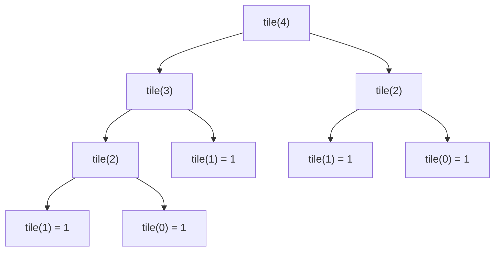

The **Tiling Problem** involves determining the number of ways to tile a given grid using dominoes (or similar tiles) of a fixed size. Specifically, in the **Domino Tiling** problem, the goal is to tile a `2 x n` grid using `1 x 2` dominoes. The dominoes can be placed either horizontally or vertically.

## Characteristics ✨

- **Grid Tiling**: The problem asks how to completely cover a grid without gaps or overlaps, using tiles of a fixed size.
- **Recursive Nature**: The problem has a recursive structure, where solving the problem for smaller grids can help solve the larger grid.
- **Dynamic Programming Solution**: The problem can be solved using dynamic programming to optimize the computation and avoid recalculating subproblems multiple times.

## Problem Statement

Given a `2 x n` grid, find the number of ways to fill it with `1 x 2` dominoes. A domino can be placed:
- **Vertically**: occupies one column, two rows
- **Horizontally**: occupies two columns, one row (requires a pair)

## Recurrence Relation

Let `dp[i]` = number of ways to tile a `2 x i` grid.

- `dp[0] = 1` — empty grid, one way (do nothing)
- `dp[1] = 1` — only one vertical domino fits
- `dp[i] = dp[i-1] + dp[i-2]` — place one vertical domino OR two horizontal dominoes

This is identical to the Fibonacci sequence.

## Time Complexity ⏱️

| Case | Complexity |
|------|-----------|
| Best | `O(n)` |
| Average | `O(n)` |
| Worst | `O(n)` |

## Space Complexity 💾

| Approach | Complexity |
|----------|-----------|
| DP array | `O(n)` |
| Optimized (two variables) | `O(1)` |

## C++ Implementation 💻

```cpp title="Tiling Problem - C++ Dynamic Programming"
#include <iostream>
#include <vector>
using namespace std;

int tilingWays(int n) {
    if (n <= 1) return 1;

    vector<int> dp(n + 1, 0);
    dp[0] = 1; // Base case: 1 way to tile a 2x0 grid
    dp[1] = 1; // Base case: 1 way to tile a 2x1 grid

    for (int i = 2; i <= n; i++) {
        dp[i] = dp[i - 1] + dp[i - 2]; // Either place 1 vertical or 2 horizontal
    }

    return dp[n];
}

int main() {
    int n = 5; // Grid size 2 x n
    cout << "Number of ways to tile the 2x" << n << " grid: " << tilingWays(n) << endl;
    // Output: 8
    return 0;
}
```

## Python Implementation 🐍

```python title="Tiling Problem - Python Dynamic Programming"
def tiling_ways(n: int) -> int:
    if n <= 1:
        return 1

    dp = [0] * (n + 1)
    dp[0] = 1  # Base case: empty grid
    dp[1] = 1  # Base case: single column

    for i in range(2, n + 1):
        dp[i] = dp[i - 1] + dp[i - 2]  # Recurrence relation

    return dp[n]

# Test
n = 5
print(f"Number of ways to tile 2x{n} grid: {tiling_ways(n)}")
# Output: 8
```

## JavaScript Implementation 🌐

```js title="Tiling Problem - JavaScript Dynamic Programming"
function tilingWays(n) {
    if (n <= 1) return 1;

    const dp = new Array(n + 1).fill(0);
    dp[0] = 1; // Base case: empty grid
    dp[1] = 1; // Base case: single column

    for (let i = 2; i <= n; i++) {
        dp[i] = dp[i - 1] + dp[i - 2]; // Recurrence relation
    }

    return dp[n];
}

console.log(`Ways to tile 2x5 grid: ${tilingWays(5)}`); // Output: 8
```

## Recursion Tree (n = 4)



## Applications 🌐

- **Computer Graphics**: Covering grids with tiles in image processing
- **Floor Planning**: Architectural design for covering floor spaces
- **Puzzles and Games**: Placing pieces in a grid without gaps

## Advantages and Disadvantages

**Advantages** ✅
- Optimal substructure makes it ideal for dynamic programming
- Solved in linear time — very efficient

**Disadvantages** ⚠️
- Applies specifically to `2 x n` grids; needs adjustment for other dimensions
- DP array uses `O(n)` space (can be optimized to `O(1)`)

## References

- [GeeksForGeeks - Tiling Problem](https://www.geeksforgeeks.org/tiling-problem/)
- [Dynamic Programming - Fibonacci Pattern](https://en.wikipedia.org/wiki/Dynamic_programming)
