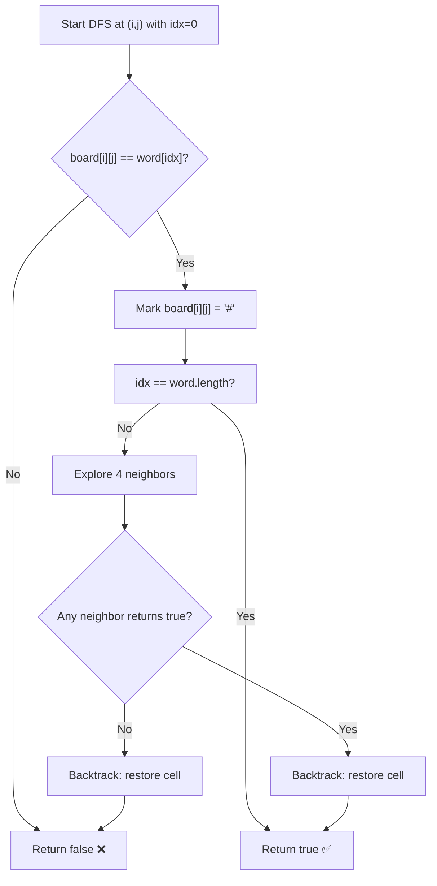

The **Word Search** problem involves finding whether a given word exists in a 2D character grid by traversing adjacent cells (up, down, left, right). It is a classic application of **DFS with backtracking** on a matrix.

## Video Explanation

<LiteYouTubeEmbed
  id="pfiQ_PS1g8E"
  params="autoplay=1&autohide=1&showinfo=0&rel=0"
  title="Word Search - Backtracking - Leetcode 79 - Python"
  lazyLoad={true}
  webp
/>

## Problem Statement

### Word Search I (LeetCode 79)

Given an `m x n` grid of characters and a string `word`, return `true` if `word` exists in the grid.

The word must be constructed from letters of sequentially adjacent cells (horizontally or vertically). The **same cell may not be used more than once**.

### Word Search II (LeetCode 212)

Given an `m x n` grid and a list of words, return all words that exist in the grid. Uses a **Trie** for efficient multi-word search.

## Approach — Word Search I

1. **Iterate every cell** as a potential starting point
2. **DFS from each cell** — try to match the word character by character
3. **Mark visited** — temporarily mark the current cell to avoid reuse
4. **Explore 4 directions** — up, down, left, right
5. **Backtrack** — unmark the cell after exploring all directions
6. **Base cases**:
   - If all characters matched → return `true`
   - If out of bounds, cell already visited, or character mismatch → return `false`

## Time and Space Complexity

| Problem | Time Complexity | Space Complexity |
|---------|----------------|-----------------|
| Word Search I | `O(m × n × 4^L)` where L = word length | `O(L)` recursion stack |
| Word Search II | `O(m × n × 4^L)` with Trie pruning | `O(W × L)` for Trie, W = number of words |

## C++ Implementation — Word Search I 💻

```cpp title="Word Search I - C++ DFS Backtracking"
#include <iostream>
#include <vector>
#include <string>
using namespace std;

bool dfs(vector<vector<char>>& board, string& word, int i, int j, int idx) {
    if (idx == word.size()) return true; // All characters matched

    // Boundary check and character mismatch check
    if (i < 0 || i >= board.size() || j < 0 || j >= board[0].size()) return false;
    if (board[i][j] != word[idx]) return false;

    char temp = board[i][j];
    board[i][j] = '#'; // Mark as visited — temporarily overwrite

    // Explore all 4 directions
    bool found = dfs(board, word, i + 1, j, idx + 1) || // Down
                 dfs(board, word, i - 1, j, idx + 1) || // Up
                 dfs(board, word, i, j + 1, idx + 1) || // Right
                 dfs(board, word, i, j - 1, idx + 1);   // Left

    board[i][j] = temp; // Backtrack — restore original character
    return found;
}

bool exist(vector<vector<char>>& board, string word) {
    if (board.empty() || board[0].empty()) return false;
    int m = board.size(), n = board[0].size();

    for (int i = 0; i < m; i++) {
        for (int j = 0; j < n; j++) {
            if (dfs(board, word, i, j, 0)) return true; // Try every cell as start
        }
    }
    return false;
}

int main() {
    vector<vector<char>> board = {
        {'A', 'B', 'C', 'E'},
        {'S', 'F', 'C', 'S'},
        {'A', 'D', 'E', 'E'}
    };

    cout << exist(board, "ABCCED") << endl; // Output: 1 (true)
    cout << exist(board, "SEE") << endl;    // Output: 1 (true)
    cout << exist(board, "ABCB") << endl;   // Output: 0 (false — can't reuse B)
    return 0;
}
```

## Python Implementation — Word Search I 🐍

```python title="Word Search I - Python DFS Backtracking"
from typing import List

def exist(board: List[List[str]], word: str) -> bool:
    m, n = len(board), len(board[0])

    def dfs(i, j, idx):
        if idx == len(word):
            return True  # All characters matched

        # Boundary and character check
        if i < 0 or i >= m or j < 0 or j >= n:
            return False
        if board[i][j] != word[idx]:
            return False

        temp = board[i][j]
        board[i][j] = '#'  # Mark as visited

        # Explore 4 directions
        found = (dfs(i + 1, j, idx + 1) or  # Down
                 dfs(i - 1, j, idx + 1) or  # Up
                 dfs(i, j + 1, idx + 1) or  # Right
                 dfs(i, j - 1, idx + 1))    # Left

        board[i][j] = temp  # Backtrack — restore cell
        return found

    for i in range(m):
        for j in range(n):
            if dfs(i, j, 0):
                return True  # Found starting from cell (i, j)
    return False

# Test
board = [["A","B","C","E"],["S","F","C","S"],["A","D","E","E"]]
print(exist(board, "ABCCED"))  # True
print(exist(board, "SEE"))     # True
print(exist(board, "ABCB"))    # False
```

## JavaScript Implementation — Word Search I 🌐

```js title="Word Search I - JavaScript DFS Backtracking"
function exist(board, word) {
    const m = board.length, n = board[0].length;

    function dfs(i, j, idx) {
        if (idx === word.length) return true; // All characters matched

        if (i < 0 || i >= m || j < 0 || j >= n) return false;
        if (board[i][j] !== word[idx]) return false;

        const temp = board[i][j];
        board[i][j] = '#'; // Mark as visited

        const found = dfs(i + 1, j, idx + 1) || // Down
                      dfs(i - 1, j, idx + 1) || // Up
                      dfs(i, j + 1, idx + 1) || // Right
                      dfs(i, j - 1, idx + 1);   // Left

        board[i][j] = temp; // Backtrack
        return found;
    }

    for (let i = 0; i < m; i++) {
        for (let j = 0; j < n; j++) {
            if (dfs(i, j, 0)) return true;
        }
    }
    return false;
}
```

## Word Search II — Trie-Based Approach

For searching multiple words simultaneously, building a **Trie** from all words and running a single DFS pass is far more efficient than running Word Search I for each word separately.

```python title="Word Search II - Python Trie + DFS"
from typing import List

class TrieNode:
    def __init__(self):
        self.children = {}
        self.word = None  # Stores the complete word at leaf nodes

def buildTrie(words):
    root = TrieNode()
    for word in words:
        node = root
        for ch in word:
            if ch not in node.children:
                node.children[ch] = TrieNode()
            node = node.children[ch]
        node.word = word  # Mark end of word
    return root

def findWords(board: List[List[str]], words: List[str]) -> List[str]:
    root = buildTrie(words)
    m, n = len(board), len(board[0])
    result = []

    def dfs(i, j, node):
        ch = board[i][j]
        if ch not in node.children:
            return  # No word in Trie starts with this path

        next_node = node.children[ch]

        if next_node.word:
            result.append(next_node.word)  # Found a complete word
            next_node.word = None           # Avoid duplicates

        board[i][j] = '#'  # Mark visited

        for di, dj in [(1,0),(-1,0),(0,1),(0,-1)]:
            ni, nj = i + di, j + dj
            if 0 <= ni < m and 0 <= nj < n and board[ni][nj] != '#':
                dfs(ni, nj, next_node)

        board[i][j] = ch  # Backtrack

    for i in range(m):
        for j in range(n):
            dfs(i, j, root)

    return result
```

## DFS Backtracking Flow



## Key Insights

- **Marking visited cells** with a sentinel (`#`) avoids using an extra `visited` array
- **Backtracking restores** the cell after each DFS path, allowing other starting points to reuse it
- **Early termination**: short-circuit with `||` in C++/JS means we stop as soon as one path succeeds
- **Trie pruning** in Word Search II eliminates entire DFS branches when no word in the Trie matches the current prefix

## References

- [LeetCode 79 - Word Search](https://leetcode.com/problems/word-search/)
- [LeetCode 212 - Word Search II](https://leetcode.com/problems/word-search-ii/)
- [GeeksForGeeks - Word Search](https://www.geeksforgeeks.org/search-a-word-in-a-2d-grid-of-characters/)
