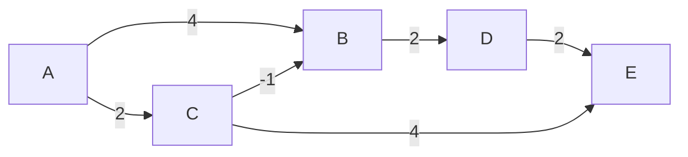
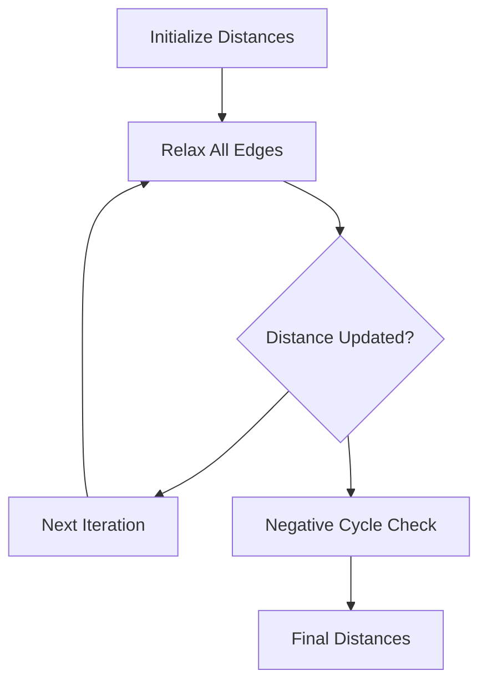
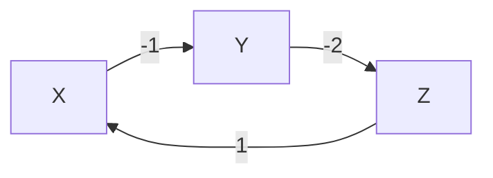

### Definition:

The **Bellman-Ford Algorithm** is a graph algorithm used to find the shortest paths from a single source vertex to all other vertices in a weighted directed graph. Unlike Dijkstra's Algorithm, it can handle graphs with **negative edge weights** and is also capable of detecting **negative weight cycles**.

### Video Explanation

<LiteYouTubeEmbed
  id="RRVYpIET_RU"
  params="autoplay=1&autohide=1&showinfo=0&rel=0"
  title="Complete C++ STL in 1 Video | Time Complexity and Notes"
  lazyLoad={true}
  webp
/>

### Characteristics:

- **Edge Relaxation Based**:
  The algorithm repeatedly relaxes all edges up to `V - 1` times (where `V` is the number of vertices), progressively finding shorter paths.
- **Handles Negative Weights**:
  Works correctly on graphs with negative edge weights, which Dijkstra's Algorithm cannot handle.
- **Negative Cycle Detection**:
  After `V - 1` iterations, if any edge can still be relaxed, a negative weight cycle exists in the graph.
- **Dynamic Programming Approach**:
  Builds up shortest path estimates step by step, ensuring correctness after each round of relaxation.

### Time Complexity:

- **Best Case: O(E)**
  When an early-termination optimization is applied and no relaxation occurs after the very first pass — meaning all edges are already in shortest-path order. The algorithm exits after a single round over all `E` edges.
- **Average Case: O(VE)**
  In practice, several rounds of relaxation are needed before distances stabilize. The algorithm performs roughly `k` passes (where `k < V - 1`) over all `E` edges before no updates are found.
- **Worst Case: O(VE)**
  When the shortest path to the farthest vertex requires all `V - 1` relaxation rounds — for example, in a linear chain graph where the source is at one end. Here `V` is the number of vertices and `E` is the number of edges.

### Space Complexity:

- **Space Complexity: O(V)**
  Only a distance array of size `V` is needed to store the shortest path estimates.

### Approach:

The algorithm follows these steps:

1. **Initialization**:
   - Set the distance to the source vertex as `0`.
   - Set the distance to all other vertices as `infinity (INF)`.

2. **Relaxation (V - 1 iterations)**:
   - For each edge `(u, v, w)`, if `distance[u] + w < distance[v]`, update `distance[v] = distance[u] + w`.
   - Repeat this for all edges, `V - 1` times.

3. **Negative Cycle Detection**:
   - After `V - 1` iterations, perform one more pass over all edges.
   - If any distance can still be reduced, the graph contains a negative weight cycle.

4. **Output**:
   - The `distance[]` array holds the shortest distance from the source to every other vertex.

---
## Dry Run Example

Consider the following graph:



Source Vertex: **A**

*Note: For this dry run, we assume the edges are relaxed in the following order: (A, B), (A, C), (C, B), (B, D), (C, E), (D, E).*

### Initial Distances

| Vertex | Distance |
|----------|----------|
| A | 0 |
| B | ∞ |
| C | ∞ |
| D | ∞ |
| E | ∞ |

### After Pass 1

| Vertex | Distance |
|----------|----------|
| A | 0 |
| B | 1 |
| C | 2 |
| D | 3 |
| E | 5 |

### After Pass 2

No further updates occur.

### Final Shortest Distances

| Vertex | Distance |
|----------|----------|
| A | 0 |
| B | 1 |
| C | 2 |
| D | 3 |
| E | 5 |

The shortest path to **B** becomes:

A → C → B

with cost:

2 + (-1) = 1

:::tip
This example demonstrates why Bellman-Ford is useful for graphs containing negative edge weights. The algorithm successfully finds a shorter path through a negative-weight edge, which standard Dijkstra's algorithm cannot handle correctly.
:::
---

## Visualization of Relaxation Process

Bellman-Ford works by repeatedly relaxing every edge in the graph. Each relaxation attempts to improve the currently known shortest distance to a vertex.

For every edge:

```text
If distance[u] + weight < distance[v]

Then

distance[v] = distance[u] + weight
```

### Relaxation Flow



### Negative Cycle Detection



Cycle Weight:

```text
-1 + (-2) + 1 = -2
```

Since the total cycle weight is negative, repeatedly traversing this cycle keeps reducing the path cost. Bellman-Ford detects this during the additional relaxation pass.

After performing V−1 iterations:

```text
One more iteration is performed.
```

If any distance still decreases:

```text
Graph contains a Negative Weight Cycle
```

Otherwise:

```text
Shortest Paths Found Successfully
```


### C++ Implementation:

```cpp
#include <bits/stdc++.h>
using namespace std;

struct Edge {
    int u, v, w;
};

void bellmanFord(int src, int V, vector<Edge>& edges) {
    vector<int> dist(V, INT_MAX);
    dist[src] = 0;

    // Relax all edges V-1 times
    for (int i = 1; i <= V - 1; i++) {
        for (auto& edge : edges) {
            if (dist[edge.u] != INT_MAX && dist[edge.u] + edge.w < dist[edge.v]) {
                dist[edge.v] = dist[edge.u] + edge.w;
            }
        }
    }

    // Check for negative weight cycles
    for (auto& edge : edges) {
        if (dist[edge.u] != INT_MAX && dist[edge.u] + edge.w < dist[edge.v]) {
            cout << "Graph contains a negative weight cycle!" << endl;
            return;
        }
    }

    // Print shortest distances
    cout << "Vertex\tDistance from Source" << endl;
    for (int i = 0; i < V; i++) {
        cout << i << "\t" << dist[i] << endl;
    }
}

int main() {
    int V = 5;
    vector<Edge> edges = {
        {0, 1, -1}, {0, 2, 4},
        {1, 2, 3},  {1, 3, 2},
        {1, 4, 2},  {3, 2, 5},
        {3, 1, 1},  {4, 3, -3}
    };

    bellmanFord(0, V, edges);
    return 0;
}
```

### Output

```
Vertex  Distance from Source
0       0
1       -1
2       2
3       -2
4       1
```

---

### Java Implementation:

```java
import java.util.*;

public class BellmanFord {

    static class Edge {
        int u, v, w;
        Edge(int u, int v, int w) {
            this.u = u;
            this.v = v;
            this.w = w;
        }
    }

    public static void bellmanFord(int src, int V, List<Edge> edges) {
        int[] dist = new int[V];
        Arrays.fill(dist, Integer.MAX_VALUE);
        dist[src] = 0;

        // Relax all edges V-1 times
        for (int i = 1; i <= V - 1; i++) {
            for (Edge edge : edges) {
                if (dist[edge.u] != Integer.MAX_VALUE && dist[edge.u] + edge.w < dist[edge.v]) {
                    dist[edge.v] = dist[edge.u] + edge.w;
                }
            }
        }

        // Check for negative weight cycles
        for (Edge edge : edges) {
            if (dist[edge.u] != Integer.MAX_VALUE && dist[edge.u] + edge.w < dist[edge.v]) {
                System.out.println("Graph contains a negative weight cycle!");
                return;
            }
        }

        // Print result
        System.out.println("Vertex\tDistance from Source");
        for (int i = 0; i < V; i++) {
            System.out.println(i + "\t" + dist[i]);
        }
    }

    public static void main(String[] args) {
        int V = 5;
        List<Edge> edges = Arrays.asList(
            new Edge(0, 1, -1), new Edge(0, 2, 4),
            new Edge(1, 2, 3),  new Edge(1, 3, 2),
            new Edge(1, 4, 2),  new Edge(3, 2, 5),
            new Edge(3, 1, 1),  new Edge(4, 3, -3)
        );

        bellmanFord(0, V, edges);
    }
}
```

---

### Python Implementation:

```python
def bellman_ford(src, V, edges):
    dist = [float('inf')] * V
    dist[src] = 0

    # Relax all edges V-1 times
    for _ in range(V - 1):
        for u, v, w in edges:
            if dist[u] != float('inf') and dist[u] + w < dist[v]:
                dist[v] = dist[u] + w

    # Check for negative weight cycles
    for u, v, w in edges:
        if dist[u] != float('inf') and dist[u] + w < dist[v]:
            print("Graph contains a negative weight cycle!")
            return

    print("Vertex\tDistance from Source")
    for i in range(V):
        print(f"{i}\t{dist[i]}")


if __name__ == "__main__":
    V = 5
    edges = [
        (0, 1, -1), (0, 2, 4),
        (1, 2, 3),  (1, 3, 2),
        (1, 4, 2),  (3, 2, 5),
        (3, 1, 1),  (4, 3, -3)
    ]
    bellman_ford(0, V, edges)
```

---

## Complexity Analysis

### Time Complexity

- **Best Case: O(E)** — early termination after a single pass when no relaxation is needed.
- **Average Case: O(VE)** — several passes are required before distances stabilize.
- **Worst Case: O(VE)** — all `V - 1` rounds are needed (e.g., a linear chain graph). The outer loop runs up to `V - 1` times and the inner loop processes all `E` edges each iteration.

### Space Complexity

- **Space Complexity: O(V)**
- Only the `dist[]` array of size `V` is maintained.

---

## Bellman-Ford vs Dijkstra's Algorithm

| Feature                    | Bellman-Ford       | Dijkstra's         |
|----------------------------|--------------------|--------------------|
| Negative edge weights      | ✅ Supported        | ❌ Not supported    |
| Negative cycle detection   | ✅ Yes              | ❌ No               |
| Time Complexity            | O(VE)            | O((V + E) log V)|
| Approach                   | Dynamic Programming| Greedy             |
| Best used for              | Sparse graphs with negative weights | Dense graphs with non-negative weights |

---

## When to Use Bellman-Ford Algorithm

- **Negative Edge Weights**: When the graph contains edges with negative weights that would cause Dijkstra's Algorithm to fail.
- **Negative Cycle Detection**: When you need to verify whether a graph contains a negative weight cycle (common in arbitrage detection in financial systems).
- **Network Routing**: Used in distance-vector routing protocols like RIP (Routing Information Protocol).
- **Single-Source Shortest Path**: When you need shortest distances from one source to all other nodes.

## Assumptions

- The graph is directed and may contain negative edge weights.
- The algorithm does **not** work correctly if a negative weight cycle is reachable from the source (it reports the cycle instead).
- If no negative cycle is present, the shortest path is guaranteed after `V - 1` iterations.

## Conclusion

The Bellman-Ford Algorithm is a versatile and powerful shortest-path algorithm that extends beyond the limitations of Dijkstra's Algorithm by supporting negative edge weights and detecting negative cycles. While it is slower than Dijkstra's for graphs with non-negative weights, it is the go-to algorithm whenever negative weights or cycle detection are involved, making it indispensable in domains like network routing and financial graph analysis.
