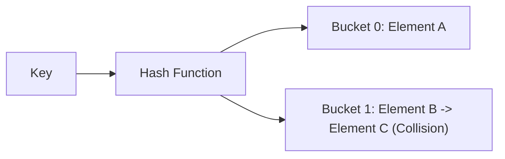

Binary Search Trees (specifically self-balancing BSTs like Red-Black Trees) and Hash Tables are the two most common data structures used to implement associative containers (maps, sets).

## Comparison Table

| Operation / Feature | Self-Balancing BST (e.g., Red-Black) | Hash Table |
| --- | --- | --- |
| **Search Time** | $O(\log N)$ (guaranteed) | $O(1)$ average, $O(N)$ worst-case |
| **Insert Time** | $O(\log N)$ (guaranteed) | $O(1)$ average, $O(N)$ worst-case |
| **Delete Time** | $O(\log N)$ (guaranteed) | $O(1)$ average, $O(N)$ worst-case |
| **Ordering** | Maintained (in-order traversal is sorted). | Unordered (randomized by hash function). |
| **Range Queries** | Highly efficient ($O(\log N + K)$). | Inefficient ($O(N)$ to scan entire table). |
| **Memory Overhead** | High (pointers for parent/left/right nodes). | High (empty buckets to avoid collisions). |

## Performance Factors

### Hash Table Collision Handling

Hash tables rely on a good hash function to distribute elements evenly. In the case of collisions, time complexity degrades:

### Self-Balancing BST

BSTs store items in sorted order, which enables order-based operations (finding closest keys, finding minimum/maximum elements, or range searches).

## Decision Criteria

* **Choose a Hash Table** if you only need fast lookup, insertion, and deletion by exact key (e.g., caching, dictionaries, indexing).
* **Choose a Self-Balancing BST** if you need keys to remain in sorted order, need range queries (e.g., keys between $10$ and $100$), or need guaranteed $O(\log N)$ behavior without any worst-case degradation.
