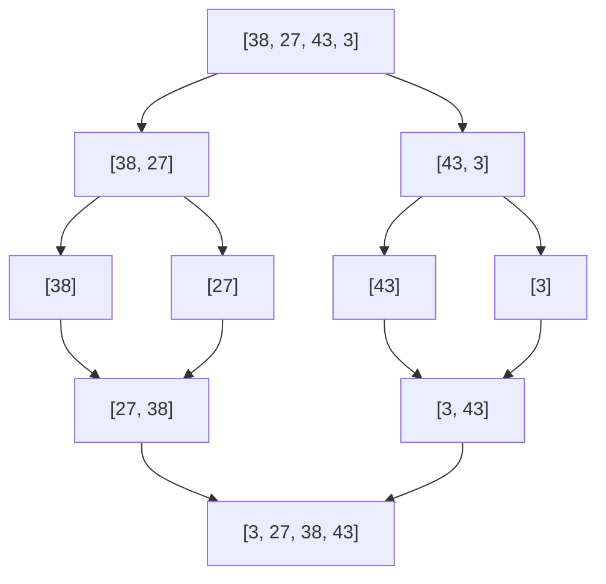

Both Merge Sort and Quick Sort are highly efficient, comparison-based sorting algorithms that utilize the **Divide and Conquer** paradigm.

## Comparison Table

### Variables:
* $N$: Number of elements to be sorted

| Feature | Merge Sort | Quick Sort |
| --- | --- | --- |
| **Average Complexity** | $O(N \log N)$ | $O(N \log N)$ |
| **Worst-Case Complexity** | $O(N \log N)$ | $O(N^2)$ (when pivot is poorly chosen) |
| **Space Complexity** | $O(N)$ (requires auxiliary array) | $O(\log N)$ auxiliary on average (recursive stack); worst-case $O(N)$ for skewed recursion |
| **Stability** | Stable (preserves relative order) | Unstable (does not preserve relative order) |
| **Sort Method** | Out-of-place | In-place |
| **Preferred for** | Linked Lists, Large Datasets. | Arrays, RAM-sensitive environments. |

## How They Work

### Merge Sort

Merge Sort divides the array into two halves, recursively sorts them, and then merges the sorted halves.

### Quick Sort

Quick Sort selects a 'pivot' element, partitions the array around the pivot such that smaller elements go left and larger ones go right, then recursively sorts the partitions.

## Decision Criteria

* **Choose Merge Sort** when stability is required (e.g., sorting database records by one field then another) or when sorting linked lists where pointer manipulation makes merging cheap.
* **Choose Quick Sort** when space is premium. It is typically faster in practice than Merge Sort due to better cache locality and lower constant factors.
