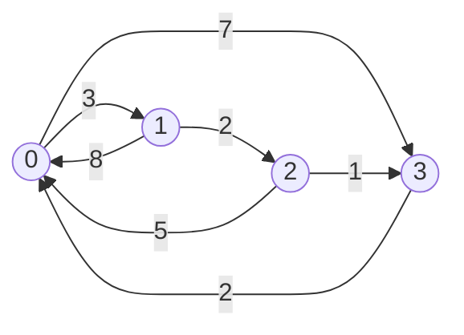

# Floyd-Warshall Algorithm

## Introduction

The **Floyd-Warshall Algorithm** is a classic **Dynamic Programming** algorithm used to find the shortest paths between **all pairs of vertices** in a weighted graph.

Unlike algorithms such as:
- Dijkstra’s Algorithm
- Bellman-Ford Algorithm

which solve the **single-source shortest path** problem, Floyd-Warshall computes the shortest distance between every pair of vertices.

The algorithm works for:
- Directed graphs
- Undirected graphs
- Graphs with negative edge weights

However, it does **not** work correctly for graphs containing **negative weight cycles**.

---

## Dynamic Programming Concept

The Floyd-Warshall Algorithm gradually improves the shortest path between every pair of vertices by considering each vertex as an intermediate node.

The core DP transition is:

\[
dist[i][j] = \min(dist[i][j], dist[i][k] + dist[k][j])
\]

Where:
- `dist[i][j]` → shortest distance from vertex `i` to vertex `j`
- `k` → intermediate vertex

---

## How the Algorithm Works

1. Create an adjacency matrix.
2. Initialize:
   - Distance to self as `0`
   - Unreachable vertices as `INF`
3. Iterate through all vertices as intermediate nodes.
4. Update shortest distances using Dynamic Programming.
5. Final matrix contains shortest paths between all pairs of vertices.

---

# Implementation in C++

```cpp
#include <iostream>
#include <vector>
using namespace std;

const int INF = 1000000000;

void floydWarshall(vector<vector<int>>& dist, int V) {

    for (int k = 0; k < V; k++) {

        for (int i = 0; i < V; i++) {

            for (int j = 0; j < V; j++) {

                if (dist[i][k] != INF &&
                    dist[k][j] != INF &&
                    dist[i][k] + dist[k][j] < dist[i][j]) {

                    dist[i][j] = dist[i][k] + dist[k][j];
                }
            }
        }
    }

    cout << "Shortest distance matrix:\n";

    for (int i = 0; i < V; i++) {

        for (int j = 0; j < V; j++) {

            if (dist[i][j] == INF)
                cout << "INF ";
            else
                cout << dist[i][j] << " ";
        }

        cout << endl;
    }
}

int main() {

    int V = 4;

    vector<vector<int>> dist = {
        {0, 3, INF, 7},
        {8, 0, 2, INF},
        {5, INF, 0, 1},
        {2, INF, INF, 0}
    };

    floydWarshall(dist, V);

    return 0;
}
```

---

# Implementation in Java

```java
public class FloydWarshall {

    static final int INF = 1000000000;

    public static void floydWarshall(int[][] dist, int V) {

        for (int k = 0; k < V; k++) {

            for (int i = 0; i < V; i++) {

                for (int j = 0; j < V; j++) {

                    if (dist[i][k] != INF &&
                        dist[k][j] != INF &&
                        dist[i][k] + dist[k][j] < dist[i][j]) {

                        dist[i][j] = dist[i][k] + dist[k][j];
                    }
                }
            }
        }

        printSolution(dist, V);
    }

    public static void printSolution(int[][] dist, int V) {

        System.out.println("Shortest distance matrix:");

        for (int i = 0; i < V; i++) {

            for (int j = 0; j < V; j++) {

                if (dist[i][j] == INF)
                    System.out.print("INF ");
                else
                    System.out.print(dist[i][j] + " ");
            }

            System.out.println();
        }
    }

    public static void main(String[] args) {

        int V = 4;

        int[][] graph = {
            {0, 3, INF, 7},
            {8, 0, 2, INF},
            {5, INF, 0, 1},
            {2, INF, INF, 0}
        };

        floydWarshall(graph, V);
    }
}
```

---

## Example
### Input Graph



### Adjacency Matrix Representation

```text
      0    1    2    3
0     0    3   INF   7
1     8    0    2   INF
2     5   INF   0    1
3     2   INF  INF   0
```

## Output

```text
0 3 5 6
5 0 2 3
3 6 0 1
2 5 7 0
```

---

# Time Complexity

The Floyd-Warshall Algorithm uses three nested loops:

\[
O(V^3)
\]

Where:
- `V` = Number of vertices

---

# Space Complexity

The algorithm stores a distance matrix:

\[
O(V^2)
\]

---

# Advantages

- Simple and elegant implementation
- Solves All-Pairs Shortest Path efficiently
- Supports negative edge weights
- Works for directed and undirected graphs
- Dynamic Programming based approach

---

# Limitations

- Inefficient for very large sparse graphs
- Cannot handle negative weight cycles
- Requires adjacency matrix representation
- Higher time complexity than single-source shortest path algorithms

---

# Applications

- Network routing algorithms
- Traffic and navigation systems
- Graph analysis problems
- Competitive programming
- Dynamic Programming education
- Path optimization systems

---

# Edge Cases Handled

- Directed graphs
- Undirected graphs
- Disconnected graphs
- Negative edge weights
- Single vertex graphs

---

# Points to Remember

- Floyd-Warshall computes shortest paths between all pairs of vertices.
- The algorithm uses Dynamic Programming with matrix optimization.
- Intermediate vertex `k` must remain the outermost loop for correctness.
- Works with negative edge weights but fails for negative cycles.
- Distance from a node to itself is always `0`.

---

# Conclusion

The Floyd-Warshall Algorithm is one of the most important graph algorithms for solving the All-Pairs Shortest Path problem.

It demonstrates matrix-based Dynamic Programming and provides a powerful approach for optimizing shortest paths incrementally using intermediate vertices.
