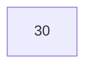
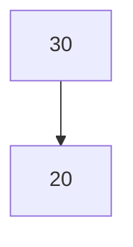
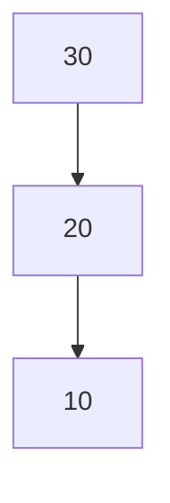
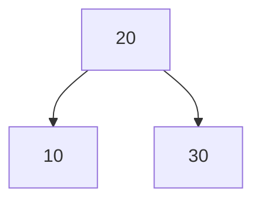
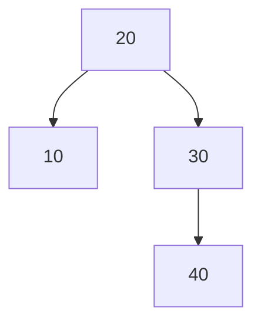
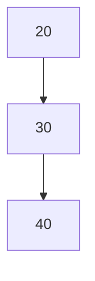
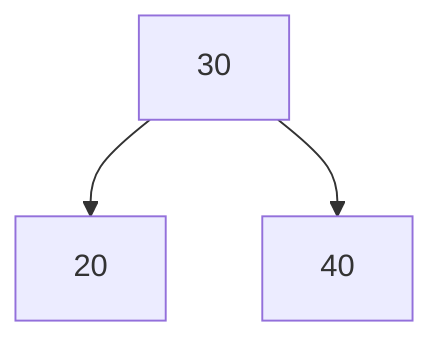

## Introduction
An **AVL Tree** is a self-balancing binary search tree (BST) where the difference in heights between the left and right subtrees of any node is at most one. This balancing property ensures that the tree remains approximately balanced after insertions and deletions, resulting in efficient operations. AVL trees are named after their inventors, Georgy Adelson-Velsky and Evgenii Landis, who introduced this data structure in 1962.

## Video Explanation

<LiteYouTubeEmbed
  id="YWqla0UX-38"
  params="autoplay=1&autohide=1&showinfo=0&rel=0"
  title="5.13 AVL Tree - Insertion, Rotations(LL,RR,LR,RL) with Example | Data Structures Tutorials"
  poster="maxresdefault"
  lazyLoad={true}
  webp
/>

## Definition and Structure
An AVL tree consists of nodes similar to a BST, but with an added balance factor for each node:
- **Data:** The value stored in the node.
- **Left Child:** A reference to the left subtree (containing nodes with smaller values).
- **Right Child:** A reference to the right subtree (containing nodes with larger values).
- **Balance Factor:** The height difference between the left and right subtrees, calculated as `height(left subtree) - height(right subtree)`.

The AVL tree maintains this balance factor throughout all operations, ensuring that the height remains logarithmic.

## Properties
Some important properties of AVL trees include:
- **Height:** The height of an AVL tree with `n` nodes is guaranteed to be O(log n).
- **Balance Factor:** For any node, the balance factor must be -1, 0, or +1.
- **Rotations:** To maintain balance during insertions and deletions, AVL trees utilize rotations (single and double) to rebalance the tree.

    ``` 
         10
        /  \
       5    20
      / \   / \
     2   7 15  25

    Height of the tree: 2
    Balance Factor of node 10: 0
    Balanced: Yes
    ```

## Types of Rotations
1. **Single Right Rotation (LL Rotation)**: Performed when a left-heavy subtree becomes unbalanced due to an insertion in the left child.
   
   

2. **Single Left Rotation (RR Rotation)**: Performed when a right-heavy subtree becomes unbalanced due to an insertion in the right child.
   
   -768.png)

3. **Left-Right Rotation (LR Rotation)**: Performed when a left-heavy subtree becomes unbalanced due to an insertion in the right child of the left child.
   
   -768.png)

4. **Right-Left Rotation (RL Rotation)**: Performed when a right-heavy subtree becomes unbalanced due to an insertion in the left child of the right child.
   
   -768.png)

## Operations on AVL Trees

### 1. Insertion
To insert a new value into an AVL tree:
- Insert it like a regular BST.
- After insertion, update the heights and balance factors of nodes along the path back to the root.
- Perform rotations as necessary to maintain the AVL balance property.

#### Code Example (C++)

```cpp
Node* insert(Node* root, int key) {
    // Regular BST insertion
    if (root == nullptr) {
        return new Node(key);
    }
    
    if (key < root->data) {
        root->left = insert(root->left, key);
    } else if (key > root->data) {
        root->right = insert(root->right, key);
    } else {
        return root; // Duplicate keys not allowed
    }
    
    // Update height and balance factor
    updateHeight(root);
    
    // Perform rotations to balance the tree
    return balance(root);
}
```
## Insertion Dry Run

Consider inserting the following values into an empty AVL Tree:

```text
30, 20, 10
```

### Step 1

Insert **30**



Balance Factor:

```text
BF(30) = 0
```

The tree is balanced.

---

### Step 2

Insert **20**



Balance Factors:

```text
BF(30) = +1
BF(20) = 0
```

The tree remains balanced.

---

### Step 3

Insert **10**



Balance Factors:

```text
BF(30) = +2
```

The tree becomes unbalanced (LL Case).

Perform a **Right Rotation** on node **30**.

After rotation:



The AVL Tree is balanced again.

:::note
Whenever the balance factor becomes greater than **1** or less than **-1**, AVL Trees perform rotations to restore balance.
:::

---

### 2. Searching
Searching in an AVL tree is similar to searching in a standard BST due to its structure:
1. Start at the root node.
2. Compare the target value with the root node:
   - If equal, return the node.
   - If less, search the left subtree.
   - If greater, search the right subtree.
3. If the target value is not found, return `false`.

### C++ Implementation

```cpp
bool search(Node* root, int key) {
    if (root == nullptr) return false;
    
    if (root->data == key) return true;
    
    if (key < root->data) return search(root->left, key);
    
    return search(root->right, key);
}
```

### 3. Deletion
Deletion in an AVL tree also follows the binary search tree rules but requires additional steps to maintain balance:
- Delete the node as you would in a BST.
- Update the heights and balance factors.
- Perform rotations if necessary.

### Case 1: Deleting a Leaf Node
Simply remove the node.

### Case 2: Deleting a Node with One Child
Replace the node with its child.

### Case 3: Deleting a Node with Two Children
Find the inorder predecessor or successor and replace the node, then delete the predecessor or successor.

#### Implementation:
```cpp
Node* deleteNode(Node* root, int key) {
    if (root == nullptr) return nullptr;

    if (key < root->data) {
        root->left = deleteNode(root->left, key);
    } else if (key > root->data) {
        root->right = deleteNode(root->right, key);
    } else {
        // Node with only one child or no child
        if ((root->left == nullptr) || (root->right == nullptr)) {
            Node* temp = root->left ? root->left : root->right;
            delete root;
            return temp;
        }
        
        // Node with two children: Get the inorder successor
        Node* temp = minValueNode(root->right);
        root->data = temp->data;
        root->right = deleteNode(root->right, temp->data);
    }
    
    // Update height and balance
    updateHeight(root);
    return balance(root);
}
```
## Deletion Dry Run

Consider the following AVL Tree.



Delete node **10**.

### Before Deletion

```text
        20
       /  \
     10    30
             \
             40
```

After deleting **10**:



Now,

```text
BF(20) = -2
```

The tree becomes unbalanced.

Since the imbalance occurs in the **Right-Right (RR)** case, perform a **Left Rotation**.

After rotation:



The AVL Tree becomes balanced again.

---

## Rotation Summary

AVL Trees use four types of rotations to maintain balance.

| Rotation | Condition | Fix |
|----------|-----------|-----|
| LL | Left child is left-heavy (or insertion in left child's left subtree) | Right Rotation |
| RR | Right child is right-heavy (or insertion in right child's right subtree) | Left Rotation |
| LR | Left child is right-heavy (or insertion in left child's right subtree) | Left Rotation followed by Right Rotation |
| RL | Right child is left-heavy (or insertion in right child's left subtree) | Right Rotation followed by Left Rotation |

Maintaining balance ensures that all search, insertion, and deletion operations continue to run in **O(log n)** time.

## Complexity Cheat Sheet

| Operation | Best Case | Average Case | Worst Case | Space Complexity |
| :--- | :--- | :--- | :--- | :--- |
| **Search** | $O(1)$ | $O(\log n)$ | $O(\log n)$ | $O(\log n)$ |
| **Insertion** | $O(\log n)$ | $O(\log n)$ | $O(\log n)$ | $O(\log n)$ |
| **Deletion** | $O(\log n)$ | $O(\log n)$ | $O(\log n)$ | $O(\log n)$ |
| **Rotation (Single / Double)** | $O(1)$ | $O(1)$ | $O(1)$ | $O(1)$ |
| **Overall Storage** | - | - | - | $O(n)$ |

## Advantages and Disadvantages
### Advantages:
- Ensures O(log n) time complexity for search, insertion, and deletion due to strict balancing.
- Self-balancing eliminates the possibility of degradation into a linked list structure.

### Disadvantages:
- More complex to implement compared to standard binary search trees.
- Additional memory required for storing height information and more rotations may increase overhead.

## Applications of AVL Trees
- **Database Indexing:** Used in databases to maintain sorted data for efficient retrieval.
- **Memory Management:** Employed in dynamic memory allocation algorithms.
- **Auto-complete Systems:** Utilized in applications that require efficient prefix searches.
- **Routing Algorithms:** Applied in network routing protocols where balanced trees improve efficiency.

AVL trees are a powerful data structure that combines the advantages of binary search trees with the need for balance, ensuring efficient operations across various applications.

## Common Interview Questions

After learning AVL Trees, try solving these interview-style problems to strengthen your understanding of balancing operations, rotations, and Binary Search Trees.

### 1. Balanced Binary Tree

**Expected Approach:**
Use a post-order traversal to calculate the height of each subtree while checking whether the balance factor of every node lies between **-1** and **+1**.

**Practice:**
- [LeetCode 110 – Balanced Binary Tree](https://leetcode.com/problems/balanced-binary-tree/)

---

### 2. Implement AVL Tree Insertion

**Expected Approach:**
Insert the node following Binary Search Tree rules, update the heights of affected nodes, compute balance factors, and perform the required rotation (LL, RR, LR, or RL) whenever the tree becomes unbalanced.

**Practice:**
- [GeeksforGeeks – AVL Tree Insertion](https://www.geeksforgeeks.org/avl-tree-set-1-insertion/)

---

### 3. Delete a Node from an AVL Tree

**Expected Approach:**
Delete the node as in a Binary Search Tree, update the heights of ancestor nodes, and rebalance the tree using the appropriate rotation if the balance factor becomes invalid.

**Practice:**
- [GeeksforGeeks – AVL Tree Deletion](https://www.geeksforgeeks.org/avl-tree-set-2-deletion/)

---

### 4. Identify the Required Rotation

**Expected Approach:**
Given a sequence of insertions or deletions, determine whether the imbalance corresponds to the **LL**, **RR**, **LR**, or **RL** case and apply the correct rotation to restore balance.

---

### 5. Compare AVL Trees and Red-Black Trees

**Expected Approach:**
Explain the differences in balancing strategy, number of rotations, height guarantees, insertion/deletion performance, and practical applications of both self-balancing Binary Search Trees.

:::tip
Practice these problems after understanding AVL Tree rotations and balance factors. They are frequently discussed in technical interviews and help reinforce the concepts covered in this article.
:::
## Conclusion

AVL Trees are an important self-balancing Binary Search Tree that guarantee **O(log n)** time complexity for search, insertion, and deletion by maintaining a balanced height. Through balance factors and rotations (LL, RR, LR, and RL), AVL Trees prevent the performance degradation that can occur in ordinary Binary Search Trees.

Understanding AVL Trees not only strengthens your knowledge of balanced tree data structures but also builds a strong foundation for advanced topics such as Red-Black Trees, B-Trees, and database indexing. Practice the interview questions above to reinforce these concepts and improve your problem-solving skills for technical interviews.