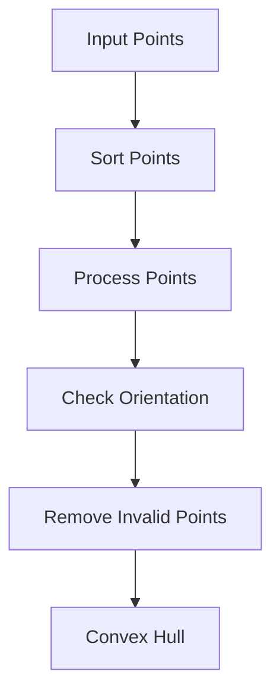

# Convex Hull Algorithms

## Introduction

Given a set of points in a 2D plane, the **convex hull** is the smallest convex polygon that contains all the points. Every point in the set either lies on the boundary of this polygon or inside it.

A helpful way to visualise this is the **rubber-band analogy**: imagine stretching a rubber band around all the points on a table and then letting it snap tight. The shape it forms — the taut outline — is the convex hull. Only the "outermost" points touch the band; all others are enclosed within.

Convex hulls are a foundational primitive in computational geometry. They appear as a preprocessing step or sub-routine in problems ranging from collision detection and path planning to image processing and geographic information systems. Understanding how to compute them efficiently — and why the algorithms work — is a key skill for anyone working in algorithms or applied mathematics.

## Video Explanation

<LiteYouTubeEmbed
  id="7gMLNiEz3nw"
  params="autoplay=1&autohide=1&showinfo=0&rel=0"
  title="L-4.5: Deadlock Avoidance Banker's Algorithm with Example |With English Subtutles"
  poster="maxresdefault"
  lazyLoad={true}
  webp
/>

---

## Characteristics

- **Smallest convex polygon**: No smaller convex set encloses all the input points.
- **Boundary points only**: The hull is defined by a subset of the input points; interior points are discarded.
- **Orientation tests**: Every mainstream convex hull algorithm relies on cross-product-based orientation tests to decide whether a turn is left (counter-clockwise), right (clockwise), or straight (collinear).
- **Broad applicability**: Convex hulls are used across computational geometry, computer graphics, robotics, GIS, and machine learning.

---

## Mathematical Foundation

### Cross Product

The backbone of convex hull algorithms is the **2D cross product**, which tells us the orientation of an ordered triple of points A, B, C.

Given three points $A = (A_x, A_y)$, $B = (B_x, B_y)$, and $C = (C_x, C_y)$, we define:

$$
\text{cross}(A, B, C) = (B_x - A_x)(C_y - A_y) - (B_y - A_y)(C_x - A_x)
$$

This is the z-component of the 3D cross product of the vectors $\overrightarrow{AB}$ and $\overrightarrow{AC}$.

The sign of the result tells us the turn direction:

| Result | Meaning |
|--------|---------|
| **Positive** | Counter-clockwise (left) turn from AB to AC |
| **Negative** | Clockwise (right) turn from AB to AC |
| **Zero** | A, B, C are collinear |

### Why Orientation Testing Works

Imagine walking from point A toward point B. When you then look toward point C:

- If C is to your **left**, you are making a counter-clockwise turn — a "left turn."
- If C is to your **right**, you are making a clockwise turn — a "right turn."
- If C is directly ahead or behind, the three points are collinear.

Convex hull algorithms exploit this: a valid convex polygon only makes turns in one direction (counter-clockwise, by convention). Whenever a new point would force a clockwise turn at the current hull vertex, that vertex is no longer on the boundary and must be removed. The cross product lets us check this in O(1) time.

---

## Convex Hull Visualization

The following flowchart summarises the high-level structure shared by most convex hull algorithms:



---

## Graham Scan Algorithm

### Idea

Graham Scan, published by Ronald Graham in 1972, computes the convex hull in O(N log N) time. The algorithm works as follows:

1. **Find the anchor point**: Select the point with the lowest y-coordinate (break ties by x-coordinate). This point is guaranteed to be on the hull.
2. **Sort by polar angle**: Sort all remaining points by their polar angle relative to the anchor. Points at the same angle are ordered by distance.
3. **Use a stack**: Iterate through the sorted points and maintain a stack of candidate hull vertices.
4. **Remove clockwise turns**: Before pushing a new point onto the stack, pop any point that would cause a clockwise (right) turn with the top two stack elements.

After processing all points, the stack contains exactly the vertices of the convex hull in counter-clockwise order.

---

### Step-by-Step Example

Consider the following six points:

```
P0 = (0, 0)   P1 = (1, 1)   P2 = (2, 2)
P3 = (0, 2)   P4 = (2, 0)   P5 = (1, 3)
```

**Step 1 — Anchor**: The lowest point is P0 = (0, 0).

**Step 2 — Sort by polar angle** from P0:
Sorted order: P4(2,0), P2(2,2), P1(1,1), P5(1,3), P3(0,2).
Note that P1 is collinear between P0 and P2, so it will be eliminated.

**Step 3 — Stack processing**:

| Action | Stack (bottom → top) |
|--------|----------------------|
| Push P0 | [P0] |
| Push P4 | [P0, P4] |
| Push P2 | [P0, P4, P2] |
| P1 is collinear/inside — popped or skipped | [P0, P4, P2] |
| Push P5 | [P0, P4, P2, P5] |
| P3: cross(P2, P5, P3) > 0 → push | [P0, P4, P2, P5, P3] |

**Final hull** (counter-clockwise): P0 → P4 → P2 → P5 → P3 → P0.

P1 is an interior point and correctly excluded.

---

### Graham Scan C++ Implementation

```cpp
#include <bits/stdc++.h>
using namespace std;

struct Point {
    long long x, y;
};

// Cross product of vectors (O->A) and (O->B)
long long cross(const Point& O, const Point& A, const Point& B) {
    return (A.x - O.x) * (B.y - O.y) - (A.y - O.y) * (B.x - O.x);
}

long long distSq(const Point& A, const Point& B) {
    return (A.x - B.x) * (A.x - B.x) + (A.y - B.y) * (A.y - B.y);
}

vector<Point> grahamScan(vector<Point> pts) {
    int n = pts.size();
    if (n < 3) return pts;

    // Find anchor (lowest y, then leftmost)
    int minIdx = 0;
    for (int i = 1; i < n; i++) {
        if (pts[i].y < pts[minIdx].y ||
           (pts[i].y == pts[minIdx].y && pts[i].x < pts[minIdx].x)) {
            minIdx = i;
        }
    }
    swap(pts[0], pts[minIdx]);
    const Point& anchorLocal = pts[0];

    // Sort remaining points by polar angle from anchor
    sort(pts.begin() + 1, pts.end(), [&anchorLocal](const Point& A, const Point& B) {
        long long cp = cross(anchorLocal, A, B);
        if (cp != 0) return cp > 0;
        return distSq(anchorLocal, A) < distSq(anchorLocal, B);
    });

    // Remove collinear points (keep only the farthest)
    int m = 1;
    for (int i = 1; i < n; i++) {
        while (i < n - 1 && cross(anchorLocal, pts[i], pts[i + 1]) == 0) i++;
        pts[m++] = pts[i];
    }

    if (m < 3) return vector<Point>(pts.begin(), pts.begin() + m);

    // Stack-based hull construction
    vector<Point> hull;
    hull.push_back(pts[0]);
    hull.push_back(pts[1]);
    hull.push_back(pts[2]);

    for (int i = 3; i < m; i++) {
        while (hull.size() > 1 &&
               cross(hull[hull.size()-2], hull[hull.size()-1], pts[i]) <= 0) {
            hull.pop_back();
        }
        hull.push_back(pts[i]);
    }

    return hull;
}

int main() {
    vector<Point> points = {{0,0},{1,1},{2,2},{0,2},{2,0},{1,3}};
    vector<Point> hull = grahamScan(points);

    cout << "Convex Hull vertices:\n";
    for (auto& p : hull)
        cout << "(" << p.x << ", " << p.y << ")\n";

    return 0;
}
```

---

### Graham Scan Java Implementation

```java
import java.util.*;

public class GrahamScan {

    static class Point {
        long x, y;
        Point(long x, long y) { this.x = x; this.y = y; }
    }

    static long cross(Point O, Point A, Point B) {
        return (A.x - O.x) * (B.y - O.y) - (A.y - O.y) * (B.x - O.x);
    }

    static long distSq(Point A, Point B) {
        return (A.x - B.x) * (A.x - B.x) + (A.y - B.y) * (A.y - B.y);
    }

    static List<Point> grahamScan(List<Point> input) {
        // Copy the input to avoid mutating the caller's list
        List<Point> pts = new ArrayList<>(input);
        int n = pts.size();
        if (n < 3) return pts;

        // Find anchor (lowest y, then leftmost x) — local variable, no global state
        int minIdx = 0;
        for (int i = 1; i < n; i++) {
            Point cur = pts.get(i), best = pts.get(minIdx);
            if (cur.y < best.y || (cur.y == best.y && cur.x < best.x))
                minIdx = i;
        }
        Collections.swap(pts, 0, minIdx);
        final Point anchorLocal = pts.get(0);

        // Sort remaining points by polar angle from anchorLocal
        List<Point> rest = new ArrayList<>(pts.subList(1, n));
        rest.sort((a, b) -> {
            long cp = cross(anchorLocal, a, b);
            if (cp != 0) return cp > 0 ? -1 : 1;
            long da = distSq(anchorLocal, a), db = distSq(anchorLocal, b);
            return Long.compare(da, db);
        });

        // Remove collinear points — keep only the farthest from anchorLocal
        List<Point> filtered = new ArrayList<>();
        filtered.add(anchorLocal);
        int i = 0;
        while (i < rest.size()) {
            int j = i;
            while (j + 1 < rest.size() &&
                   cross(anchorLocal, rest.get(j), rest.get(j + 1)) == 0) {
                j++;
            }
            filtered.add(rest.get(j)); // keep only the farthest collinear point
            i = j + 1;
        }

        // Handle all-collinear input safely
        if (filtered.size() < 3) return filtered;

        // Stack-based hull construction with size guard
        Stack<Point> stack = new Stack<>();
        stack.push(filtered.get(0));
        stack.push(filtered.get(1));
        stack.push(filtered.get(2));

        for (int k = 3; k < filtered.size(); k++) {
            while (stack.size() > 1) {
                Point top = stack.peek();
                Point second = stack.get(stack.size() - 2);
                if (cross(second, top, filtered.get(k)) <= 0)
                    stack.pop();
                else break;
            }
            stack.push(filtered.get(k));
        }

        return new ArrayList<>(stack);
    }

    public static void main(String[] args) {
        List<Point> points = new ArrayList<>(Arrays.asList(
            new Point(0,0), new Point(1,1), new Point(2,2),
            new Point(0,2), new Point(2,0), new Point(1,3)
        ));
        List<Point> hull = grahamScan(points);
        System.out.println("Convex Hull vertices:");
        for (Point p : hull)
            System.out.println("(" + p.x + ", " + p.y + ")");
    }
}
```

---

### Graham Scan Python Implementation

```python
from functools import cmp_to_key

def cross(O, A, B):
    """Return the cross product of vectors OA and OB."""
    return (A[0] - O[0]) * (B[1] - O[1]) - (A[1] - O[1]) * (B[0] - O[0])

def dist_sq(A, B):
    return (A[0] - B[0]) ** 2 + (A[1] - B[1]) ** 2

def graham_scan(points):
    # Remove duplicate points
    points = list(set(points))
    n = len(points)
    if n < 3:
        return points

    # Find anchor: lowest y, then leftmost x
    anchor = min(points, key=lambda p: (p[1], p[0]))
    rest = [p for p in points if p != anchor]

    # Sort by polar angle from anchor; closer points first when collinear
    def cmp(a, b):
        cp = cross(anchor, a, b)
        if cp != 0:
            return -1 if cp > 0 else 1
        da, db = dist_sq(anchor, a), dist_sq(anchor, b)
        return -1 if da < db else (1 if da > db else 0)

    rest.sort(key=cmp_to_key(cmp))

    # Remove collinear points — keep only the farthest along each direction
    filtered = []
    i = 0
    while i < len(rest):
        j = i
        while j + 1 < len(rest) and cross(anchor, rest[j], rest[j + 1]) == 0:
            j += 1
        filtered.append(rest[j])  # farthest collinear point in this direction
        i = j + 1

    pts = [anchor] + filtered

    # Handle all-collinear inputs safely
    if len(pts) < 3:
        return pts

    # Stack-based hull construction
    hull = [pts[0], pts[1], pts[2]]

    for i in range(3, len(pts)):
        while len(hull) > 1 and cross(hull[-2], hull[-1], pts[i]) <= 0:
            hull.pop()
        hull.append(pts[i])

    return hull


if __name__ == "__main__":
    points = [(0,0),(1,1),(2,2),(0,2),(2,0),(1,3)]
    hull = graham_scan(points)
    print("Convex Hull vertices:")
    for p in hull:
        print(p)
```

---

### Graham Scan Complexity Analysis

| Phase | Time Complexity |
|-------|----------------|
| Finding anchor | O(N) |
| Sorting by polar angle | O(N log N) |
| Hull construction (stack) | O(N) |
| **Total** | **O(N log N)** |
| **Space** | **O(N)** |

The O(N log N) sorting step dominates. The stack-based construction is O(N) because each point is pushed and popped at most once. The space complexity is O(N) for storing sorted points and the hull.

---

## Andrew's Monotone Chain Algorithm

### Idea

Andrew's Monotone Chain (1979) is closely related to Graham Scan but uses a different sorting strategy that avoids trigonometry and is numerically more robust. The algorithm:

1. **Lexicographic sorting**: Sort all points by (x, y) — left to right, bottom to top for ties.
2. **Build the lower hull**: Iterate left-to-right, maintaining a sequence that only makes left (counter-clockwise) turns. Remove the last point whenever a right turn would occur.
3. **Build the upper hull**: Iterate right-to-left over the same sorted list, applying the same rule.
4. **Merge**: Concatenate the lower and upper hulls (removing duplicate endpoints) to obtain the complete convex hull.

The result is a counter-clockwise list of hull vertices.

---

### Step-by-Step Example

Using the same six points as before, sorted lexicographically:

```
Sorted: (0,0), (0,2), (1,1), (1,3), (2,0), (2,2)
```

**Lower hull** (left to right, remove right turns):

| Point added | Hull | Action |
|-------------|------|--------|
| (0,0) | [(0,0)] | push |
| (0,2) | [(0,0),(0,2)] | push |
| (1,1) | [(0,0),(1,1)] | (0,2) caused right turn → pop, push (1,1) |
| (1,3) | [(0,0),(1,1),(1,3)] | push |
| (2,0) | [(0,0),(1,1),(1,3)] → pop → [(0,0),(1,1)] → pop → [(0,0),(2,0)] | push |
| (2,2) | [(0,0),(2,0),(2,2)] | push |

Lower hull: `[(0,0), (2,0), (2,2)]`

**Upper hull** (right to left):

Starting fresh from (2,2) → (1,3) → (0,2) → (0,0)

Upper hull: `[(2,2), (1,3), (0,2), (0,0)]`

**Merged** (removing duplicated endpoints (0,0) and (2,2)):

`(0,0) → (2,0) → (2,2) → (1,3) → (0,2) → back to (0,0)`

---

### Andrew's Monotone Chain C++ Implementation

```cpp
#include <bits/stdc++.h>
using namespace std;

struct Point {
    long long x, y;
    bool operator<(const Point& o) const {
        return x < o.x || (x == o.x && y < o.y);
    }
};

long long cross(const Point& O, const Point& A, const Point& B) {
    return (A.x - O.x) * (B.y - O.y) - (A.y - O.y) * (B.x - O.x);
}

vector<Point> monotonicChain(vector<Point> pts) {
    int n = pts.size();
    if (n < 3) return pts;

    sort(pts.begin(), pts.end());

    vector<Point> hull;

    // Build lower hull
    for (int i = 0; i < n; i++) {
        while (hull.size() >= 2 &&
               cross(hull[hull.size()-2], hull[hull.size()-1], pts[i]) <= 0)
            hull.pop_back();
        hull.push_back(pts[i]);
    }

    // Build upper hull
    int lower_size = hull.size() + 1;
    for (int i = n - 2; i >= 0; i--) {
        while ((int)hull.size() >= lower_size &&
               cross(hull[hull.size()-2], hull[hull.size()-1], pts[i]) <= 0)
            hull.pop_back();
        hull.push_back(pts[i]);
    }

    hull.pop_back(); // Remove the last point (same as first)
    return hull;
}

int main() {
    vector<Point> points = {{0,0},{1,1},{2,2},{0,2},{2,0},{1,3}};
    vector<Point> hull = monotonicChain(points);

    cout << "Convex Hull vertices (counter-clockwise):\n";
    for (auto& p : hull)
        cout << "(" << p.x << ", " << p.y << ")\n";

    return 0;
}
```

---

### Andrew's Monotone Chain Java Implementation

```java
import java.util.*;

public class MonotoneChain {

    static class Point implements Comparable<Point> {
        long x, y;
        Point(long x, long y) { this.x = x; this.y = y; }

        @Override
        public int compareTo(Point o) {
            if (this.x != o.x) return Long.compare(this.x, o.x);
            return Long.compare(this.y, o.y);
        }
    }

    static long cross(Point O, Point A, Point B) {
        return (A.x - O.x) * (B.y - O.y) - (A.y - O.y) * (B.x - O.x);
    }

    static List<Point> monotonicChain(List<Point> pts) {
        int n = pts.size();
        if (n < 3) return pts;

        // Copy input to avoid mutating the caller's list
        List<Point> sortedPts = new ArrayList<>(pts);
        Collections.sort(sortedPts);

        List<Point> hull = new ArrayList<>();

        // Lower hull
        for (int i = 0; i < n; i++) {
            while (hull.size() >= 2 &&
                   cross(hull.get(hull.size()-2), hull.get(hull.size()-1), sortedPts.get(i)) <= 0)
                hull.remove(hull.size() - 1);
            hull.add(sortedPts.get(i));
        }

        // Upper hull
        int lowerSize = hull.size() + 1;
        for (int i = n - 2; i >= 0; i--) {
            while (hull.size() >= lowerSize &&
                   cross(hull.get(hull.size()-2), hull.get(hull.size()-1), sortedPts.get(i)) <= 0)
                hull.remove(hull.size() - 1);
            hull.add(sortedPts.get(i));
        }

        hull.remove(hull.size() - 1); // remove duplicate of first point
        return hull;
    }

    public static void main(String[] args) {
        List<Point> points = Arrays.asList(
            new Point(0,0), new Point(1,1), new Point(2,2),
            new Point(0,2), new Point(2,0), new Point(1,3)
        );
        List<Point> hull = monotonicChain(points);
        System.out.println("Convex Hull vertices:");
        for (Point p : hull)
            System.out.println("(" + p.x + ", " + p.y + ")");
    }
}
```

---

### Andrew's Monotone Chain Python Implementation

```python
def cross(O, A, B):
    """Cross product of vectors OA and OB."""
    return (A[0] - O[0]) * (B[1] - O[1]) - (A[1] - O[1]) * (B[0] - O[0])

def monotone_chain(points):
    """
    Compute convex hull using Andrew's Monotone Chain.
    Returns vertices in counter-clockwise order.
    """
    points = sorted(set(points))  # sort lexicographically, remove duplicates
    n = len(points)
    if n < 3:
        return points

    # Build lower hull
    lower = []
    for p in points:
        while len(lower) >= 2 and cross(lower[-2], lower[-1], p) <= 0:
            lower.pop()
        lower.append(p)

    # Build upper hull
    upper = []
    for p in reversed(points):
        while len(upper) >= 2 and cross(upper[-2], upper[-1], p) <= 0:
            upper.pop()
        upper.append(p)

    # Concatenate, removing duplicate endpoints
    return lower[:-1] + upper[:-1]


if __name__ == "__main__":
    points = [(0,0),(1,1),(2,2),(0,2),(2,0),(1,3)]
    hull = monotone_chain(points)
    print("Convex Hull vertices (counter-clockwise):")
    for p in hull:
        print(p)
```

---

### Andrew's Monotone Chain Complexity Analysis

| Phase | Time Complexity |
|-------|----------------|
| Lexicographic sorting | O(N log N) |
| Lower hull construction | O(N) |
| Upper hull construction | O(N) |
| **Total** | **O(N log N)** |
| **Space** | **O(N)** |

As with Graham Scan, sorting is the bottleneck. Each point enters and leaves the hull list at most once during both the lower and upper hull passes, giving O(N) for construction. The space complexity is O(N) for the sorted list and hull storage.

---

## Graham Scan vs Andrew's Monotone Chain

| Feature | Graham Scan | Andrew's Monotone Chain |
|---------|-------------|------------------------|
| **Sorting Method** | Polar angle from anchor point | Lexicographic (x, then y) |
| **Implementation Difficulty** | Moderate — requires careful polar angle comparator and collinearity handling | Easier — simple coordinate comparison, two symmetric passes |
| **Numerical Stability** | Slightly less stable — polar angle comparison can be tricky with collinear points and floating-point angles | More stable — only uses integer cross products when coordinates are integers |
| **Performance** | O(N log N) | O(N log N) |
| **Output Order** | Counter-clockwise starting from anchor (bottom-left) | Counter-clockwise starting from leftmost point |
| **Typical Use Cases** | Competitive programming, situations where an anchor-relative ordering is natural | Production systems, geometry libraries, cases where numerical robustness matters |

Both algorithms are optimal for comparison-based convex hull computation (the Ω(N log N) lower bound). The choice between them often comes down to implementation preference and the need for robustness.

---

## Applications

### Geographic Information Systems (GIS)

Convex hulls are used to compute the bounding region of a set of GPS coordinates — for example, defining the approximate boundary of a city, forest, or archaeological site from a collection of surveyed points. They also accelerate spatial queries: checking whether a query point falls within a region can be done against the hull before doing a more expensive per-polygon test.

### Computer Graphics

In rendering pipelines, convex hulls are used to compute bounding volumes for 3D models. View frustum culling — determining which objects are visible to the camera — often uses convex hull representations for fast rejection of off-screen geometry, significantly reducing rendering overhead.

### Collision Detection

Game engines and physics simulators represent rigid bodies as convex hulls for collision detection. The GJK (Gilbert–Johnson–Keerthi) algorithm, a popular collision detection method, requires convex shapes as input. Decomposing complex meshes into their convex hull allows fast, accurate collision tests.

### Robotics

In robot motion planning, the free configuration space — the set of positions a robot can occupy without colliding with obstacles — is often computed using convex hull operations. Path planning algorithms such as Rapidly-exploring Random Trees (RRT) use convex hulls to represent obstacle boundaries efficiently.

### Pattern Recognition

Convex hulls are used as shape descriptors in machine learning and computer vision. Features such as "convex hull area," "hull perimeter," and the ratio of object area to hull area (convexity) are used to distinguish between object categories — for example, differentiating handwritten digits or classifying cell shapes in medical imaging.

### Image Processing

In digital image analysis, the convex hull of a binary region (e.g., a segmented cell, leaf, or tumor) is used to fill holes (convex hull filling), measure shape irregularity, and detect defects. The difference between an object and its convex hull reveals concavities, which can be meaningful features.

---

## Summary

The **convex hull** of a point set is the smallest convex polygon enclosing all the points, and computing it efficiently is a cornerstone problem in computational geometry.

**Graham Scan** builds the hull by sorting points by polar angle around a chosen anchor, then sweeping through the sorted sequence while maintaining a stack that enforces counter-clockwise turns. It runs in O(N log N) time, dominated by the sort, and is well-suited to competitive programming.

**Andrew's Monotone Chain** achieves the same asymptotic complexity by sorting lexicographically and making two linear sweeps — one for the lower hull, one for the upper — using only cross-product comparisons. It is simpler to implement correctly, especially for integer inputs, and is the preferred choice in production geometry libraries.

Both algorithms rely on the same mathematical primitive — the **2D cross product** — to decide turn direction. A positive cross product means a left (counter-clockwise) turn; a negative one means a right (clockwise) turn; zero means collinear. Any point that causes a clockwise turn at the current hull boundary is removed, ensuring the result is always convex.

Convex hulls underpin a wide range of applied fields, from GIS boundary computation and game physics to shape descriptors in machine learning. Mastering these algorithms — both the intuition and the implementation — provides a solid foundation for tackling more advanced computational geometry problems such as Voronoi diagrams, Delaunay triangulations, and visibility graphs.
