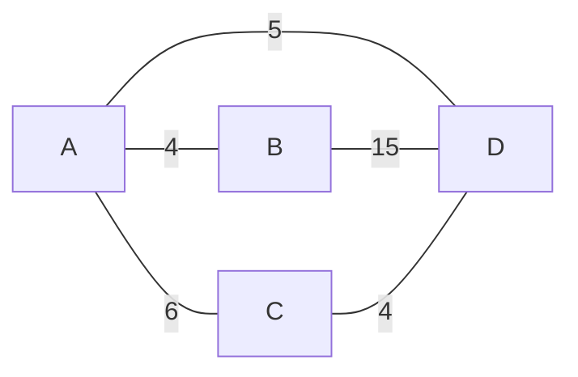
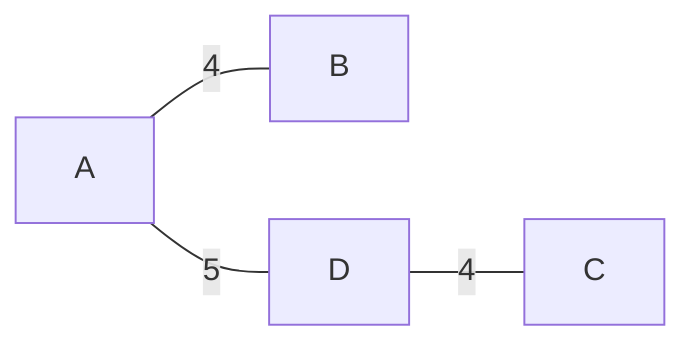
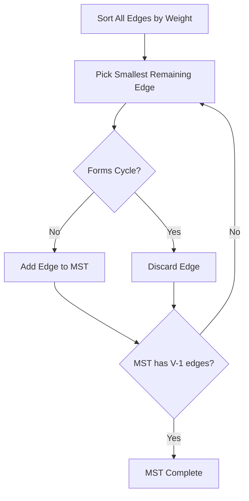

### Definition:

Kruskal's algorithm is a **greedy algorithm** used to find the Minimum Spanning Tree (MST) of a graph. The MST is a subset of the edges of a connected, weighted, and undirected graph that connects all the vertices together, without any cycles and with the minimum possible total edge weight.

### Video Explanation

<LiteYouTubeEmbed
  id="4ZlRH0eK-qQ"
  params="autoplay=1&autohide=1&showinfo=0&rel=0"
  title="3.5 Prims and Kruskals Algorithms - Greedy Method"
  lazyLoad={true}
  webp
/>

### Characteristics:

- **Greedy Approach**:

  - Kruskal's algorithm works by selecting the smallest edge and ensuring that no cycles are formed in the process. It greedily adds edges in increasing order of weight.

- **Disjoint Set Data Structure**:

  - The algorithm uses a **Disjoint Set Union (DSU)** or **Union-Find** data structure to efficiently determine whether adding an edge will form a cycle in the growing spanning tree.

- **Edge-Based Algorithm**:

  - Kruskal's algorithm focuses on edges rather than vertices, sorting them by weight and picking the smallest ones that do not create a cycle.

- **Applicable to Sparse Graphs**:
  - Kruskal's algorithm is often preferred for sparse graphs, where the number of edges is much smaller than the number of vertices squared.

### Time Complexity:

- **Best, Average, and Worst Case: O(E log E)**  
  Kruskal's algorithm sorts all the edges in ascending order of their weights, and the most time-consuming operation is sorting, which takes O(E log E), where E is the number of edges.

### Space Complexity:

- **Space Complexity: O(V + E)**  
  The algorithm requires extra space for the parent and rank arrays used by the Union-Find data structure, resulting in O(V + E) space, where V is the number of vertices and E is the number of edges.

---
## Dry Run Example

Consider the following weighted graph:



### Sorted Edges

| Edge | Weight |
|------|---------|
| C-D | 4 |
| A-B | 4 |
| A-D | 5 |
| A-C | 6 |
| B-D | 15 |

Kruskal's Algorithm processes edges in ascending order of weight.

:::note
The algorithm repeatedly selects the smallest edge that does not create a cycle in the growing Minimum Spanning Tree (MST).
:::

## Edge Selection Process

### Step 1

Select edge **C-D (4)**

✅ No cycle is formed, so include it in the MST.

Current MST:

```text
(C-D)
```

Current Weight = 4

### Step 2

Select edge **A-B (4)**

✅ No cycle is formed, so include it in the MST.

Current MST:

```text
(C-D), (A-B)
```

Current Weight = 8

### Step 3

Select edge **A-D (5)**

✅ A and D belong to different components.

Include the edge in the MST.

Current MST:

```text
(C-D), (A-B), (A-D)
```

Current Weight = 13

Since the graph contains 4 vertices, the MST must contain exactly:

```text
V - 1 = 3 edges
```

The MST is now complete.

### Total MST Weight

```text
4 + 4 + 5 = 13
```

:::tip
A Minimum Spanning Tree of a graph with `V` vertices always contains exactly `V - 1` edges.
:::

---

## Minimum Spanning Tree Visualization

The selected edges form the following MST:



Selected edges:

1. C-D (4)
2. A-B (4)
3. A-D (5)

Total MST Weight = **13**

---

## Cycle Detection Using Union-Find

Kruskal's Algorithm uses the **Union-Find (Disjoint Set Union - DSU)** data structure to efficiently detect cycles while constructing the Minimum Spanning Tree.

### How It Works

1. Initially, every vertex belongs to its own set.
2. For each edge `(u, v)`:
   - Find the representative (parent) of `u`.
   - Find the representative (parent) of `v`.
3. If both vertices belong to different sets:
   - Add the edge to the MST.
   - Merge the two sets.
4. If both vertices belong to the same set:
   - Adding the edge would create a cycle.
   - Discard the edge.

### Example

Initial sets:

```text
{A}
{B}
{C}
{D}
```

After selecting edges `(C-D)` and `(A-B)`:

```text
{A, B}
{C, D}
```

When edge `(A-D)` is considered:

```text
find(A) ≠ find(D)
```

Therefore, the edge is added and the sets are merged:

```text
{A, B, C, D}
```

If another edge connects vertices already inside this set:

```text
find(A) = find(C)
```

the edge is skipped because it would create a cycle.

### Why Union-Find?

Without Union-Find, cycle detection could require repeatedly traversing the graph. Union-Find performs cycle checks and set merges in nearly constant time, making Kruskal's Algorithm highly efficient.

### Union-Find Check

```text
if Find(u) != Find(v)
    Add Edge
    Union(u, v)
else
    Skip Edge
```

---

## Algorithm Visualization



---

## MST Construction Summary

| Selected Edge | Weight |
|--------------|---------|
| C-D | 4 |
| A-B | 4 |
| A-D | 5 |

### Final MST Weight

```text
13
```

The algorithm successfully constructs the Minimum Spanning Tree by selecting the smallest valid edges while avoiding cycles using the Union-Find data structure.

---
### C++ Implementation:

```cpp
#include <iostream>
#include <vector>
#include <algorithm>
using namespace std;

struct Edge {
    int u, v, weight;
    bool operator<(Edge const& other) {
        return weight < other.weight;
    }
};

vector<int> parent, rank;

int find(int v) {
    if (v == parent[v])
        return v;
    return parent[v] = find(parent[v]);
}

void unite(int a, int b) {
    a = find(a);
    b = find(b);
    if (a != b) {
        if (rank[a] < rank[b])
            swap(a, b);
        parent[b] = a;
        if (rank[a] == rank[b])
            rank[a]++;
    }
}

int kruskal(int n, vector<Edge>& edges) {
    sort(edges.begin(), edges.end());
    parent.resize(n);
    rank.resize(n);
    for (int i = 0; i < n; i++) {
        parent[i] = i;
        rank[i] = 0;
    }

    int mst_weight = 0;
    for (Edge e : edges) {
        if (find(e.u) != find(e.v)) {
            mst_weight += e.weight;
            unite(e.u, e.v);
        }
    }

    return mst_weight;
}

int main() {
    int n = 4; // number of vertices
    vector<Edge> edges = {
        {0, 1, 10}, {0, 2, 6}, {0, 3, 5}, {1, 3, 15}, {2, 3, 4}
    };

    int mst_weight = kruskal(n, edges);
    cout << "Weight of the Minimum Spanning Tree: " << mst_weight << endl;

    return 0;
}
```

### Java Implementation:

```java
import java.util.*;

class Edge{

    int u;
    int v;
    int weight;

    Edge(int u, int v, int weight)
    {
        this.u = u;
        this.v = v;
        this.weight = weight;
    }
}

class DisjointSet{

    ArrayList<Integer> parent = new ArrayList<>();
    ArrayList<Integer> rank = new ArrayList<>();
    int V;

    public DisjointSet(int V)
    {
        for(int i=0; i<V; i++)
        {
            parent.add(i);
            rank.add(0);
        }
    }

    int find(int v)
    {
        if(v == parent.get(v)) return v;

        int par = find(parent.get(v));
        parent.set(v, par);
        return par;
    }

    void unite(int a, int b)
    {
        a = find(a);
        b = find(b);

        if(a == b) return;

        if(rank.get(a) < rank.get(b))
        {
            int temp = a;
            a = b;
            b = temp;
        }

        parent.set(b,a);
        if(rank.get(a) == rank.get(b))
        rank.set(a, rank.get(a)+1);

    }

    int kruskal(int n, ArrayList<Edge> edges)
    {
        Collections.sort(edges, (a,b)->a.weight - b.weight);

        int mst_weight = 0;
        for(Edge e : edges)
        {
            if(find(e.u) != find(e.v))
            {
                mst_weight += e.weight;
                unite(e.u, e.v);
            }

        }

        return mst_weight;
    }

}

public class Main {
    public static void main(String args[]) {

        int n = 4; //number of vertices
        ArrayList<Edge> edges = new ArrayList<>();
        edges.add(new Edge(0, 1, 10));
        edges.add(new Edge(0, 2, 6));
        edges.add(new Edge(0, 3, 5));
        edges.add(new Edge(1, 3, 15));
        edges.add(new Edge(2, 3, 4));

        DisjointSet ds = new DisjointSet(4);
        int mst_weight = ds.kruskal(n, edges);
        System.out.println("Weight of the Minimum Spanning Tree: " + mst_weight);

    }
}
```

#### Output

```java
Weight of the Minimum Spanning Tree: 19
```

### Summary:

Kruskal's algorithm is an efficient way to find the Minimum Spanning Tree of a graph by considering the smallest edges first. It uses the Union-Find data structure to avoid forming cycles and guarantees that the resulting spanning tree has the minimum possible total weight. The algorithm is particularly useful for sparse graphs and is widely used in network design and optimization problems.
