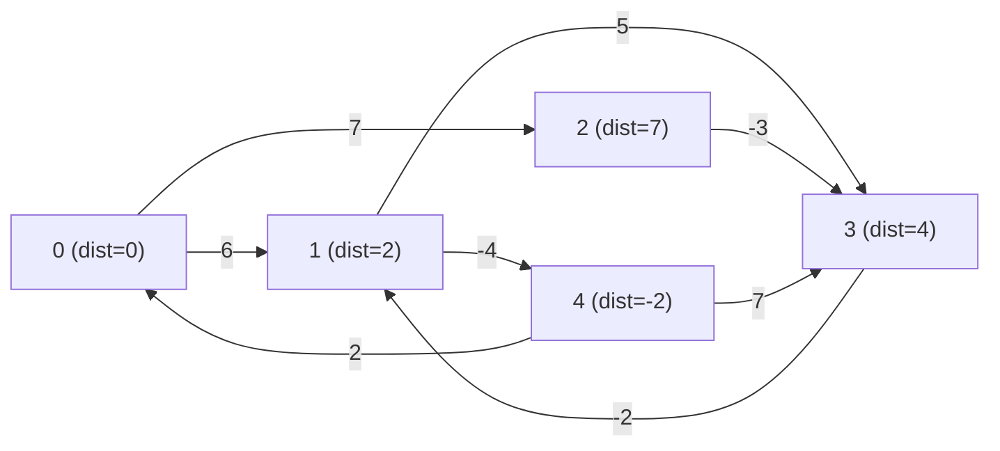

# Bellman-Ford Algorithm

## Overview

The **Bellman-Ford Algorithm** finds the shortest path from a **single source vertex** to all other vertices in a weighted, directed graph. Its key advantage over Dijkstra's Algorithm is that it correctly handles **negative edge weights** and can **detect negative weight cycles**.

### Why Not Dijkstra's?

Dijkstra's Algorithm uses a greedy approach — once a vertex is finalized, it is never revisited. This fails when a shorter path through a negative edge exists later. Bellman-Ford avoids this by relaxing **all edges repeatedly**, ensuring all possible shorter paths are discovered.

| Feature                    | Dijkstra's Algorithm | Bellman-Ford Algorithm |
|----------------------------|----------------------|------------------------|
| Negative edge weights      | ❌ Not supported     | ✅ Supported           |
| Negative cycle detection   | ❌ No                | ✅ Yes                 |
| Time Complexity            | O(E log V)           | O(V · E)               |
| Approach                   | Greedy               | Dynamic Programming    |

---

## Key Features

- **Time Complexity**: `O(V · E)` — where `V` is the number of vertices and `E` is the number of edges.
- **Space Complexity**: `O(V)` — for the distance array.
- Works on **directed** and **undirected** graphs (treat each undirected edge as two directed edges).
- Detects **negative weight cycles** — reports if a valid shortest path cannot exist.

---

## Applications

- **Network Routing Protocols** — used in RIP (Routing Information Protocol) for hop-count based routing.
- **Currency Arbitrage Detection** — detect profit opportunities (negative cycles) in currency exchange graphs.
- **Traffic & Transportation Systems** — finding shortest routes where some roads may have "negative" costs (e.g., toll rebates).
- **Game AI** — pathfinding in game worlds with cost-reducing zones.

---

## Algorithm — How It Works

### Core Idea: Edge Relaxation

**Relaxation** means: *"Can we find a shorter path to vertex `v` by going through vertex `u`?"*

$$
\text{if } dist[u] + weight(u, v) < dist[v] \text{, then } dist[v] = dist[u] + weight(u, v)
$$

This is repeated **V - 1** times (the maximum number of edges in any shortest path without a cycle in a graph with `V` vertices).

After `V - 1` passes, a **V-th pass** is run — if any distance can still be reduced, a **negative weight cycle** exists.

### Steps

1. Initialize `dist[src] = 0` and `dist[all others] = ∞`.
2. Repeat **V - 1** times:
   - For every edge `(u, v, w)`:
     - If `dist[u] + w < dist[v]`, update `dist[v] = dist[u] + w`.
3. Run one more pass over all edges:
   - If any update is still possible → **negative cycle detected**.

---

## Pseudocode

```
function BellmanFord(Graph, source):
    // Step 1: Initialize distances
    dist[source] = 0
    for each vertex v ≠ source:
        dist[v] = ∞

    // Step 2: Relax all edges V-1 times
    for i from 1 to V - 1:
        for each edge (u, v, w) in Graph.edges:
            if dist[u] + w < dist[v]:
                dist[v] = dist[u] + w

    // Step 3: Check for negative weight cycles
    for each edge (u, v, w) in Graph.edges:
        if dist[u] + w < dist[v]:
            return "Negative weight cycle detected"

    return dist[]
```

---

## Step-by-Step Trace Example

Consider the following graph with **5 vertices** and **8 edges** (source = `0`):

```
Edges:
  0 → 1  (weight:  6)
  0 → 2  (weight:  7)
  1 → 2  (weight:  8)
  1 → 3  (weight:  5)
  1 → 4  (weight: -4)
  2 → 3  (weight: -3)
  2 → 4  (weight:  9)
  3 → 1  (weight: -2)
  4 → 0  (weight:  2)
  4 → 3  (weight:  7)
```

### Initial State

| Vertex | dist |
|--------|------|
| 0      | 0    |
| 1      | ∞    |
| 2      | ∞    |
| 3      | ∞    |
| 4      | ∞    |

### After Pass 1 (relax all edges once)

Processing `0→1 (6)`: dist[1] = 0 + 6 = **6**  
Processing `0→2 (7)`: dist[2] = 0 + 7 = **7**  
Processing `1→3 (5)`: dist[3] = 6 + 5 = **11**  
Processing `1→4 (-4)`: dist[4] = 6 + (-4) = **2**  
Processing `2→3 (-3)`: dist[3] = min(11, 7 + (-3)) = **4**  

| Vertex | dist |
|--------|------|
| 0      | 0    |
| 1      | 6    |
| 2      | 7    |
| 3      | 4    |
| 4      | 2    |

### After Pass 2

Processing `3→1 (-2)`: dist[1] = min(6, 4 + (-2)) = **2**  
Processing `1→4 (-4)`: dist[4] = min(2, 2 + (-4)) = **-2**  
Processing `4→3 (7)`:  dist[3] = min(4, -2 + 7) = **4** (no change)  
Processing `1→3 (5)`:  dist[3] = min(4, 2 + 5) = **4** (no change)  

| Vertex | dist |
|--------|------|
| 0      | 0    |
| 1      | 2    |
| 2      | 7    |
| 3      | 4    |
| 4      | -2   |

Passes continue until no updates occur. After **V - 1 = 4** passes, final shortest distances are stable.

**Final Output** (no negative cycle):

| Vertex | Shortest Distance from 0 |
|--------|--------------------------|
| 0      | 0                        |
| 1      | 2                        |
| 2      | 7                        |
| 3      | 4                        |
| 4      | -2                       |

---

## Visualization (Graph Flow)



---

## Code Implementations

### C

```c
#include <stdio.h>
#include <limits.h>

#define MAX_VERTICES 100
#define MAX_EDGES    200

typedef struct {
    int src, dest, weight;
} Edge;

void bellmanFord(int V, int E, Edge edges[], int src) {
    if (V > MAX_VERTICES) return;
    int dist[MAX_VERTICES];

    // Step 1: Initialize all distances to infinity
    for (int i = 0; i < V; i++)
        dist[i] = INT_MAX;
    dist[src] = 0;

    // Step 2: Relax all edges V-1 times
    for (int i = 1; i <= V - 1; i++) {
        for (int j = 0; j < E; j++) {
            int u = edges[j].src;
            int v = edges[j].dest;
            int w = edges[j].weight;
            if (dist[u] != INT_MAX && dist[u] + w < dist[v])
                dist[v] = dist[u] + w;
        }
    }

    // Step 3: Check for negative weight cycles
    for (int j = 0; j < E; j++) {
        int u = edges[j].src;
        int v = edges[j].dest;
        int w = edges[j].weight;
        if (dist[u] != INT_MAX && dist[u] + w < dist[v]) {
            printf("Graph contains a negative weight cycle.\n");
            return;
        }
    }

    // Print results
    printf("Vertex\tDistance from Source\n");
    for (int i = 0; i < V; i++)
        printf("%d\t%d\n", i, dist[i]);
}

int main() {
    int V = 5, E = 8;
    Edge edges[] = {
        {0, 1, 6}, {0, 2, 7},
        {1, 2, 8}, {1, 3, 5}, {1, 4, -4},
        {2, 3, -3}, {2, 4, 9},
        {3, 1, -2}
    };

    bellmanFord(V, E, edges, 0);
    return 0;
}
```

### C++

```cpp
#include <iostream>
#include <vector>
#include <climits>
using namespace std;

struct Edge {
    int src, dest, weight;
};

void bellmanFord(int V, int E, vector<Edge>& edges, int src) {
    vector<int> dist(V, INT_MAX);
    dist[src] = 0;

    // Step 2: Relax all edges V-1 times
    for (int i = 1; i <= V - 1; i++) {
        bool updated = false;
        for (auto& e : edges) {
            if (dist[e.src] != INT_MAX && dist[e.src] + e.weight < dist[e.dest]) {
                dist[e.dest] = dist[e.src] + e.weight;
                updated = true;
            }
        }
        if (!updated) break;
    }

    // Step 3: Detect negative weight cycles
    for (auto& e : edges) {
        if (dist[e.src] != INT_MAX && dist[e.src] + e.weight < dist[e.dest]) {
            cout << "Graph contains a negative weight cycle." << endl;
            return;
        }
    }

    cout << "Vertex\tDistance from Source\n";
    for (int i = 0; i < V; i++)
        cout << i << "\t" << dist[i] << "\n";
}

int main() {
    int V = 5, E = 8;
    vector<Edge> edges = {
        {0, 1, 6}, {0, 2, 7},
        {1, 2, 8}, {1, 3, 5}, {1, 4, -4},
        {2, 3, -3}, {2, 4, 9},
        {3, 1, -2}
    };

    bellmanFord(V, E, edges, 0);
    return 0;
}
```

### Java

```java
import java.util.*;

public class BellmanFord {

    static class Edge {
        int src, dest, weight;
        Edge(int s, int d, int w) { src = s; dest = d; weight = w; }
    }

    static void bellmanFord(int V, List<Edge> edges, int src) {
        int[] dist = new int[V];
        Arrays.fill(dist, Integer.MAX_VALUE);
        dist[src] = 0;

        // Step 2: Relax all edges V-1 times
        for (int i = 1; i <= V - 1; i++) {
            for (Edge e : edges) {
                if (dist[e.src] != Integer.MAX_VALUE &&
                    dist[e.src] + e.weight < dist[e.dest]) {
                    dist[e.dest] = dist[e.src] + e.weight;
                }
            }
        }

        // Step 3: Detect negative weight cycles
        for (Edge e : edges) {
            if (dist[e.src] != Integer.MAX_VALUE &&
                dist[e.src] + e.weight < dist[e.dest]) {
                System.out.println("Graph contains a negative weight cycle.");
                return;
            }
        }

        System.out.println("Vertex\tDistance from Source");
        for (int i = 0; i < V; i++)
            System.out.println(i + "\t" + dist[i]);
    }

    public static void main(String[] args) {
        int V = 5;
        List<Edge> edges = new ArrayList<>(Arrays.asList(
            new Edge(0, 1, 6),  new Edge(0, 2, 7),
            new Edge(1, 2, 8),  new Edge(1, 3, 5), new Edge(1, 4, -4),
            new Edge(2, 3, -3), new Edge(2, 4, 9),
            new Edge(3, 1, -2)
        ));

        bellmanFord(V, edges, 0);
    }
}
```

### Python

```python
import math

def bellman_ford(V, edges, src):
    # Step 1: Initialize distances
    dist = [math.inf] * V
    dist[src] = 0

    # Step 2: Relax all edges V-1 times
    for _ in range(V - 1):
        for u, v, w in edges:
            if dist[u] != math.inf and dist[u] + w < dist[v]:
                dist[v] = dist[u] + w

    # Step 3: Detect negative weight cycles
    for u, v, w in edges:
        if dist[u] != math.inf and dist[u] + w < dist[v]:
            print("Graph contains a negative weight cycle.")
            return

    print("Vertex\tDistance from Source")
    for i in range(V):
        print(f"{i}\t{dist[i]}")


# Example usage
if __name__ == "__main__":
    V = 5
    edges = [
        (0, 1,  6), (0, 2,  7),
        (1, 2,  8), (1, 3,  5), (1, 4, -4),
        (2, 3, -3), (2, 4,  9),
        (3, 1, -2)
    ]
    bellman_ford(V, edges, 0)
```

---

## Example Output

```
Vertex  Distance from Source
0       0
1       2
2       7
3       4
4       -2
```

---

## Complexity Analysis

| Complexity | Value   | Explanation                                                       |
|------------|---------|-------------------------------------------------------------------|
| **Time**   | O(V · E) | V-1 passes over E edges, plus one detection pass                 |
| **Space**  | O(V)    | Only a `dist[]` array of size V is needed                        |

---

## Points to Remember

- ✅ Handles **negative edge weights** — unlike Dijkstra's.
- ✅ Detects **negative weight cycles** — invaluable for financial/routing apps.
- ⚠️ Slower than Dijkstra's — use Dijkstra when all weights are non-negative.
- ⚠️ Does **not** produce correct results if a **negative cycle is reachable** from the source.
- 💡 Used as a sub-routine in **Johnson's Algorithm** to handle negative weights before running Dijkstra on each vertex.

---

## References

- [GeeksforGeeks — Bellman-Ford Algorithm](https://www.geeksforgeeks.org/bellman-ford-algorithm-dp-23/)
- [Wikipedia — Bellman-Ford Algorithm](https://en.wikipedia.org/wiki/Bellman%E2%80%93Ford_algorithm)
- CLRS — *Introduction to Algorithms*, Chapter 24.1
