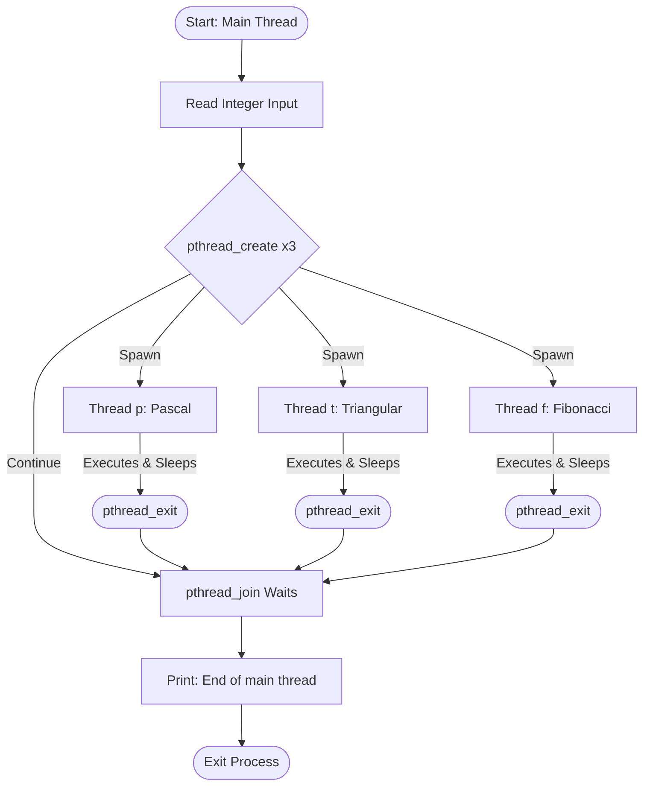

A **thread** is an independent flow of execution within a process. Multiple threads within the same process share its resources (such as memory space, file descriptors, and global variables), allowing different tasks to execute concurrently and efficiently.

---

## 1. Introduction

In C, threads are managed using the **POSIX Threads (Pthreads)** library (`pthread.h`). Multi-threading is essential when a program needs to execute multiple operations simultaneously, such as running background computations, handling concurrent network requests, or processing heavy I/O operations without freezing the main application.

The following example demonstrates concurrent execution by launching three independent mathematical worker threads alongside the main thread:
* **Thread 1:** Generates rows of Pascal's Triangle
* **Thread 2:** Computes Triangular Numbers
* **Thread 3:** Generates Fibonacci Numbers

## Video Explanation

<LiteYouTubeEmbed
  id="b_h4-_j6JmY"
  params="autoplay=1&autohide=1&showinfo=0&rel=0"
  title="Creating a Thread by Extending Thread class"
  poster="maxresdefault"
  lazyLoad={true}
  webp
/>

---

## 2. C Implementation

```c
#include <stdio.h>
#include <pthread.h>
#include <unistd.h>

// Thread 1: Generates and prints Pascal's Triangle rows
void *pascal_rows(void *arg) {
    int n = *(int*)arg;
    int a[50] = {0};
    a[0] = 1;

    for (int i = 0; i < n; i++) {
        printf("Pascal row %d = ", i + 1);
        // Compute the row backwards to update in place safely
        for (int j = i; j > 0; j--) {
            a[j] = a[j] + a[j - 1];
        }
        
        for (int j = 0; j <= i; j++) {
            printf("%d ", a[j]);
        }
        printf("\n");
        sleep(1);
    }
    pthread_exit(NULL);
}

// Thread 2: Computes and prints Triangular Numbers
void *triangular_nos(void *arg) {
    int n = *(int*)arg;
    int sum = 0;
    for (int i = 1; i <= n; i++) {
        sum += i;
        printf("Triangular number %d = %d\n", i, sum);
        sleep(2);
    }
    pthread_exit(NULL);
}

// Helper function for Fibonacci calculation
int fibonacci(int m) {
    if (m <= 0) return 0;
    if (m == 1) return 1;
    return fibonacci(m - 1) + fibonacci(m - 2);
}

// Thread 3: Computes and prints Fibonacci Numbers
void *prt_fib(void *arg) {
    int n = *(int*)arg;
    for (int i = 1; i <= n; i++) {
        printf("Fibonacci no %d = %d\n", i, fibonacci(i));
        sleep(3);
    }
    pthread_exit(NULL);
}

int main() {
    pthread_t p, t, f;
    int x = 0;

    printf("Enter a positive integer: ");
    if (scanf("%d", &x) != 1 || x <= 0) {
        printf("Invalid input.\n");
        return 1;
    }

    // Creating threads concurrently
    pthread_create(&p, NULL, pascal_rows, &x);
    pthread_create(&t, NULL, triangular_nos, &x);
    pthread_create(&f, NULL, prt_fib, &x);

    // Waiting for threads to finish execution
    pthread_join(p, NULL);
    pthread_join(t, NULL);
    pthread_join(f, NULL);

    printf("End of main thread\n");
    return 0;
}
```

### Sample Input & Output

**Input:**

```text
Enter a positive integer: 3
```

**Output (Interleaved due to concurrency):**

```text
Pascal row 1 = 1 
Triangular number 1 = 1
Fibonacci no 1 = 1
Pascal row 2 = 1 1 
Triangular number 2 = 3
Pascal row 3 = 1 2 1 
Fibonacci no 2 = 1
Triangular number 3 = 6
Fibonacci no 3 = 2
End of main thread
```

---

## 3. Deep Dive: How It Works

### 3.1 Header Files

* `<stdio.h>` – Standard I/O operations (`printf`, `scanf`).
* `<pthread.h>` – Provides Pthreads core functions, types, and macros.
* `<unistd.h>` – System call wrapper interface providing the `sleep()` function.

### 3.2 Thread Creation API

The `main` function initializes three threads via `pthread_create()`.

#### Function Syntax

```c
int pthread_create(
    pthread_t *thread,
    const pthread_attr_t *attr,
    void *(*start_routine)(void *),
    void *arg
);
```

| Parameter | Type | Purpose |
| --- | --- | --- |
| `thread` | `pthread_t *` | Pointer to a variable that stores the unique thread ID. |
| `attr` | `const pthread_attr_t *` | Thread attributes (passing `NULL` applies default configuration like joinable state). |
| `start_routine` | `void *(*)(void *)` | Pointer to the function that the thread will execute. |
| `arg` | `void *` | Pointer to the argument passed to the target function. |

> **Note:** Once `pthread_create` is invoked, execution shifts to a scheduled context switch where the target function runs asynchronously alongside the caller.

### 3.3 Argument Passing & Type Casting

Because `pthread_create` requires a generic `void *` pointer for its arguments, data must be safely cast inside the thread functions:

1. **Passing:** The address of the variable is passed: `&x`
2. **Receiving:** The `void *arg` is cast back to its true type pointer and dereferenced:
```c
int n = *(int*)arg;
```

### 3.4 Synchronization and Termination

* **`pthread_exit(NULL)`**: Explicitly terminates the calling thread. Using this ensures that only the local execution stream wraps up, keeping other running peer threads alive.
* **`pthread_join(thread_id, retval)`**: Acts as a blocking synchronization barrier. The main thread pauses execution at each `pthread_join` line, waiting for the designated thread to finish before proceeding. This prevents the process from completing prematurely and creating zombie threads.

---

## 4. Execution Flow Summary

The diagram below illustrates how the main thread spawns the worker threads, blocks until they are completely finished, and then finalizes the process:


