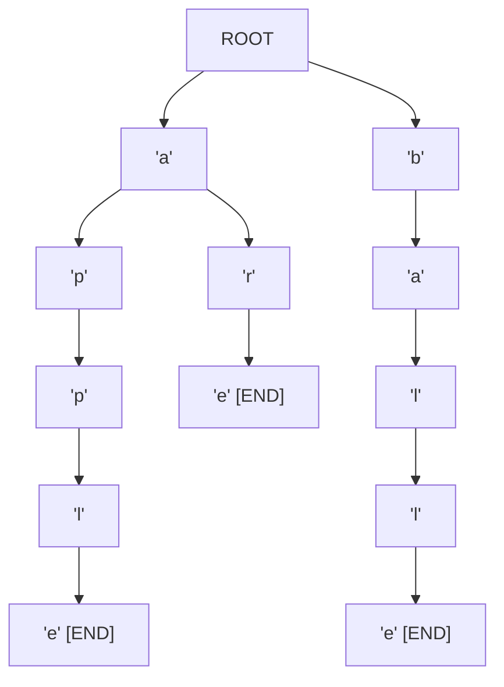

**Trie** (pronounced "try") is a specialized **tree-based data structure** used to store and search strings efficiently. Also known as a **Prefix Tree**, a Trie organizes keys based on their common prefixes, enabling extremely fast prefix-based queries.

Trie is particularly efficient for operations that involve string prefixes, autocomplete, and dictionary lookups, making it ideal for search engines, IP routing tables, and spelling checkers.

:::info Key Feature
In a Trie, every node represents a single character, and paths from the root to nodes form the stored strings. This allows searching by prefix in O(m) time where m is the length of the prefix, regardless of the number of stored strings.
:::

---

## Structure of a Trie

Each Trie node contains:
- **children**: A map or array of child nodes (one per possible character)
- **is_end_of_word**: A boolean flag indicating if this node marks the end of a stored word
- (Optional) **frequency/count**: For frequency-based queries



In this example, the Trie stores: "apple", "are", "ball", "ballet"

---

## Operations

### Insert

1. Start at the root.
2. For each character in the word:
   - If the child node for this character exists, move to it.
   - Otherwise, create a new node.
3. Mark the last node as end-of-word.

**Time Complexity**: O(m) where m is the word length.

### Search

1. Start at the root.
2. For each character:
   - If the child node exists, move to it.
   - Otherwise, return False.
3. Return the `is_end_of_word` flag of the last node.

**Time Complexity**: O(m) where m is the word length.

### Prefix Search

1. Navigate to the node corresponding to the prefix (same process as search).
2. If the prefix node exists, return True.

**Time Complexity**: O(m) where m is the prefix length.

### Delete

1. Search for the word (same as search).
2. If the word exists, unmark the `is_end_of_word` flag.
3. Recursively delete nodes that have no children and are not end-of-word.

---

## Complexity Analysis

| Operation          | Time Complexity | Space Complexity        |
|--------------------|-----------------|------------------------|
| Insert             | O(m)            | O(ALPHABET_SIZE * m * n)|
| Search             | O(m)            | O(1) (per node lookup) |
| Prefix Search      | O(m)            | O(1) (per node lookup) |
| Delete             | O(m)            | O(1) (per node)        |

Where m = length of word/prefix, n = number of words, ALPHABET_SIZE = 26 for lowercase English.

---

## Implementation

### Python

```python
class TrieNode:
    def __init__(self):
        self.children = {}
        self.is_end_of_word = False

class Trie:
    def __init__(self):
        self.root = TrieNode()

    def insert(self, word):
        node = self.root
        for ch in word:
            if ch not in node.children:
                node.children[ch] = TrieNode()
            node = node.children[ch]
        node.is_end_of_word = True

    def search(self, word):
        node = self._find_node(word)
        return node is not None and node.is_end_of_word

    def starts_with(self, prefix):
        return self._find_node(prefix) is not None

    def _find_node(self, prefix):
        node = self.root
        for ch in prefix:
            if ch not in node.children:
                return None
            node = node.children[ch]
        return node

    def autocomplete(self, prefix):
        """Return all words starting with the given prefix."""
        node = self._find_node(prefix)
        if not node:
            return []
        results = []
        self._dfs_collect(node, prefix, results)
        return results

    def _dfs_collect(self, node, current_word, results):
        if node.is_end_of_word:
            results.append(current_word)
        for ch, child in node.children.items():
            self._dfs_collect(child, current_word + ch, results)
```

### Java

```java
import java.util.*;

class TrieNode {
    Map<Character, TrieNode> children = new HashMap<>();
    boolean isEndOfWord = false;
}

class Trie {
    private final TrieNode root = new TrieNode();

    public void insert(String word) {
        TrieNode node = root;
        for (char ch : word.toCharArray()) {
            node.children.putIfAbsent(ch, new TrieNode());
            node = node.children.get(ch);
        }
        node.isEndOfWord = true;
    }

    public boolean search(String word) {
        TrieNode node = findNode(word);
        return node != null && node.isEndOfWord;
    }

    public boolean startsWith(String prefix) {
        return findNode(prefix) != null;
    }

    private TrieNode findNode(String prefix) {
        TrieNode node = root;
        for (char ch : prefix.toCharArray()) {
            if (!node.children.containsKey(ch))
                return null;
            node = node.children.get(ch);
        }
        return node;
    }
}
```

### C++

```cpp
#include <bits/stdc++.h>
using namespace std;

struct TrieNode {
    unordered_map<char, TrieNode*> children;
    bool isEndOfWord = false;
};

class Trie {
    TrieNode* root;
public:
    Trie() { root = new TrieNode(); }

    void insert(const string& word) {
        TrieNode* node = root;
        for (char ch : word) {
            if (!node->children.count(ch))
                node->children[ch] = new TrieNode();
            node = node->children[ch];
        }
        node->isEndOfWord = true;
    }

    bool search(const string& word) {
        TrieNode* node = findNode(word);
        return node != nullptr && node->isEndOfWord;
    }

    bool startsWith(const string& prefix) {
        return findNode(prefix) != nullptr;
    }

private:
    TrieNode* findNode(const string& prefix) {
        TrieNode* node = root;
        for (char ch : prefix) {
            if (!node->children.count(ch))
                return nullptr;
            node = node->children[ch];
        }
        return node;
    }
};
```

### JavaScript

```javascript
class TrieNode {
    constructor() {
        this.children = new Map();
        this.isEndOfWord = false;
    }
}

class Trie {
    constructor() {
        this.root = new TrieNode();
    }

    insert(word) {
        let node = this.root;
        for (const ch of word) {
            if (!node.children.has(ch))
                node.children.set(ch, new TrieNode());
            node = node.children.get(ch);
        }
        node.isEndOfWord = true;
    }

    search(word) {
        const node = this.findNode(word);
        return node !== null && node.isEndOfWord;
    }

    startsWith(prefix) {
        return this.findNode(prefix) !== null;
    }

    findNode(prefix) {
        let node = this.root;
        for (const ch of prefix) {
            if (!node.children.has(ch))
                return null;
            node = node.children.get(ch);
        }
        return node;
    }
}
```

---

## Applications

- **Autocomplete / Search Suggestions**: Search engines and messaging apps.
- **Spell Checkers**: Finding valid words and suggesting corrections.
- **IP Routing**: Longest prefix matching in network routers (used in routing tables).
- **Phone Contact Search**: Efficient contact lookup by name prefix.
- **Word Games**: Finding valid words from a set of characters (Boggle solver).
- **T9 Text Input**: Predictive text on mobile phones.
- **DNA Sequence Matching**: Storing and searching genetic sequences by prefix.

---

## Trie vs Hash Table

| Aspect               | Trie                       | Hash Table           |
|----------------------|----------------------------|----------------------|
| Search (exact match) | O(m)                       | O(1) average         |
| Prefix search        | O(m) -- natural            | O(n) -- scan all     |
| Space efficiency     | Shared prefixes (good)     | Independent entries  |
| Ordering             | Lexicographic by default   | No ordering          |
| Collision handling   | None                       | Required             |

---

## Key Takeaways

- Trie stores strings by their common prefixes, enabling O(m) prefix lookups.
- Each node represents a character; paths form complete words.
- Autocomplete, spell checking, and IP routing are natural use cases.
- Space can be optimized using arrays of fixed size (for small alphabets) or compressed tries.
- Insertion, search, and deletion are all O(m) where m is the word/prefix length.
