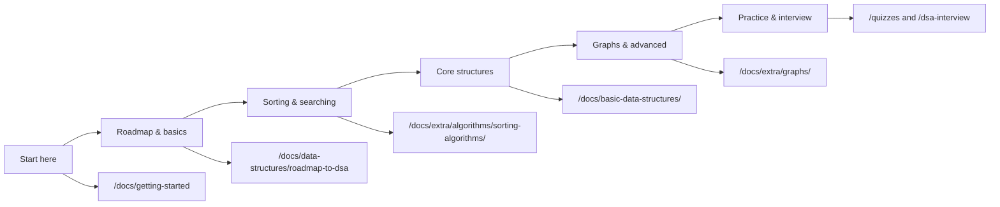

# How to Use This Site

Welcome to **Algo**. If you landed here from the [README](https://github.com/ajay-dhangar/algo), **GSSoC**, or another event, this page answers one question: **where do I go first?**

:::tip Interactive 8-step tour
Use the **Tour** button (bottom-left on any page) or open the site with [`?tour=1`](/?tour=1) to walk through Tutorial, roadmap, interview prep, playground, and quizzes. You can **Skip tour** on any step.
:::

The site has two main learning surfaces:

1. **Tutorial (Docs)** — structured articles in the left sidebar (this section).
2. **Interactive pages** — roadmap picker, playground, quizzes, challenges, and more in the top navigation under **More**.

---

## How content is organized

### Tutorial sidebar (Docs)

| Area | What you will find | Good for |
| ---- | ------------------ | -------- |
| [Welcome](./index.md) | Overview of Algo | First visit |
| **How to Use This Site** (this page) | Navigation and learning path | Beginners |
| [Table of Contents](./content.md) | Visual overview of DSA topics | Seeing the big picture |
| [Programming Fundamentals](./programming-fundamentals/index.md) | Syntax, control flow, OOP basics | Very new programmers |
| [Basic Data Structures](./basic-data-structures/index.md) | Arrays, pointers, core structures | Building foundations |
| [Data Structures](./data-structures/index.md) | Roadmaps and structure-focused topics | Structured DSA study |
| [Languages](./languages/index.md) | Python, Java, C++, JavaScript, etc. | Language-specific tips |
| [Extra](./extra/index.md) | Algorithms, graphs, DP, heaps, and advanced topics | Deeper dives after basics |
| [Cheatsheets](./cheatsheets/index.md) | Quick reference | Review before interviews |

**Topics vs languages:** Algorithm write-ups usually live under **Extra** (or related topic folders) with code in several languages in one article. The **Languages** section is for learning the language itself—not every algorithm duplicated per language folder.

### Top navigation (outside the Tutorial sidebar)

| Link | Purpose |
| ---- | ------- |
| **Tutorial** | Returns to Docs (sidebar content) |
| **Blog** | Articles and updates |
| **FAQ** | Common questions |
| **Pick Topic For Contribution** | [DSA roadmap](/dsa-roadmap) for contributors choosing what to add |
| **More → Top DSA Questions** | [DSA Interview](/dsa-interview) section (separate doc collection) |
| **More → Roadmap** | Product / feature roadmap page |
| **More → Challenges** | Timed coding challenges |
| **More → Practice** | Practice hub |
| **More → Playground** | Run JavaScript, Python, C++, or Java snippets |
| **More → Quizzes** | Topic quizzes (arrays, stacks, trees, …) |
| **More → Quizzes Solutions** | Review answers after attempting quizzes |
| **More → Leaderboard** | Community rankings (see [Quizzes & backend](#quizzes-leaderboard-and-backend) below) |
| **More → Community** | Connect with other learners |
| **More → Resources** | Curated external links |

### DSA Interview section

Interview-focused material lives at **[DSA Interview Preparation](/dsa-interview)**—a separate docs area from the main Tutorial. Use it when you are preparing for coding interviews; use the **Tutorial** sidebar when you are learning concepts from scratch.

### Graphs and advanced algorithms

Graph algorithms (BFS, DFS, shortest paths, MST, etc.) are under **[Extra → Graphs](/docs/extra/graphs/)**. General sorting, searching, DP, and greedy topics are under **[Extra → Algorithms](/docs/extra/algorithms/)** and related folders.

---

## Suggested learning path

Follow this order if you are new to DSA. Skip steps you already know.



### Step 1 — Orient yourself

- Read this page and [Welcome to Algo](/docs/).
- Skim the [Table of Contents](/docs/content) to see how topics connect.

### Step 2 — Follow the roadmap

- **[Roadmap to Learning DSA](./data-structures/roadmap-to-learning-dsa)** — step-by-step study plan inside Docs.
- **[learn.md](https://github.com/ajay-dhangar/algo/blob/main/learn.md)** on GitHub — same journey described for offline reading.
- Optional: external [DSA Roadmap on roadmap.sh](https://roadmap.sh/datastructures-and-algorithms).

### Step 3 — Master sorting and searching

- [Sorting algorithms](/docs/extra/algorithms/sorting-algorithms/) (bubble, merge, quick, heap, …).
- [Searching algorithms](/docs/extra/algorithms/Searching%20Algorithms/) (binary search, etc.).
- Practice on the [Playground](/playground) with small examples.

### Step 4 — Core data structures

- [Basic Data Structures](/docs/basic-data-structures/) — arrays, strings, pointers.
- [Stacks](/docs/extra/Stack/), [Queues](/docs/extra/Queue/), [Linked lists](/docs/extra/linked-list/), [Trees](/docs/extra/Trees/), [Heaps](/docs/extra/heap/).

### Step 5 — Graphs and advanced topics

- [Graphs](/docs/extra/graphs/) — representations, traversals, shortest paths.
- [Dynamic programming](/docs/extra/dynamic-programming/) when you are comfortable with recursion.

### Step 6 — Test yourself

- **[Quizzes](/quizzes)** — topic-wise multiple-choice practice.
- **[DSA Interview](/dsa-interview)** — interview-style pathways.
- **[Challenges](/challenges)** and **[Practice](/practice)** when you want timed or structured problems.

---

## Quizzes, leaderboard, and backend

Some features save progress through the **Algo backend** (`server/`). Without it, quizzes may still run in the browser, but **attempts and scores are not stored**.

### Run the backend locally

```bash
npm run server:install
npm run server:dev
```

In another terminal, point the frontend at the API and start the site:

```bash
# Windows PowerShell
$env:DOCUSAURUS_API_BASE_URL="http://localhost:5000"
npm start
```

Or use **`npm run start:all`** to run frontend and backend together (see [README](https://github.com/ajay-dhangar/algo#local-development)).

### What the backend provides

| Feature | API (examples) | Notes |
| ------- | -------------- | ----- |
| Quiz attempts | `POST /api/quiz-attempts` | Saves username, answers, and time per quiz |
| Past attempts | `GET /api/quiz-attempts/:userId/:quizId` | Resume or review progress |
| Quiz leaderboard data | `GET /api/leaderboard` | Aggregated scores from stored attempts |
| Playground (Python, C++, Java) | `POST /api/execute-code` | See [MULTI_LANGUAGE_PLAYGROUND.md](https://github.com/ajay-dhangar/algo/blob/main/MULTI_LANGUAGE_PLAYGROUND.md) |

The **[Leaderboard](/leaderboard)** page in the navbar highlights community activity; quiz scoring depends on the backend being reachable from your environment. If quizzes do not save, confirm `DOCUSAURUS_API_BASE_URL` is set and the server is running.

---

## Contributing or improving docs

- **[CONTRIBUTING.md](https://github.com/ajay-dhangar/algo/blob/main/CONTRIBUTING.md)** — how to fork, branch, and open PRs.
- **[Recommended reading](https://github.com/ajay-dhangar/algo/blob/main/CONTRIBUTING.md#recommended-reading)** — Docusaurus, Markdown, MDX, and Mermaid when you edit pages.
- **[Pick Topic For Contribution](/dsa-roadmap)** — find a doc area that still needs coverage.

---

## Quick links

| I want to… | Go to |
| ---------- | ----- |
| Learn DSA from zero | [Roadmap to Learning DSA](/docs/data-structures/roadmap-to-dsa) |
| Study graphs | [Graphs](/docs/extra/graphs/) |
| Prepare for interviews | [DSA Interview](/dsa-interview) |
| Run code online | [Playground](/playground) |
| Take a quiz | [Quizzes](/quizzes) |
| Choose a contribution topic | [DSA Roadmap](/dsa-roadmap) |

Still stuck? Open a [GitHub Discussion](https://github.com/ajay-dhangar/algo/discussions) or issue and say where you got lost—we use that feedback to improve this guide.
